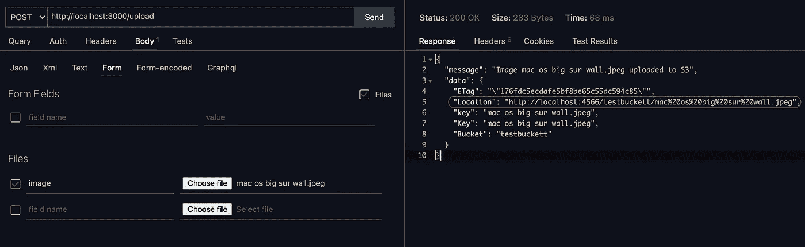

# 使用 Nest + Typescript 将图像上传到 AWS S3 (Localstack)。

> 原文：<https://medium.com/geekculture/upload-image-to-aws-s3-localstack-using-nest-typescript-1104bcb5d9ec?source=collection_archive---------4----------------------->

作为一名开发人员，有时你很可能会遇到使用 AWS S3 桶作为上传文件的存储。这就是我们今天努力要实现的目标。我将带你通过整个流程，让你知道确切的设置/配置，我使用开始存储任何类型的文件在 S3。我将在演示中使用 Nest.js 和 Typescript。虽然您可以在 S3 存储桶中存储任何东西(文本文件、图像、视频、blobs)，但是我们将明确地处理图像，因为我们只想存储图像文件用于演示。

另外，我们不需要任何 access/secret AWS 配置密钥，因为我们将使用 localstack 作为开发环境。如果你不知道的话，Localstack 已经基本上帮助我们避免了繁琐的前期工作，这些工作通常是在配置开发环境时进行的，我认为是非常耗时的。如果你真的想拥有访问/秘密密钥，你最好拥有它们。将它们包含在. env 文件中，并确保在 S3 配置提供程序文件中将其提取出来。

此外，我正在使用 [localstack docker 映像](https://hub.docker.com/r/localstack/localstack)，它将帮助我支持 AWS 云服务，如 S3。如果您还没有 localstack docker 映像，那么请继续操作。一旦你安装了它，你就可以继续运行了。如果你在寻找能帮助你安装和配置 localstack 的指南，你可以访问他们的 [Github](https://github.com/localstack/localstack) 。

## 安装 localstack 的快速步骤

*   为您的系统下载 Docker 桌面。你可以在这里找到可下载的文件。
*   从 Docker Hub 中提取 localstack docker 映像。你可以在这里找到图片[。](https://hub.docker.com/r/localstack/localstack)

## S3 配置提供程序

我们有 S3 配置提供商，它可以完成我们开始所需的所有设置。因为我们实际上不需要任何真正的访问/秘密密钥，我们可以像这样硬编码密钥，或者如果您有密钥，请确保从。环境文件。我们现在有了具有所需配置的 S3 对象。我们有 getS3()和 getBucketName()方法来导出 S3 对象和存储桶的名称，以便在项目中的任何地方使用。

另外，确保运行一次 createBucket()方法，为您创建一个名为 **testBucket** 的 bucket。您可以利用最后一行来创建一个存储桶。

## 定义 DTO

让我们定义图像文件对象的 DTO，以及将图像上传到 S3 后我们将收到的响应对象。

我们都准备好了 DTO。现在，我们可以继续定义将在控制器中处理 HTTP POST 请求的唯一路由。

## 控制器类别

在控制器文件中，我们定义了路由或路径前缀 **/upload** ，负责将图像文件上传到 S3。我们使用文件拦截器只拦截带有特定键的文件。下面的 **upload** 方法将通过调用服务文件内部的 upload 方法将剩余的操作委托给服务文件，该方法执行将映像上传到 S3 所需的逻辑。

控制器的主要目标是处理对其端点之一的传入请求，并将响应返回给客户端。这里，我们最后返回一个响应成功/错误对象，通知图像是否上传。现在让我们编写逻辑，在服务类中将图像上传到 S3。

## 服务级别

服务类(ImageUploadService)负责将图像上传到 S3，并设计为由 UploadImageController 使用。我们这里有一个基本的服务类。它创建了一个 S3 提供者的实例来获取实际的 S3 对象，以在其上执行上传操作。

服务类或提供者的本质是组织并与应用程序中的多个组件共享业务逻辑、数据或功能。

我们最终根据操作是否成功返回一个带有 resolve/reject 对象的承诺。下一步是将控制器和服务文件捆绑在一起。模块通常用于将与应用程序相关的组件和服务组合在一起。让我们使用模块类来实现它。

## 模块类

**UploadImageModule** 类使用我们之前创建的控制器和提供者文件创建一个模块。我们在项目中创建的每个模块都可以共享。例如，如果我们有另一个模块导入了 **UploadImageModule** ，那么它将可以访问 **UploadImageService** 及其方法。

最后一步是将这个模块(UploadImageModule)导入到根应用程序模块中。让我们就这样做最后一步。

一旦我们将 UploadImageModule 导入到根 AppModule，我们就可以测试应用程序了。我们将使用 [Thunder Client](https://www.thunderclient.io) VSCode 扩展来测试端点。在启动 Thunder 客户端之前，确保使用以下命令运行 Nest 服务器和 localstack:

Thunder Client (Testing the `/upload` endpoint)

从上面的图片中我们可以看到，我们收到了一个响应，返回的数据对象包含上传到 S3 的图片的链接(URL)。现在可以从 URL 访问该图像。好了，我们现在终于实现了一个将图像文件上传到 S3 桶的服务。

谢谢你留下来。

## 参考

*   [NestJS 文档](https://docs.nestjs.com)
*   [本地堆栈](https://localstack.cloud)
*   [S3 101](https://www.onixnet.com/insights/aws-101-what-is-amazon-s3-and-why-should-i-use-it) :什么是 S3，我为什么要用它？
*   [AWS S3](https://aws.amazon.com/s3/) 官网