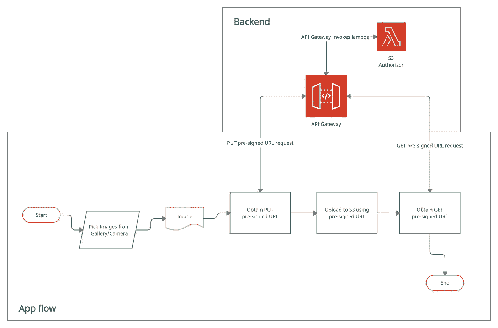

# 使用 React Native 中预先设计的 URL 将图像上传到 AWS S3

> 原文：<https://medium.com/geekculture/upload-images-to-aws-s3-using-presigned-url-in-react-native-45059fe3d31b?source=collection_archive---------2----------------------->

System Architecture

在这篇短文中，我将讨论如何使用预签名的 URL 将图像上传到 AWS S3。使用预先签名的 URL 是从 AWS S3 上传和获取图像的安全方式。它通过预先签名的 URL 授予用户对特定 S3 对象的临时访问权限，用户可以使用该 URL 读取或写入对象。

# 可选先决条件