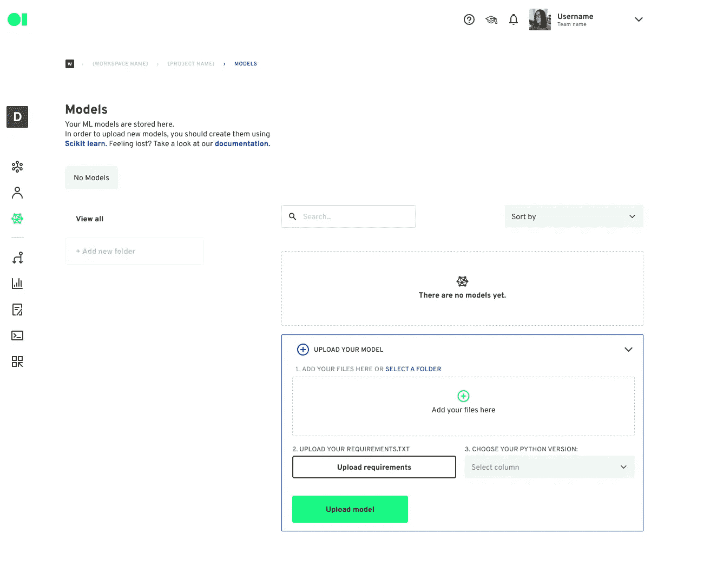
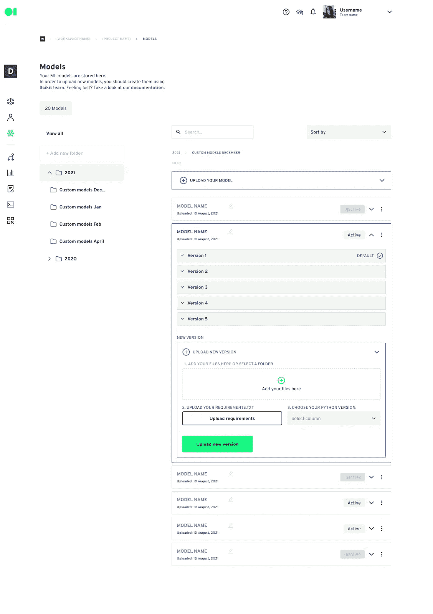
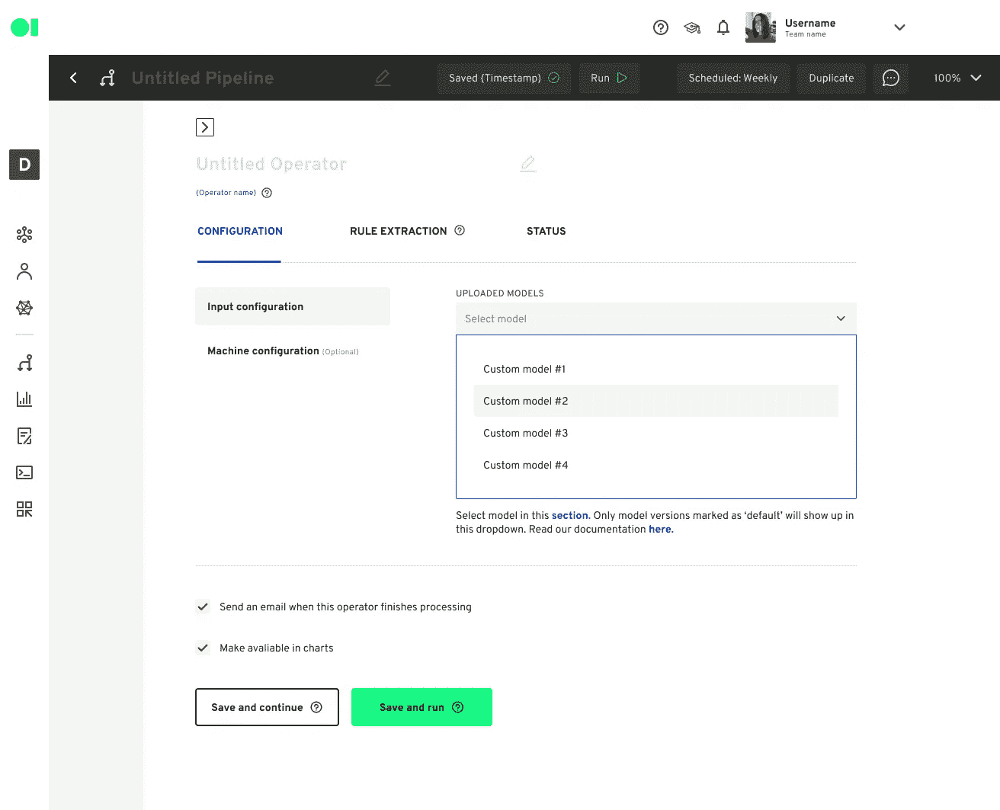
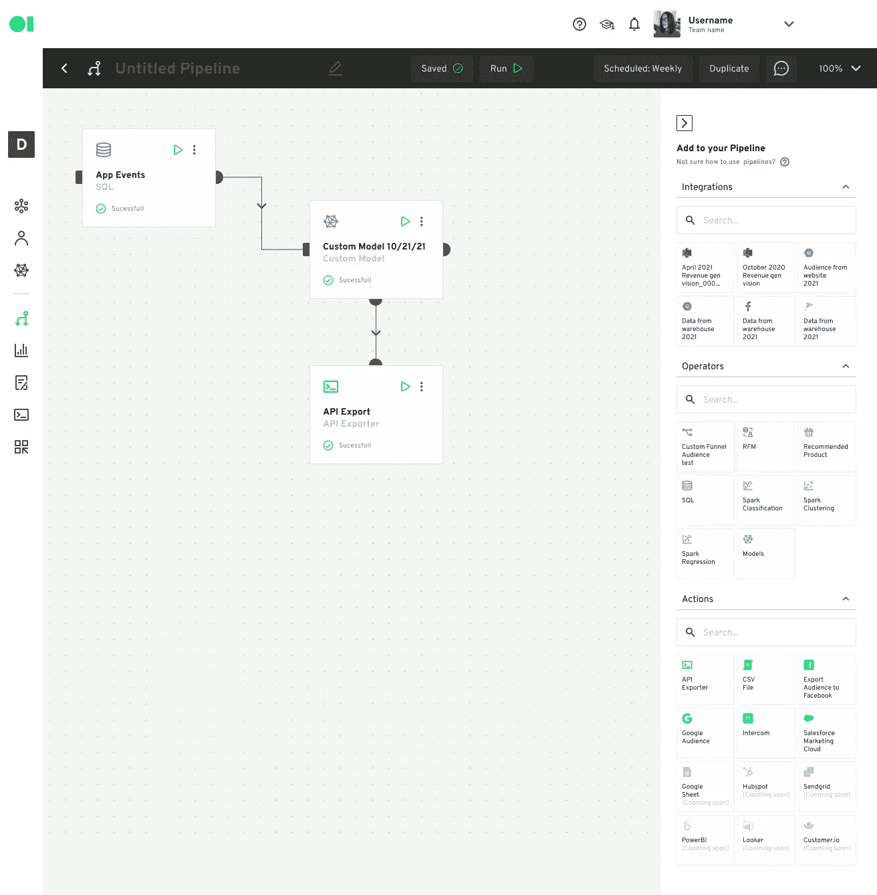

# 上传您的 ML 模型并以惊人的速度自动化工作流程。

> 原文：<https://medium.com/geekculture/upload-your-ml-model-and-automate-workflows-blazingly-fast-b43c84e1dac7?source=collection_archive---------28----------------------->

今天，我们很兴奋地宣布我们最期待的功能。模型上传允许数据科学家上传经过培训的 Scikit-Learn 模型，并自动化其工作流程，以快速将输出发送到业务应用程序。为什么这很重要？

据 TechRepublic 称，52%的数据专业人士表示，他们在展示数据科学对业务成果的影响方面遇到了困难，根据 Gartner.com 的数据，所有大数据项目中有一半都失败了。主要原因是难以将模型投入生产、安全性和组织。然而，事实证明，就机器学习工作流而言，建立模型只是旅程的开始。

借助我们新的模型上传功能，我们希望能够解决所有这三个挑战，并使数据专业人员证明价值变得非常简单。原因如下:

1.  将模型投入生产的困难:使用上传模型工具，数据科学家将只需要上传他们的模型，并选择业务方需要数据的特定业务应用程序。此外，数据科学家不必担心扩展机器、调度和开发 API。该过程将被自动管理。这种工具有望大大缩短生产时间，从几周缩短到几分钟。受益的不仅仅是只有 1 到 2 名数据科学家、没有 ML Ops 的小公司。此外，这也有利于大数据科学团队，因为他们通常在业务部门中有科学家，他们很难快速建立原型。
2.  组织:数据驱动型组织的主要挑战之一是缺乏协作。借助自动化工作流，Datagran 成为高效的 XOPs 工具，消除了运营团队和业务部门之间的孤岛，使他们能够控制模型输出如何影响其业务应用。
3.  安全性:Datagran 构建了一个生态系统，以前所未有的方式帮助组织保护其数据。从内部构建的 ELTs(提取负载转换),提供 SSL(安全套接字层)和密钥加密、数据治理仪表板、防止数据下载和上传到版本控制，以及关于如何使用数据和模型的治理。

以下是如何使用新模型上传功能的步骤:

1.  在本地训练模型中创建转储或管道转储。下面是一个代码示例。

certify = = 2018 . 10 . 15
chardet = = 3 . 0 . 4
Click = = 7.0
dash = = 0 . 30 . 0
dash-core-components = = 0 . 38 . 0
dash-html-components = = 0 . 13 . 2
dash-renderer = = 0 . 15 . 0
decorator = = 4 . 3 . 0
Flask = = 1 . 0 . 2
Flask-Compress = =

前往项目中的模型部分并上传您的模型。你需要上传一个. txt 文件，选择你的 python 版本和参数。

1.  将您的模型添加到项目中。

1.  走向管道，建立一个工作流程。拖放模型操作符，并将其连接到您的源或另一个操作符。在本例中，我们将它连接到一个 SQL 操作符。

然后，按“编辑”按钮选择您想要使用的型号和版本。按绿色按钮保存并运行它。

1.  连接另一个操作符以添加逻辑，或者拖放操作以将输出发送到业务应用程序。

‍

我们对 Datagran 将如何影响数据科学的未来感到非常兴奋，并希望获得您的反馈。我们的团队努力推出了这一新功能，我们期待听到您如何利用它。