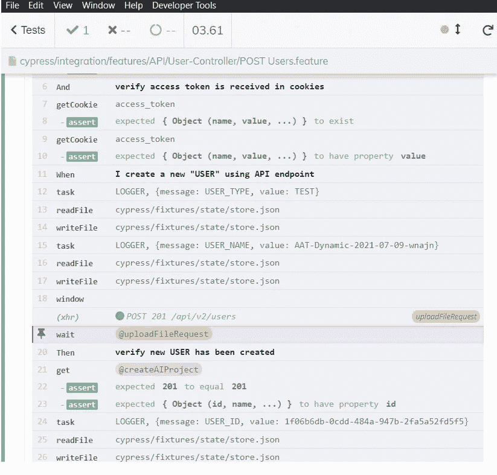

# 使用 API 上传 JSON 文件— Cypress.io [shorts]

> 原文：<https://medium.com/geekculture/uploading-a-json-file-using-api-cypress-io-shorts-578dade376d2?source=collection_archive---------16----------------------->

> 在这个名为 [#shorts](https://kushalbhalaik.xyz/tag/shorts/) 的新闻系列中，我将挖掘一些小而特殊的问题及其解决方案。你好！

我们都知道 cypress.io 是一个非常酷的自动化工具，可以很容易地自动化 web 应用程序的 API 和 UI 部分。Cypress 为其成功提供了一切，因为它提供了大部分开箱即用的东西；除了少数几件事之外，一个人必须处理的事情并不容易。

在这篇#short 中，我们将探索如何使用 cypress 自定义命令来处理一个简单的 JSON 文件上传。

问题:我们正在解决的问题是上传一个 JSON 文件，通过多部分/表单数据请求将表单数据传递给 API 端点。

解决方案:我们将从在**/cypress/support/command . js**中编写一个名为“ **uploadFile()** 的自定义 cypress 命令开始

> **uploadFile()** 接受 2 个参数；
> 
> url =我们必须上传文件的端点，formData =我们必须传递给端点的表单数据对象

使用 Cypress 别名创建和检索用户的示例 API 代码:

```
/**
 * This Command uploads a file to a given POST endpoint
 * 
 * @param {String} url - full URL of the upload endpoint
 * @param {String} formData - formaData to be passed as body to endpoint
 */
Cypress.Commands.add("uploadFile", (url, formData) => {
    return cy.server().route("POST", url).as("uploadFileRequest").window().then(window => {
        var xhr = new window.XMLHttpRequest();
        xhr.open("POST", url);
        xhr.send(formData);
    }).wait("[@uploadFileRequest](http://twitter.com/uploadFileRequest)");
});
```

上面的命令是使用 [**cy.server()**](https://docs.cypress.io/api/commands/server) 实现的(在撰写本文时，cypress v.7.7.0 现已弃用，将在以后的版本中移到插件中)。在这个命令中，我们使用 Javascript 窗口方法 [XMLHttpRequest()](https://developer.mozilla.org/en-US/docs/Web/API/XMLHttpRequest) 上传这个文件。

我们可以重复使用这个命令任意次，而不用一次又一次地重复这个代码。

编写代码:在下面的代码中，我们从 fixtures 中的 user.json 获取用户数据。

一旦我们有了用户数据，我们就使用[cypress . blob](https://docs.cypress.io/api/utilities/blob#Usage)***base64 stringtoblob()***方法将其转换为 blob(将 base64 字符串转换为 blob)。然后，我们使用这个创建的 blob，通过使用新的 file()创建一个新的 File 对象来构造一个文件。

之后，只需创建一个简单的表单数据对象，并将这个新形成的文件对象传递到“**内容**”表单数据参数中。

最后就是调用 *cy.uploadFile()* 并传递 requestURL 和 form-data。对此请求的响应存储在“@ **createANewUser** ”别名中。

编写创建表单数据的代码并将其传递给 **cy.uploadFile()**

```
cy.fixture('/test/requestPayloads/user.json', "binary").then(data => {
            const fileName = "user.json";
            const blob = Cypress.Blob.base64StringToBlob(btoa(JSON.stringify(data)), 'application/json');
            const file = new File([blob], fileName);
            const formData = new FormData();
            formData.set('name', "John");
            formData.set('description', "A new User named John");
            formData.set('id', generateRandomUUID());
            formData.set('citizenship', country.toUpperCase());
            formData.set('content', file);
            cy.uploadFile('/api/v2/user', formData).as('createANewUser');
  });
```



> 注意:
> **btoa(JSON . stringify(data))**需要先将二进制 **user.json** 数据串转换为 base64 编码。查看 [**此链接**](https://www.digitalocean.com/community/tutorials/how-to-encode-and-decode-strings-with-base64-in-javascript) 了解有关 base64 编码/解码的更多信息。

**编辑【2022】:**

在上面的文章中，我们使用现在已经废弃的 **cy.server()** 和 **cy.route()** 命令上传 JSON 文件；尽管他们将来会继续在 cypress 中作为一个插件工作，直到我们在 Cypress 控制台中看到一个反对的消息。

所以有一个 **cy.uploadFile()** 命令的替代实现:

```
/**
 * This Command uploads a file to a given POST endpoint
 *
 * @param {String} url - full URL of the upload endpoint
 * @param {String} formData - formaData to be passed as body to endpoint
 */
 Cypress.Commands.add("uploadFile", (url, formData) => {
	return cy.request({
	   method: 'POST',
	   url: url,
	   headers: {
		 'Content-Type': 'application/json'  
	   },
	   body: formData
	 }).as('uploadFileRequest')

})
```

现在，有时我们从这个注释中得到的响应可能不是普通的 JSON，也就是说，它可能包含[**Buffer**](https://developer.mozilla.org/en-US/docs/Web/JavaScript/Reference/Global_Objects/ArrayBuffer)**对象。**

**因此，我们可以使用下面的代码对此进行清理:
**将 Javascript ArrayBuffer 转换为 JSON 对象****

```
cy.get('@uploadFileRequest').then(async (res) => {

   //convert res.body ArrayBuffer to JSON object
   var jsonResponse = JSON.parse(String.fromCharCode.apply(null, new Uint8Array(res.body)))
   return jsonResponse;});
```

**那都是乡亲们！！**

***原帖*[*https:kushalbhalaik . XYZ/blog*](https://kushalbhalaik.xyz/blog/uploading-a-json-file-using-api-cypress-io/)**