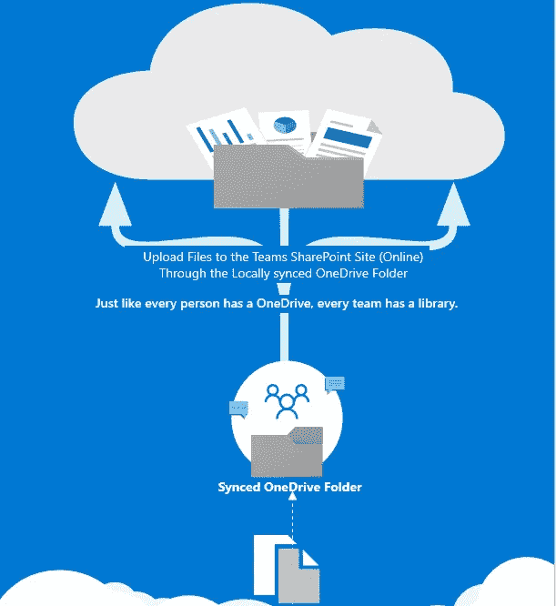
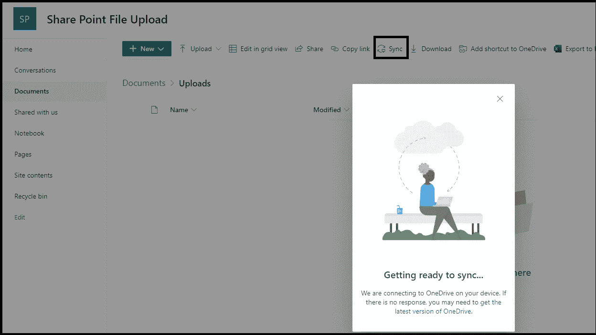
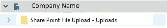
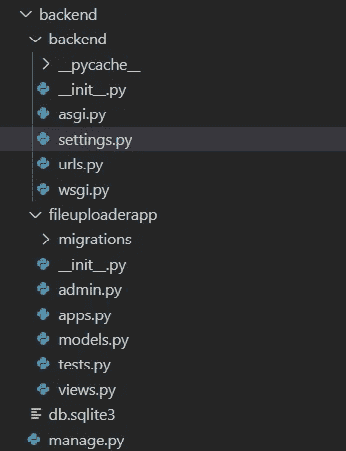
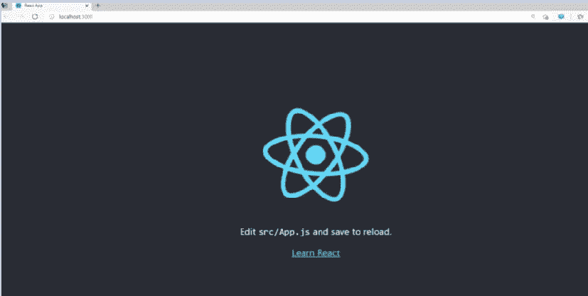
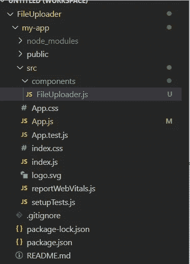
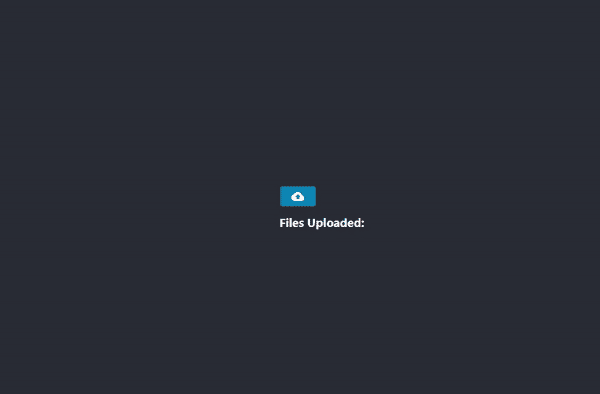
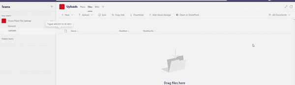
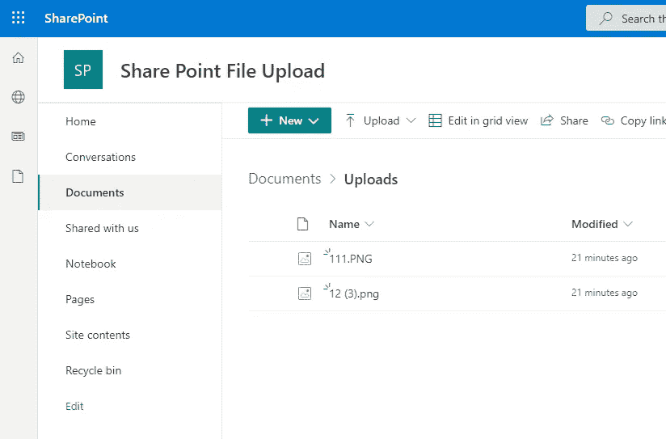

# 通过 React 将文件上传到 SharePoint 站点

> 原文：<https://medium.com/geekculture/uploading-files-to-sharepoint-site-via-react-django-rest-api-a-hack-186dd5390483?source=collection_archive---------15----------------------->



最近，我在做一个项目，需要将文件上传到微软团队的 SharePoint 文件夹中。要将文件上传到 SharePoint 文件夹，用户需要提供身份验证凭据以获得身份验证，并能够访问网站以上传文件。但是，不使用通过 REST API 传递凭证来上传的传统方法来实现相同类型的上传的方法是将 OneDrive 与团队的 SharePoint 位置同步的想法。

1.  **将团队的 SharePoint 网站与 OneDrive 同步:**

团队 SharePoint 站点可能意味着在本地创建一个存储库，即站点的文件和文件夹可以通过文件资源管理器进行管理。通过文件资源管理器执行的任何操作或更改都直接反映在团队站点中(因此，我们可以上传、删除或更改站点位置，而无需真正打开 SharePoint 位置进行记录)。这可以减轻我们的负担，因为我们不必每次都登录浏览器。

要同步网站，打开 share point 网站并点击位于
的同步按钮。考虑一下，我们有一个名为 **Share Point 文件上传**的团队，由两个**渠道组成:1 .通用& 2。上传**。通过单击
1 打开工作组的 SharePoint 网站。 **'…'** 2。**点击在 SharePoint 中打开
3。点击工具栏中的“同步”。**



**The Site Folder is Syncing**

这里的目的是将文件夹上传到**上传通道**，即**我们同步上传文件夹。**我们在文件浏览器中看到，上传通道的一个目录在**公司名称父目录下同步为:**



**Synced folder to the above SharePoint site**

现在，任何上传到此**分享点上传-上传**文件夹的文件将直接上传到站点文件夹。现在我们构建一个**应用程序(React + Django REST)** ，通过**“SharePoint 文件上传—上传”**文件夹将文件上传到 SharePoint 站点。

> **设置 Django REST 后端:**

1.  首先，需要创建一个虚拟环境，要创建虚拟环境请查看[这篇文章](https://andrewroblesdev.medium.com/creating-a-django-project-inside-a-virtual-environment-8e9b874e1a03)。创建一个文件夹 **my-app** ，即包含前端和 django 文件。
2.  在建立虚拟环境之后，我们需要安装其他依赖项。因此，接下来激活虚拟环境，pip 安装以下内容:

```
pip install django
pip install djangorestframework
pip install django-cors-headers
pip install djangorestframework-bulk
```

*我们启用* `***cors-headers***` *，因为我们通过不同的端口发送请求。我们导入* `***djangorestframework-bulk***` *来为将要创建的视图集注册路线。*

3.我们通过创建一个名为`**backend**` 的项目和一个名为`**fileuploaderapp**` 的 django 应用程序来创建 Django 项目，使用如下代码:

```
django-admin startproject backend
python manage.py startapp fileuploaderapp
```

创建应用程序后的文件夹结构如下所示:



现在，我们修改`**backend/settings.py**`,将创建的应用程序包含在项目中，并添加一些中间件和其他更改，如下所示:

在 settings.py 中，我们将媒体根目录映射到本地目录中另一个名为`DocumnetStore`的文件夹。上传的文件也在此存储中保存一份副本。

现在，我们通过创建一个`**ViewSet**` 来修改文件`**fileuploaderapp/views.py**`用于上传目的
**这里定义了 3 个方法:
1 .上传::** `**create**`该方法在用户提交要上传的文件时启动。在这种方法中，我们提供了 sharepoint 同步文件夹，在该文件夹中上传的文件等同于上传到实际 sharepoint 网站的文件。**2
。上传文件后立即删除::** `**delete**`此方法处理从 SharePoint 站点删除文件。当点击上传文件的**取消图标**时调用该方法。
**3。用于在上传摘要中打开上传的文件::**`**list**`File system storage 类是一个文件存储 API，用于处理本地文件系统中的基本文件存储。这从本地创建的`DocumentStore`中读取文件内容并返回作为响应，该动作被用户观察为:当上传的芯片被点击时，导致再次下载文件。

现在为我们的 API 定义一个端点，它将基于 API 调用的方法调用上面定义的视图集的方法。通过用相应的 URL 和路由模式注册已定义的视图集来定义端点。为此，在`**fileuploaderapp**` 文件夹中创建一个文件`**urls.py**` 。我已经将路由字符串命名为**‘upload’**，这将是 API 端点的一部分。创建的`**fileuploaderapp/urls.py**`，我们在其中定义了视图集的端点模式，看起来像:

我在项目文件夹(`**backend\urls.py**`)的 urls.py 中注册了 app ( `**fileuploaderapp**` ) url routes。打开`**backend\urls.py**` 并进行修改，使其最终看起来为:

现在，我们通过导航到后端文件夹运行 django 服务器:

`python manage.py runserver`

在 [http://127.0.0.1:8000/](http://127.0.0.1:8000/) 可以看到 django 服务器正在运行。

> **设置 React 前端:**

首先是 React 应用程序的设置。运行以下命令:

```
npx create-react-app my-app
cd my-app
npm start
```

在这个项目中主要使用了 [**React 材质的 UI**](https://material-ui.com/) 组件来构建 UI 元素。浏览`**localhost:8000**`，起始页看起来像左图，
然后在组件文件夹
中创建一个名为`**FileUploader.js**` 的组件 React App 的文件夹结构看起来像右图。



现在，安装构建应用程序所需的 npm 包，如 axios、material-ui/core、js-file-download、material-ui/icons、material-ui-dropzone(我已经提到了几乎所有的模块，但是在运行代码时，如果您发现任何模块未找到错误，请 npm 安装它，如果我错误地遗漏了任何模块)。

在创建的 FileUploader 组件中，我使用了来自`material-ui-dropzone`的`DropzoneDialog`，文件看起来像这样:

现在，将这个组件包含在项目文件夹的`App.js`中。然后`App.js`文件看起来像这样:

现在，在这之后，让我们通过命令`npm start`启动 React 应用程序，并浏览到 [React 应用程序](http://localhost:3000/)，发现您的应用程序成功运行。现在，我们看到，通过单击“上传”按钮，我们可以

1.  上传文件
2.  此外，我们一上传就可以删除它们
3.  打开上传的文件。

应用程序的工作可以通过以下方式证明:

**注意:在录制视频时，我没有暴露我的文件浏览器。但是一旦用户点击上传按钮，文件浏览器会自动打开，选择要上传的文件:**



**Uploading Files From the File Explorer(The File explorer wasn’t recorded to maintain the privacy of other files but on click of button the explorer opens)**

上传的文件(111.png，12.png)会上传到 Teams 文件夹:



**The Uploaded Files found in the Teams Folder**

当我们在 SharePoint online 浏览器中打开它时，它显示为:



**Files Uploaded to the SharePoint Cloud**

这种方法是对将文件上传到 SharePoint 站点的传统方法的一种攻击。希望这篇文章可以帮助寻找这种需求的人。

**注意:这里我使用了一个团队 SharePoint 文件夹的例子。但是，这种将文件夹同步到在线站点位置的方法可以适用于任何在线文件存储系统，如果它可以映射到本地的同步驱动器的话。**

**要直接从 GITHUB 克隆 App，可以访问我的资源库:** [***我的 GitHub 资源库***](https://github.com/SrinidhiKulkarni28/App-to-uplaod-File-to-SharePoint-site-via-Syncing-/tree/master)

**感谢读者耐心阅读本文。嗯…..这篇文章结果很长…但是我希望你喜欢它！**

**祝读者未来一切顺利！！不要忘记…学习！..微笑！..成长！重复！**