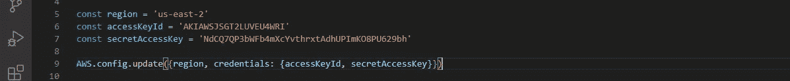
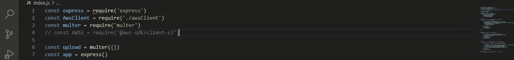
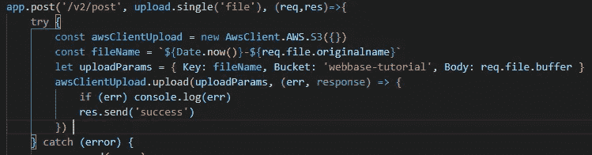
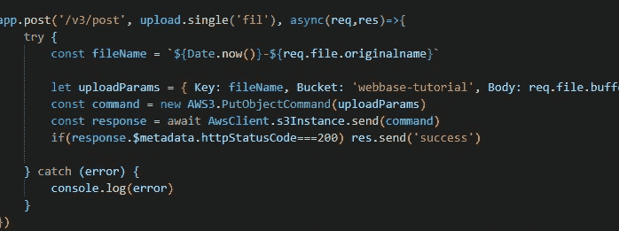

# 通过 AWS SDK 版本 2 和版本 3 从 Express 上传到 AWS S3

> 原文：<https://medium.com/geekculture/uploading-to-aws-s3-via-aws-sdk-version-2-and-version-3-from-express-38927787b705?source=collection_archive---------1----------------------->

有 3 种方式与 AWS 交互

1.通过 AWS 控制台

2.通过 AWS cli

3.通过 SDK

这篇文章解释了如何通过 SDK 从 express JS 上传对象到 S3 桶。AWS SDK for javascript 有两个版本，版本 2 和版本 3。

**第二版**

设置 express 服务器后，您将需要安装“aws-sdk”软件包以使用版本 2 SDK。要安装它，只需运行“ *npm install aws-sdk* ”。

安装后，创建一个文件，这个文件将存放 SDK 的配置。

首先在该文件中引入 AWS 包，然后通过调用 AWS.config.update()更新凭证。这个函数调用接受一个对象 *{region，credentials: {accessKeyId，secreteAccessKey}}*

This is what you are expected to have

> 注意:文件将作为表格数据发送到 express。Express 本身不能处理表单数据，而是必须安装一个“multer”包来启用 express 处理表单数据。然后，通过创建一个 const upload= multer({})来初始化 multer，这应该在索引文件的全局环境中完成，即不在任何路径中。

multer is initialized

之后，导出已配置的 AWS 对象。创建一个 index.js 文件，导入上面导入的 aws 配置，正常设置 express server，然后创建一个 route，在这个 route 中你要利用 multer 提供的中间件来处理文件。定义路由后，调用 upload.single('file ')。传递到 single 中的“file”是我们期望文件在表单中出现的字段的名称。因此，基本上,“文件”可以被重命名为任何名称，只要它与我们期望的表单数据中的文件字段相同。

在快速路由回调函数中，创建一个新的 const(姑且称之为 AwsUploadClient)并调用对象构造函数 ConfiguredAws。S3({})

创建一个有 3 个条目的新对象

> let upload params = { Key:req . file . original name，Bucket: 'Abucket '，Body: req.file.buffer }
> 
> 注意:req.file.originalname 和 req.file.buffer 是 multer 中间件提供给我们的。

现在我们将上面定义的 AwsUploadClient 常量称为 AwsUploadClient.upload()，

传入上传函数的第一个参数是上面定义的对象，第二个参数是接受错误和响应的回调函数。

callback function of the express route

这就是回调的样子，当然当你得到一个响应或者一个错误时，你可以做任何你想做的事情。

> 注意:版本 2 SDK 不支持承诺，因此您必须利用传统的回调

**第三版**

对于版本 3 SDK，您还必须通过 aws 安装一个包。在命令提示符下，您输入“npm i @aws-sdk/client-s3”

在如上所示的安装过程之后，您创建了一个 awsClient.js 文件。V3 sdk 的配置略有不同。与其直接配置 AWS 凭证，不如调用 AWS。S3Client({})，这将返回一个新对象，因为它是一个构造函数。在对象中传递给 S3Client 一个单独的对象，该对象将包含；1)将具有 accessKeyId、secretAccessKey 和 region 的凭证对象

config for v3 sdk

然后导出 S3 实例

注意:在这一点上，你应该有 multer，express 和一个路由设置。有关这方面的更多信息，请参考上文。

还要在索引文件中导入导出的 s3Instance。如上所述，创建一个 uploadparams 对象，它将包含 3 个条目:

1)密钥:这是密钥，即在你的对象中的文件上的文件名。我们可以使用 req . file . origin name，这是由 multer 中间件提供的。

2)存储桶:要上传到的存储桶

3) Body:这是你要上传的文件的缓冲区。在这种情况下，该文件将在 req.file.buffer 上可用

然后创建所谓的命令。要创建它，您必须从原始的“@aws-sdk/client-s3”引入“PutObjectCommand()”构造器，因此我们必须在索引文件中导入“@aws-sdk/client-s3”。uploadparams 也被传递到 PutObjectCommand 中。

由于版本 3 支持承诺，我们等待对 s3Instance.send(从 awsClient 文件导入的 s3Instance)的调用，然后传递给函数 call 命令

最后，你的路线应该是这样的

通过这种设置，您可以使用 postman 测试端点，方法是发送一个 post 请求，其中包含表单数据，预期字段包含 multer.single 中的文件(“文件”)。

你可以观看 youtube 上的视频来了解这一点；