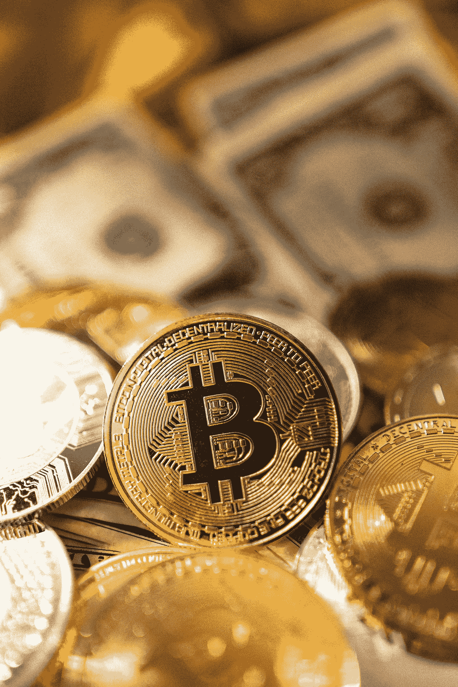

# 稳定的硬币是浪费时间

> 原文：<https://medium.com/geekculture/us-dollar-stable-coins-are-a-waste-of-time-87964d270ebd?source=collection_archive---------16----------------------->

## 或者他们是？

Photo by [Art Rachen](https://unsplash.com/@artrachen?utm_source=unsplash&utm_medium=referral&utm_content=creditCopyText) on [Unsplash](https://unsplash.com/images/things/money?utm_source=unsplash&utm_medium=referral&utm_content=creditCopyText)

大多数加密货币投资者认为比特币是货币的未来。

他们大谈通货膨胀，以及美元如何因为政府凭空印钱而不断贬值。确实如此。美国的流通货币比以往任何时候都多。