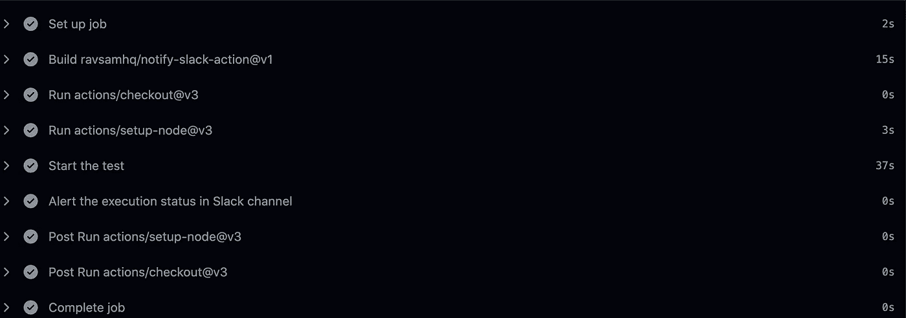

# 使用 Cypress 进行 API 测试！

> 原文：<https://medium.com/geekculture/use-cypress-for-api-testing-4ff74fec99e7?source=collection_archive---------8----------------------->

## 你需要自动化 API 测试？

## 基于真实世界应用的教程。


Photo by [Kate Townsend](https://unsplash.com/@k8townsend?utm_source=unsplash&utm_medium=referral&utm_content=creditCopyText) on [Unsplash](https://unsplash.com/s/photos/waiter?utm_source=unsplash&utm_medium=referral&utm_content=creditCopyText)

我在咨询一个后端应用程序。需求之一是对他们的端点进行自动化测试。因此，我有机会探索自动化 [API 测试](/technogise/journey-of-a-quality-analyst-2d78ddc44798#e258)的不同工具。以下是我选择赛普拉斯的原因，以及它是否成功。

## 为什么是柏树？

*   主要是因为[赛普拉斯有能力](https://learn.cypress.io/advanced-cypress-concepts/integration-and-api-tests)测试 API。
*   这已经在组织内部被用于功能 UI 测试。
*   Cypress 有一个支持性的社区和文档。
*   我们的愿景是，万一这个应用程序最终有了一个前端，我们可以利用相同的框架。

所以，让我们进一步深入细节。

## 发出 API 请求:

为此使用 *cy.request* 命令。

您可以在发出请求时指定各种属性:

*   *方法& url* 是必填项。
*   我已经在本文前面描述了可选的，如*retryOnStatusCodeFailure&failOnStatusCode*。
*   根据上下文，您可能有也可能没有*正文。*
*   要认证端点，有两种方法，要么使用 *auth* 要么使用*头。*举例:

```
headers: {'Authorization': `Bearer ${authToken}`}
OR
auth: {bearer: authToken}
```

## 断言:

是的，可以验证整个 JSON 响应体。

***Comparing JSON response body.***

Cypress 能够断言不同的数据点。以下是许多可用断言中的几个:

```
expect(response?.status).to.eq(403);
expect(response?.statusText).to.eq('Forbidden');
expect(response?.body).to.have.property(<value>).to.be.eq(<value>);
expect(response?.body).to.be.eq(<value>);
expect(response?.body).to.have.property(<value>).to.not.be.null;
expect(response?.body).to.have.property(<value>).to.not.be.empty;
expect(response?.body).to.have.property('metaData').to.have.property('count').to.equal(2);
expect(response?.body).to.have.property(<value>).to.have.length(2);
```

## 用于身份验证的自定义命令:

Cypress 鼓励为你的项目中的重复动作创建[自定义命令](/geekculture/integrate-puppeteer-as-a-plugin-in-cypress-1f0912d8e265)。身份验证就是这样一种候选方案:

**Fetching & storing auth token through an API call.**

注意: *writeFile* 命令可以创建一个不存在的新文件。

## 管道:

*   测试通过 Github Actions 在测试环境中对主分支每天运行一次。
*   Github Actions 的日志显示了详细的报告，就像您在 CLI 上看到的一样。考虑到这不是一个前端应用程序，没有必要的视频，截图或合并的 HTML 报告。

PS:要在失败时停止截图，您需要在 *index.ts 中添加以下内容:*

```
***Cypress***.Screenshot.defaults({
    screenshotOnRunFailure: false
})
```

*   我使用下面的命令来确保[锁文件](https://classic.yarnpkg.com/lang/en/docs/cli/install/)没有被更新。它还确保免受恶意用户的攻击。

```
yarn install --frozen-lockfile
```

*   我们使用缓存来节省反馈时间和账单:

```
- uses: actions/setup-node@v3
  with:
    node-version: '16.15.1'
    cache: 'yarn'
```

## 测试的性能:

我们在 27-63 秒内进行了 25 次测试，取决于所有相关兰姆达斯的温度。在管道上，额外的 20 秒用于设置。



Github Action timeline example.

我在寻找优化流水线准备时间的方法。
PS:还有一个评估不同社区插件的选项。

## 在不同环境下运行:

我们希望能够灵活地在任何环境下运行，如本地或开发环境。这可以通过创建一个类似于 *cypress.json* 的配置文件来实现。示例:一个 *dev-config.json* 文件:

```
{
  "projectId": <value>,
  "watchForFileChanges": false,
  "responseTimeout": 45000,
  "baseUrl": <value>,
  "reporter": "mochawesome",
  "reporterOptions": {
    "overwrite": false,
    "html": false,
    "json": true,
    "reportDir": "cypress/mochawesome-report"
  },
  "testFiles": "**/*.*",
  "env": {
    "parameter": <value>
  }
}
```

测试数据存在于实际环境中，它们的 id 会随着环境的变化而变化。这意味着我们需要一个可以修改所有测试数据值的地方。我们为此使用了上面提到的文件——你看到的*的 *env* 部分。*在*规格*文件中，我们通过名称导入并使用这些作为变量。

## **删除 API 集成测试:**

我们的是一个微服务(通过 API 调用)与其他一些创建的微服务进行通信。

这些测试成功地及时给出了正确的反馈。

我们意识到 API 集成测试和 Cypress 测试是重复的工作。与回报相比，编写集成测试的工作量更大——我们嘲笑所有需要的服务。这意味着如果其他服务在他们的代码中做了改变，我们将不能捕获问题。然而，Cypress 测试是在实际环境中使用所有服务的最新代码运行的。

因此，我们放弃了集成测试。

## 常见问题:

我们的微服务架构使用 AWS 基础设施，特别是***λ***。这意味着当测试运行时，我们的服务 ***可能不热*** 。***Cypress 是否足够健壮以避免这样的假阴性？是..***

为了确保这一点，我们可以在 cypress.json 中做一些调整:

```
"responseTimeout": 45000
```

我们也可以使用

```
retryOnStatusCodeFailure: true
```

同时通过 *cy.request* 调用我们的端点。

***它是否启动浏览器？没有*** ，它不会启动浏览器。

你可能已经注意到了上面片段中*[***然后***](https://docs.cypress.io/guides/core-concepts/variables-and-aliases#Closures) 的用法。下一个问题是 ***为什么 async / await 没有被使用*** ？这里有一点细微的差别:*

*   *这是 Cypress 方法链接，在这里重试前一个命令。*
*   *值得注意的是，在断言*中，不会重试*，但*会重试*。*
*   **那么*用于多个断言。其中有多个*期望*(参见上面的片段)。*

*交给你:与 Cypress 相比，你对 API 测试工具有什么看法？*