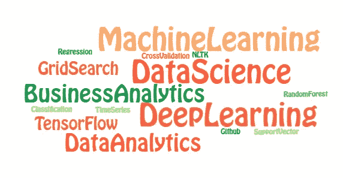
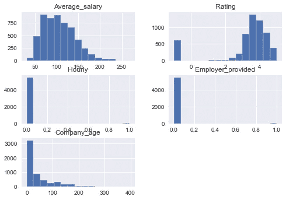
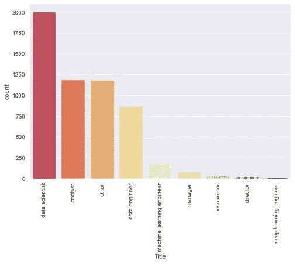
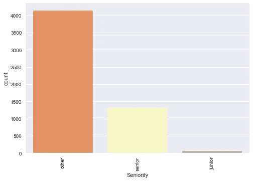
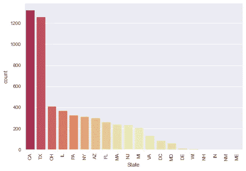
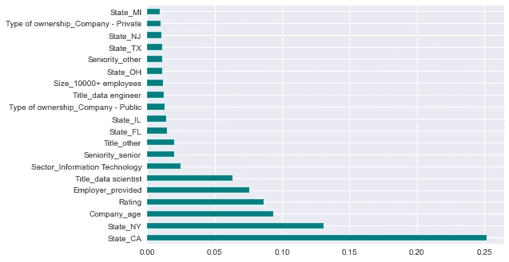

# 用数据科学来预测数据科学家的薪水

> 原文：<https://medium.com/geekculture/use-data-science-to-predict-data-scientists-earnings-641849c7270?source=collection_archive---------42----------------------->

# 前言

近年来，数据科学吸引了大量的注意力，这要归功于它所处理的迷人和前沿的话题以及更高的薪水。

有许多博客和 youtube 视频讨论数据科学领域和主题，但我没有注意到对数据科学家工资的那种关注。

在这篇文章中，我将回顾我开发的 RandomForestRegressor 模型，以预测数据科学家的工资，更重要的是，预测影响工资的因素。

# 动机

1.  数据科学家的工资可以预测吗？如果可以，有多准确？
2.  预测一个数据科学家的薪资，哪些特征很重要？
3.  另一个动机是想看看美国不同州发布的数据科学家职位的相对数量。
4.  哪些行业/部门薪资较高？

# 数据收集和数据清理

我决定通过 Python 中的 Selenium library 抓取 glassdoor.com 上最近发布的数据科学家职位，并将它们与 kaggle.com 上 2020 年的旧数据集相结合。

在美国不同的州总共有大约 5500 个职位。

合并的数据必须被清理和重组。此外，从原始数据中提取了一些特征，并作为新列添加到最终数据框中。整个过程详细解释在相应的 Github 库[这里](https://github.com/amirostad/Web_scraping_jobs)中。

# 探索性数据分析

在这里，我将查看一些为 EDA 创建的图表。对于更广泛和技术性的 EDA，请参考这个项目的 Github 库[这里](https://github.com/amirostad/Web_scraping_jobs)。

## 数字特征和响应变量:

在下图中，显示了数字特征和响应变量(Average_salary)的分布。

可以看出，平均工资分布接近正态分布，但向左倾斜。此外，工资数字除以 1000，以美元为单位。

## 职位头衔有哪些？

大多数发布的职位是“数据科学家”和“分析师”，如下图所示。

Number of open positions for different job titles

## 这些职位是初级还是高级？

大部分职位的资历级别不详。还有，高级职位比初级多。

Seniority level of open positions

## 空缺职位在哪里？

下图显示，该数据集中大多数未结职位位于加利福尼亚州和德克萨斯州。

Number of open positions in different states

## 哪些行业提供的开放岗位比较多？

下图显示了哪些行业正在雇佣数据科学家。请注意，plot 中的“-1”表示“未知”。

Open positions for data scientists in different industries

在相应的 Github 库中有更广泛的 EDA。

# 模型开发和性能

为了预测数据科学家的工资，开发了一个 RandomForestRegressor 模型，并使用 GridSearchCV 进行了微调。更多细节和代码请参考 Github 库[这里](https://github.com/amirostad/Web_scraping_jobs)。

该模型的性能通过如下所述的 3 个不同指标进行衡量:

*   平均绝对误差= 22.40
*   均方根误差= 28.72
*   R2 分数= 0.40

## 功能重要性:

通过使用 GridSearchCV 提取最佳拟合模型，影响数据科学家工资的前 20 个特征如下图所示。

Feature importance: which features impact data scientists’ salaries more

上图中的前 20 个特征是:

1.  State_CA:如果职位位于加利福尼亚，则该特征等于 1，对于其他位置，该特征等于 0
2.  State_NY:如果职位位于纽约，此特征等于 1，对于其它位置，此特征等于 0
3.  Company_age:发布职位的公司有多长时间了
4.  评级:公司在 glassdoor 上的评级
5.  雇主提供的:如果职位的薪金数据由雇主提供，则此功能等于 1，否则等于 0
6.  Title_data scientist:如果职位名称包含“数据科学家”，则该特征等于 1
7.  部门 _ 信息技术:如果公司在“信息技术”部门运营，此特征等于 1
8.  资历 _ 高级:如果职位是高级职位，该特征等于 1
9.  Title_other:如果职位在数据科学领域，但确切的头衔未知，则该特征等于 1
10.  State_FL:如果位置位于佛罗里达州，此特征等于 1，对于其他位置，此特征等于 0
11.  State_IL:如果位置位于伊利诺伊州，则该特征等于 1，对于其他位置，该特征等于 0
12.  所有权类型 _ 公司-上市公司:如果公司是上市公司，此特征等于 1
13.  Title_data engineer:如果职位名称中包含“数据工程师”，则该特性等于 1
14.  Size_10000+ employees:如果公司拥有超过 10，000 名员工，则该特性等于 1
15.  State_OH:如果职位位于俄亥俄州，此特征等于 1，对于其他位置，此特征等于 0
16.  资历 _ 其他:如果职位的资历级别没有明确提到“高级”或“低级”，则此功能等于 1
17.  State_NJ:如果职位位于新泽西州，则该特征等于 1，对于其他位置，该特征等于 0
18.  所有权类型 _ 公司-私有:如果公司是私有的，此特征等于 1
19.  State_MI:如果位置位于密歇根州，则该特征等于 1，对于其他位置，该特征等于 0
20.  Size_51 到 200 名员工:如果公司有 51 到 200 名员工，则该特征等于 1

# 结论

如上所示，最重要的特性是 State_CA、State_NY、Company_age 等等。因此，可以说，根据这一模型，数据科学家分别在加利福尼亚州、纽约州和佛罗里达州的薪酬更高。

此外，公司的评级是数据科学家薪酬的一个重要因素。

此外，根据上图，“信息技术”是数据科学家薪酬最高的行业。

从上面的图表中可以看出，大公司比小公司支付更高的薪水。

值得注意的是，这些结果纯粹基于 glassdoor 收集的数据，也没有考虑不同州的人均收入、支出和工作的中位数。因此，需要考虑这一分析的结果和其他因素，以便更彻底地比较不同地点的数据科学家的生活条件。

# Github 知识库

请参考 [Github 库](https://github.com/amirostad/Web_scraping_jobs)以获得更多技术和详细的解释。

谢谢你。