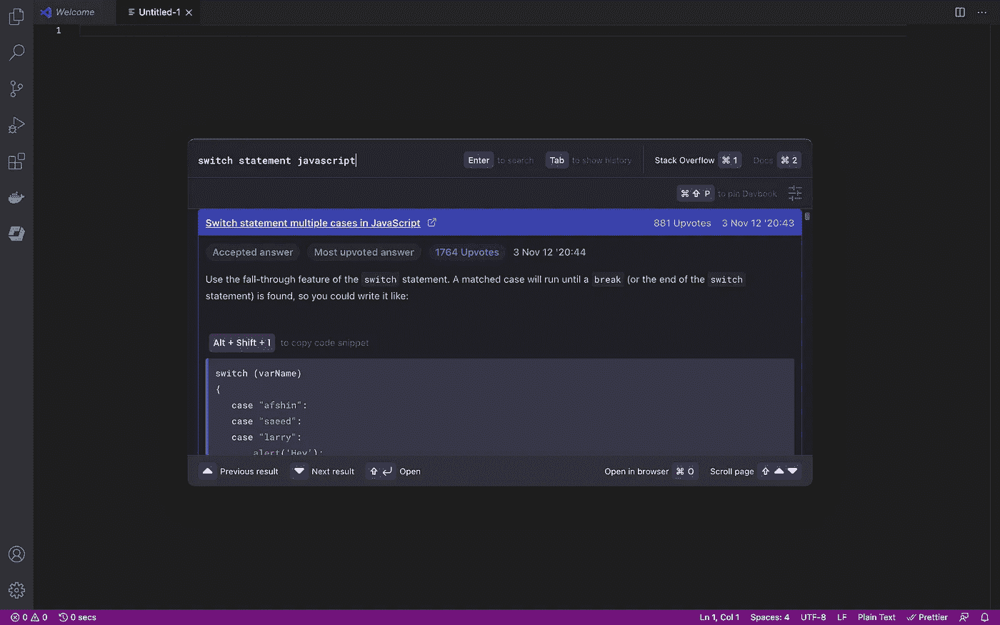
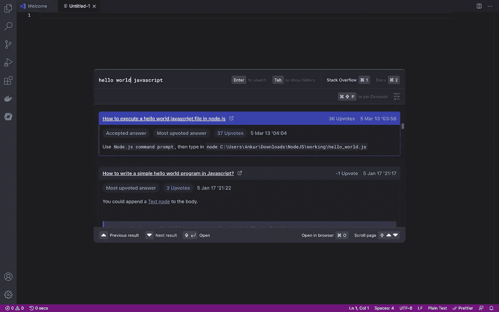
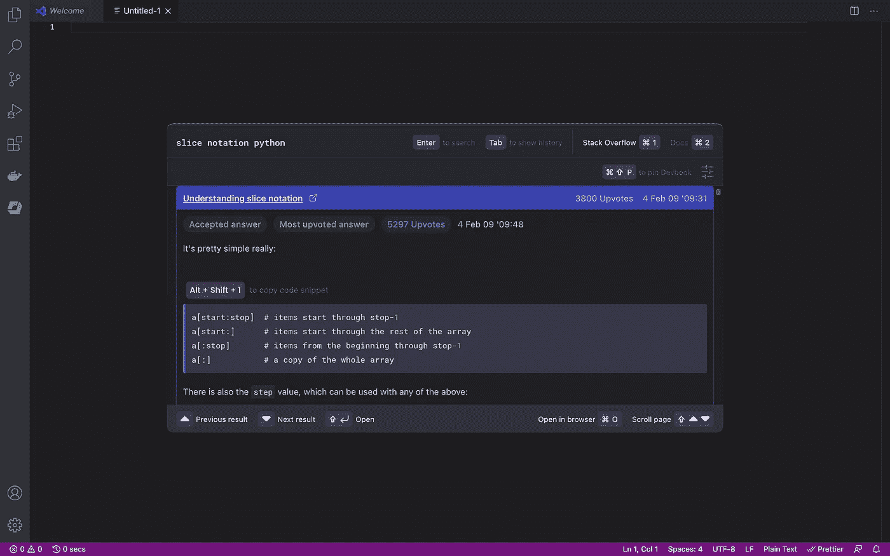

# 使用 Devbook 回答编程问题，无需离开编辑器

> 原文：<https://medium.com/geekculture/use-devbook-to-answer-programming-questions-without-leaving-your-editor-851177a5cb0e?source=collection_archive---------32----------------------->

# 问题是

作为开发人员，我们经常发现自己为了解决问题而在 web 上查找信息。记不住 JavaScript 开关语法？需要一种更有效的连接 API 的方式？为什么你的 C++代码不能编译？所有这些问题在网上都有答案，通常只有一个文档或 StackOverflow 搜索。

然而，这种搜索意味着我们必须离开我们的编辑器才能找到答案，这降低了我们从编辑器流程切换到搜索流程的效率。离开编辑器意味着我们不仅要花时间打开和加载浏览器或将我们的注意力转移到另一个屏幕上，而且还会停止我们对一个任务的思路，在精神上切换到另一个任务。

这种从一个程序到另一个程序的转变意味着我们需要重新评估我们面前的屏幕，改变我们的精神状态来识别浏览器的不同布局、图标和风格，而不是我们的编辑器。所有这一切的最终结果是，在编辑器和浏览器之间的切换打破了开发流程状态，结果降低了我们的生产力。

# 解决方案

现在，由于有了 [Devbook](https://usedevbook.com/) ，我们可以在不离开编辑器的情况下执行我们的文档和栈溢出搜索，事实上，甚至不需要使用鼠标。整个过程可以通过键盘命令单独控制，这意味着高级用户会喜欢这个新工具。

Devbook 充当编辑器的内部搜索引擎，搜索你所使用的语言的官方文档，并检查 StackOverflow 寻找答案。有了 Windows、macOS 和 Linux 的选项，不管你偏好什么操作系统，都应该有 Devbook 的味道。

A Hello World example of Devbook

Devbook 作为一个独立的程序，你可以通过一个简单的键盘快捷键在你的编辑器上聚焦。这意味着无论您使用什么代码编辑器，Devbook 都将为您提供快速、便捷的访问。

安装完成后，您可以输入您的搜索查询，并可以检查 StackOverflow 结果或官方文档(尽管后者需要注册一个 Devbook 帐户)。

Python Slice Notation

然后可以使用鼠标或键盘命令来浏览这些结果。您甚至可以一次复制整个代码片段，而无需突出显示！需要更深入地了解 StackOverflow 上的结果吗？有一个键盘快捷键可以在你的浏览器中打开它，直接进入相关页面，减少浪费的时间。

# 结论

虽然有时间和地方可以后退并离开代码编辑器，但也有时候你不想中断你的流程并切换到浏览器。呆在编辑器中，使用键盘命令来完成工作流程会使事情变得容易得多，而且在试图找到解决方案时，也不太可能出现不和谐的白屏。

Devbook 让许多操作系统的开发人员可以轻松地在 StackOverflow 或文档中快速无缝地搜索答案，甚至不需要从键盘上抬起手，这肯定会提高您的工作效率。

# 资源

*   [Devbook 网站](https://usedevbook.com/)
*   [Devbook 不和](https://discord.com/invite/ypuZfadw8H)