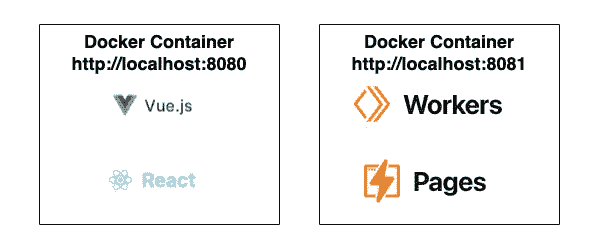

# 将 Docker 用于 Cloudflare 页面和 Workers 开发

> 原文：<https://medium.com/geekculture/use-docker-for-cloudflare-pages-and-workers-development-d0fa5acbb260?source=collection_archive---------4----------------------->

## 改善本地开发，同时保护您的系统

Example of how to do local development with Docker

大约几年前，Cloudflare 推出了一种新型的无服务器产品。他们的无服务器解决方案允许我们在边缘部署无服务器功能，并托管由快速内容交付网络(CDN)提供服务的无服务器网站。

# 什么是无服务器…