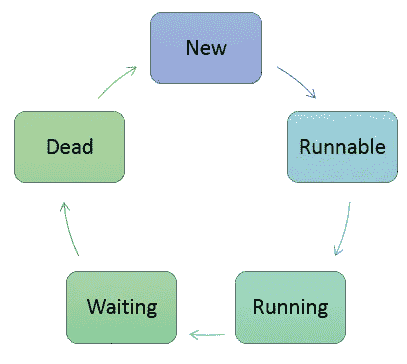

# 通过多线程使用 FutureTask 和 Callable 来提高 Java 应用程序的性能

> 原文：<https://medium.com/geekculture/use-futuretask-and-callable-with-multithreading-to-boost-your-java-application-performance-47a8fc6cf8a5?source=collection_archive---------2----------------------->

Multithreading Lifecycle

这里我有一个示例 **Spring Boot Web** 应用程序来获取用户信息。基本上有三个等级的**很重要:**

【UserController.java 

这是一个 RestController 类，它有一个带有 request param“userId”的 rest 端点“/GetUserInfo”。这将返回的用户信息…