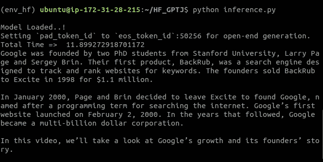

# 使用 GPT-J 60 亿参数模型与拥抱脸

> 原文：<https://medium.com/geekculture/use-gpt-j-6-billion-parameters-model-with-huggingface-2ea30e151003?source=collection_archive---------24----------------------->


为了寻求复制 OpenAI 的 GPT-3 模型，EleutherAI 的研究人员已经发布了强大的语言模型。在 GPT-近地天体之后，最新的一个是 GPT-J，它有 60 亿个参数，与类似大小的 GPT-3 模型相比，它的工作性能相当。

在零短学习方面，GPT-J 的性能被认为是与其他开源语言模型相比最好的。

由于它是在大型编码文本语料库(来自 GitHub 和 StackExchange)上训练的，GPT-J 在编写代码方面的性能优于 GPT-3。

GPT-J 6B 的[演示早些时候由艾勒瑟·艾提供。由于它是开源的，我们可以下载模型并在我们自己的服务器上运行。](https://6b.eleuther.ai/)

使用 https://github.com/kingoflolz/mesh-transformer-jax/的 T4，我们可以在我们的服务器上运行 GPT-J，我们计划发布相同的 docker 容器，这样任何人都可以下载容器并在他们的服务器上运行。

但我们一直在等待 GPT-J 被包含在 Huggingface 回购中，以便我们可以通过 Huggingface 直接使用它。

等待终于结束了！Huggingface 终于在回购中加入了 GPT J 模型。我们已经试过了，结果令人印象深刻。

从[https://huggingface.co/EleutherAI/gpt-j-6B](https://huggingface.co/EleutherAI/gpt-j-6B)可以进入拥抱脸 GPT-J 模型。

在我们的实验中，我们试图在有和没有 GPU 的情况下运行它。Huggingface 使模型的使用变得非常容易。让我们带您了解如何在您自己的服务器上运行它。

# GPT-J 带 CPU(不带 GPU)

如果你在没有 GPU 的情况下运行 GPT-J，那么你将需要一个大约 50 GB 内存的系统。

一旦系统安装了所需的 RAM、python 和 virtualenv 库，请遵循以下步骤:

1.创建和激活虚拟环境

```
virtualenv env_cpu --python=python3 
source env_cpu/bin/activate
```

2.克隆和设置变压器存储库

```
git clone https://github.com/huggingface/transformers 
cd transformers 
pip install .
```

3.安装火炬

```
pip3 install torch==1.9.0+cpu torchvision==0.10.0+cpu torchaudio==0.9.0 -f [https://download.pytorch.org/whl/torch_stable.html](https://download.pytorch.org/whl/torch_stable.html)
```

4.现在创建一个 python 文件并粘贴下面的代码块。

```
from transformers import AutoTokenizer, AutoModelForCausalLM
import timetokenizer = AutoTokenizer.from_pretrained("gpt2")
model = AutoModelForCausalLM.from_pretrained("EleutherAI/gpt-j-6B")print("Model Loaded..!")start_time = time.time()input_text = "Google was founded by"
inputs = tokenizer(input_text, return_tensors="pt")
input_ids = inputs["input_ids"]output = model.generate(
input_ids,
attention_mask=inputs["attention_mask"],
do_sample=True,
max_length=150,
temperature=0.8,
use_cache=True,
top_p=0.9
)end_time = time.time() - start_time
print("Total Taken => ",end_time)
print(tokenizer.decode(output[0]))
```

5.就是这样！运行 python 文件，您将获得输出。


# 带 GPU 的 GPT J

我们在 AWS EC2 实例上使用了 T4 GPU。使用 GPU 时，系统所需的 RAM 大约为 38GB。

在使用 GPU 时，主要的区别是我们必须用 CUDA 安装 torch 并在代码中使用它。

遵循“带 CPU 的 GPT-J”中提供的前两步，然后

3.用 CUDA 安装火炬

```
pip3 install torch==1.9.0+cu111 torchvision==0.10.0+cu111 torchaudio==0.9.0 -f [https://download.pytorch.org/whl/torch_stable.html](https://download.pytorch.org/whl/torch_stable.html)
```

注意:从这里根据你的平台安装兼容的 torch 版本[https://pytorch.org/](https://pytorch.org/)

4.创建一个 python 文件并粘贴下面的代码块。

```
from transformers import AutoTokenizer, GPTJForCausalLM
import time

tokenizer = AutoTokenizer.from_pretrained("gpt2")
model =  GPTJForCausalLM.from_pretrained("EleutherAI/gpt-j-6B", torch_dtype=torch.float16).to("cuda")

print("Model Loaded..!")

start_time = time.time()

input_text = "Google was founded by"

inputs = tokenizer(input_text, return_tensors="pt")
input_ids = inputs["input_ids"].to("cuda")

output = model.generate(
   input_ids,
   attention_mask=inputs["attention_mask"].to("cuda"),
   do_sample=True,
   max_length=150,
   temperature=0.8,
   use_cache=True,
   top_p=0.9
)

end_time = time.time() - start_time
print("Total Time => ",end_time)
print(tokenizer.decode(output[0]))
```

5.运行该文件，您将获得由 GPT-J 生成的输出文本



# 多 GPU 支持

在上面的例子中，我们使用了一个 T4 GPU。如果您想要使用多个 GPU，那么您可以将其添加到您的系统中，然后在代码中进行以下更改，以便该模型将利用系统上可用的多个 GPU。

```
from transformers import AutoTokenizer, GPTJForCausalLM

tokenizer = AutoTokenizer.from_pretrained("gpt2")
model = GPTJForCausalLM.from_pretrained("EleutherAI/gpt-j-6B")
model.parallelize()
```

正如我们所看到的，我们只需要在代码中添加“model.parallelize()”。

去试试吧，在你自己的服务器上运行 GPT-J！如果你面临任何困难，请在评论中告诉我们。

我们提供[自然语言处理](https://www.pragnakalp.com/services/natural-language-processing-services/)咨询服务。请务必在 letstalk@pragnakalp.com[与我们联系任何与 GPT-J、GPT-3、BERT 或 NLP 相关的项目。](mailto:letstalk@pragnakalp.com)

*最初发布于 2021 年 9 月 3 日* [*使用 GPT-J 60 亿参数模型与 Huggingface*](https://www.pragnakalp.com/gpt-j-6b-parameters-model-huggingface/) *。*