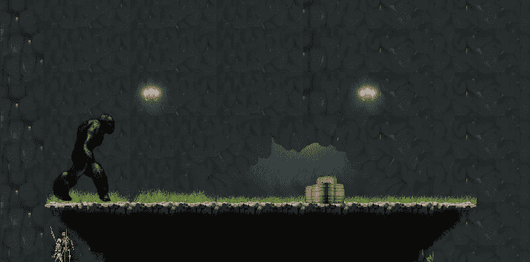
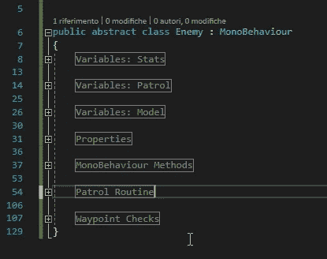
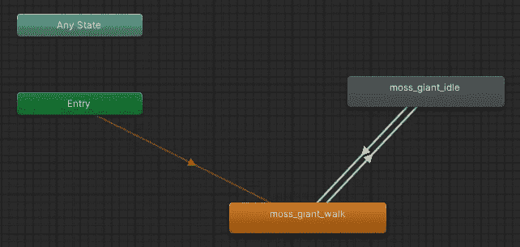
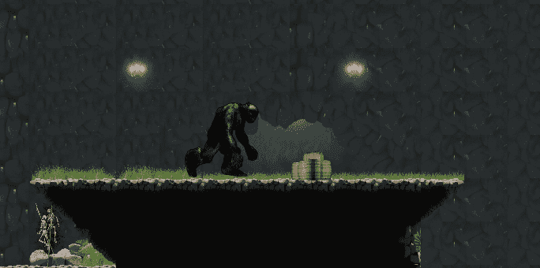

# 在敌方行为脚本中使用继承概念

> 原文：<https://medium.com/geekculture/use-inheritance-concepts-in-enemy-behaviour-scripting-16acea09b3c9?source=collection_archive---------18----------------------->



**目标**:将继承概念应用到敌方行为脚本中

在这篇文章中，我将向你展示我如何将**继承**应用到敌人行为的脚本中。

让我们跳过我创建和动画敌人模型的部分。没意思。让我们深入研究代码。



为了保持脚本的整洁，我使用了预处理指令符号#来创建**区域**:

```
#region myregion
//code
#endregion
```

敌人将会是一个抽象的类并且会有:

1.  统计数据——如速度等。
2.  **巡视变量** —需要对其巡视行为进行编码
3.  **模型变量** —需要访问 sprite 和 animator
4.  **属性**
5.  **常用方法** —如启动和更新
6.  **巡视逻辑**
7.  **巡逻公用设施**

抽象类不能有实例。唯一的方法是定义扩展抽象类的非抽象类:它们可以有实例。

在父子关系中，最好记住访问修饰符关键字的含义

*   私人的:只能从班级内部进入，甚至连孩子都不允许进入
*   **public** :可从类外访问:孩子和不相关的类都可以访问
*   **受保护的**:可从类内部和派生类中访问

## 常用方法

这里重要的是`abstract`和`virtual`方法关键字的使用。

**抽象**用于只有一个方法签名:它将由扩展类来实现逻辑，被迫这样做。

**另一方面，虚拟的**用于定义方法中的基本行为，并允许子类覆盖它:没有这个关键字的方法不能在子类中被**覆盖**。

Update 没有基本行为，它留给了子类，Start 用于初始化我们需要的东西。

## 巡逻

这个特性的核心逻辑摘自我为一个[移动平台特性](https://danio-quero.medium.com/moving-platform-abb47d7a07ca)写的另一篇文章。

这种行为，分解成它的成分，无非是:

1.  检查当前位置是否等于当前目标航路点的位置
2.  如果是，检查该航路点是第一个还是最后一个→在空闲模式下等待一段时间
3.  如果没有，等待一段时间，但只有在该选项启用时(在每个中间航路点等待)
4.  最后，设定新的目标
5.  移动到目标

patrol 方法是受保护的，所以子类可以从 update 方法或协程中调用它。

## 闲置的

空闲的协程被认为能够**暂停巡逻**，即使是从一个不可能让步的更新方法。

为了暂停巡逻，速度被设置为零，然后在一段时间后恢复。空闲动画从这里开始播放，是敌人的**行走动画****默认**状态。



## 活动

通过**move forward**方法执行移动，要求当前位置、目标位置和最小步长。后者可能与速度有关。

> 别误会我的意思！

这里我们也检查我们是否需要翻转精灵。有一个速度检查，但没有得到它的迹象！我们正在检查敌人是在移动(速度> 0)还是在闲置(速度= 0):精灵只有在行走状态下才需要翻转！

## 下一个目标

当在第一个路点时，路点列表必须以自然顺序行走。当到达最后一个航路点时，顺序相反。

## 翻转精灵

Flip 是 SpriteRender 组件中的一个布尔值。如果敌人从右向左移动，也就是说，如果目标的当前位置在右边，我们必须翻转精灵。

## 其他检查

可以参考[移动平台](https://danio-quero.medium.com/moving-platform-abb47d7a07ca)文章或者[我的 git hub repo](https://github.com/daniele-quero/dungeon-escape) 。

## 继承卑鄙的行为

苔藓巨人延伸敌人，会**继承**一堆东西。它必须实现 Update 方法的逻辑，它将调用 patrol 例程。它**覆盖了**start 方法，并且(目前)只调用基本实现。

从那里我们有一个开放的道路，以具体的脚本的苔藓巨人，这将是不同于任何其他敌人，除了继承的代码！

## 诱人的结果



如果你喜欢这篇文章，请鼓掌并分享！
也看看我的其他游戏或者我的支持页面！

[](https://danioquero.itch.io/)[](https://ko-fi.com/danioquero)