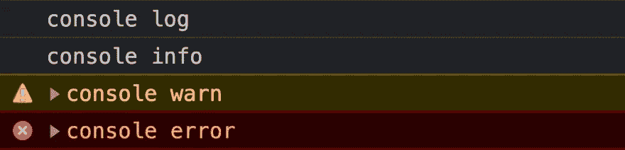
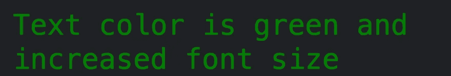
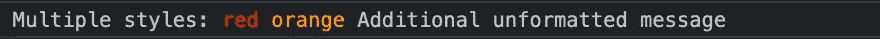
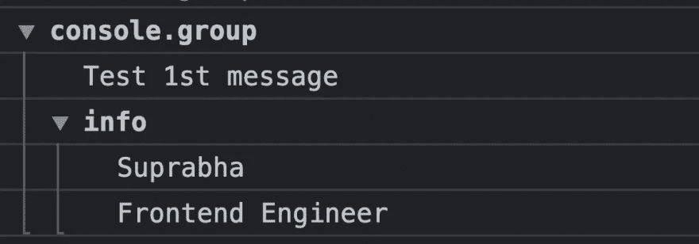
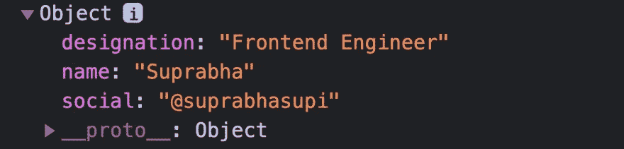
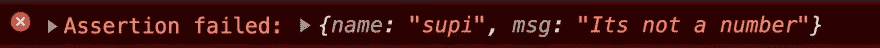
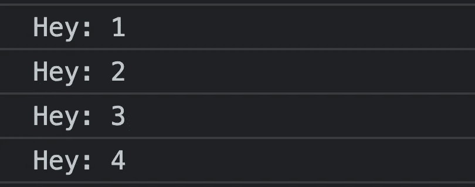
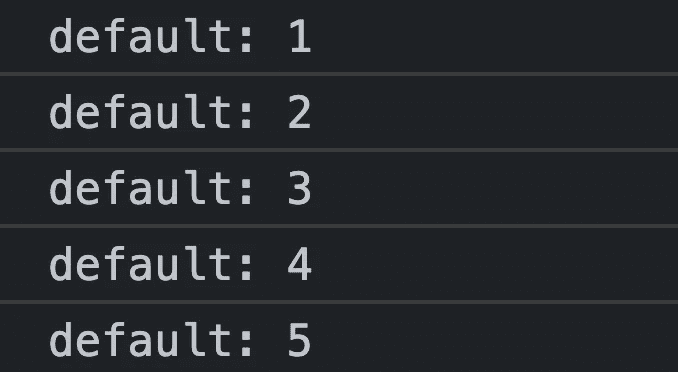
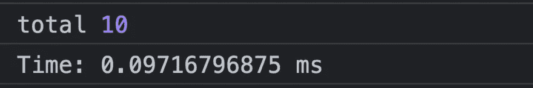

# 像 Pro 一样使用 JavaScript 控制台

> 原文：<https://medium.com/geekculture/use-javascript-console-like-pro-671c0dcbe239?source=collection_archive---------17----------------------->


每个 JavaScript 开发者都用过“console.log("message ")”。

它提供了一个简单的调试控制台，类似于 web 浏览器提供的 JavaScript 控制台机制。

在这篇文章中，我们将讨论每个人都应该开始使用的大多数控制台方法。

以下所有方法在全局实例控制台中都可用，因此不需要控制台模块。

# 默认值:console . log()| info()| debug()| warn()| error()🔥

这些控制台将根据提供给它们的事件类型，用适当的颜色直接打印原始字符串。

```
console.log("console log")
console.info("console info")
console.debug("console debug")
console.warn("console warn")
console.error("console error")
```



# 样式控制台输出👻

您可以使用%c 指令将 CSS 样式应用于控制台输出

```
console.log("%cText color is green and increased font size", "color: green; font-size: 2rem;")
```



我们可以多次添加%c。

```
console.log("Multiple styles: %cred %corange", "color: red", "color: orange", "Additional unformatted message");
```



# 1.console.table()

**console.table ( )** 允许我们在控制台中生成一个表格。输入必须是一个数组或一个将显示为表格的对象。

```
let info = [["Suprabha"], ["Frontend Dev"], ["Javascript"]]
console.table(info)
```


# 2.console . group(" group ")& console . groupend(" group ")

为了组织控制台，让我们使用 console . group()& console . groupend()。

使用控制台组，您的控制台日志被分组在一起，而每个分组在层次结构中创建另一个级别。调用 groupEnd 减一。

```
console.group()
    console.log("Test 1st message")
    console.group("info")
        console.log("Suprabha")
        console.log("Frontend Engineer")
    console.groupEnd()
console.groupEnd()
```



# 3.console.dir()

打印指定对象的 JSON 表示。

```
let info = {
    "name": "Suprabha", 
    "designation": "Frontend Engineer",
    "social": "@suprabhasupi"    
}
console.dir(info)
```



# 4.console.assert()

如果第一个参数为 false，则记录一条消息并将跟踪堆栈到控制台。

它只会打印错误的参数。如果第一个论点是真的，它什么也不做。

```
console.assert(false, "Log me!")
```

示例:

```
let name = "supi"
let msg = "Its not a number"
console.assert(typeof msg === "number", {name: name, msg: msg})
```



# 5.console.count()

这个函数记录了这个对`count()`的特定调用被调用的次数。这个函数有一个可选参数`label`。

如果提供了`label`，这个函数记录这个特定的`label`调用`count()`的次数。

```
console.count("Hey")
console.count("Hey")
console.count("Hey")
console.count("Hey")
```



如果省略了`label`，该函数将记录在该特定行调用`count()`的次数

```
for (let i = 0; i < 5; i++) {
    console.count()
}
```



# 6.console.time()和 console.timeEnd()

检查代码在执行时的性能

console.time()是跟踪 JavaScript 执行所用微时间的更好方法。

```
console.time("Time")
let l = 0;
for (let i = 0; i < 5; i++) {
   l += i
}
console.log("total", l)
console.timeEnd("Time")
```



# 参考🧐

*   [MDN 文件控制台](https://developer.mozilla.org/en-US/docs/Web/API/Console)

🌟[推特](https://twitter.com/suprabhasupi)👩🏻‍💻 [suprabha.me](https://www.suprabha.me/) 🌟 [Instagram](https://www.instagram.com/suprabhasupi/)