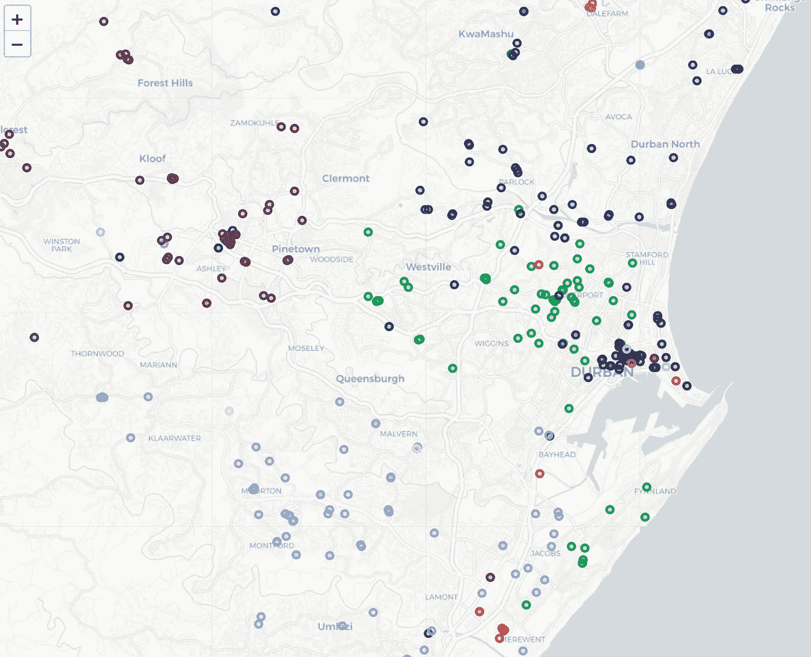
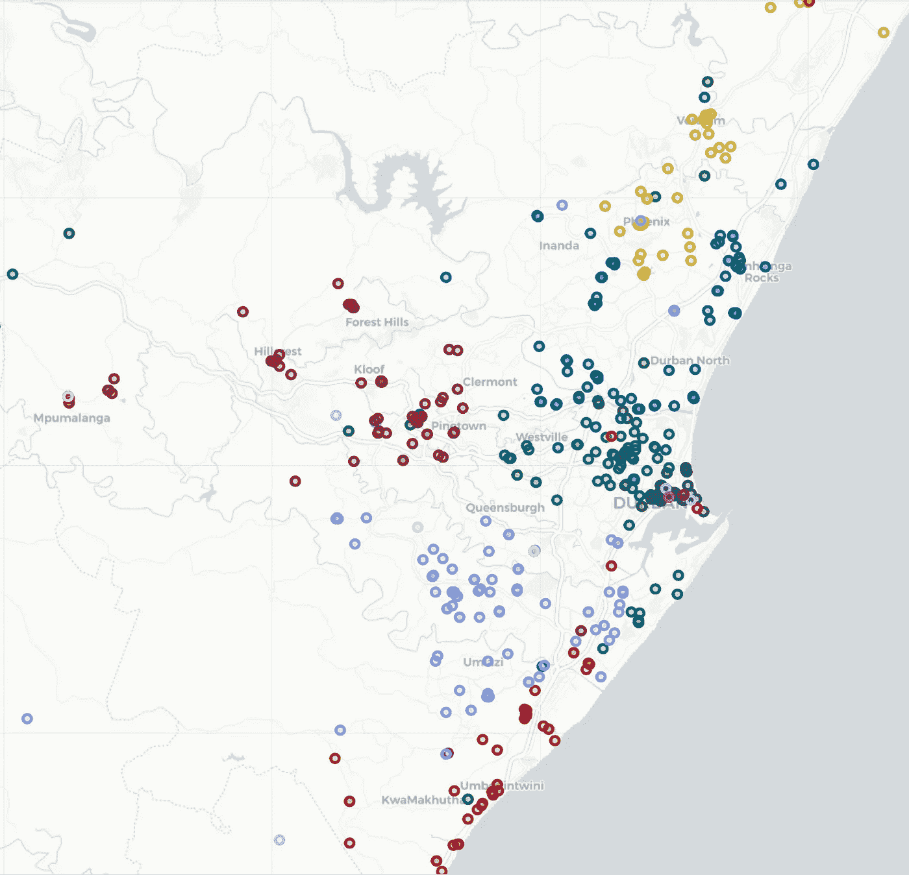
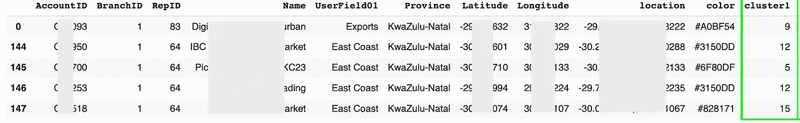
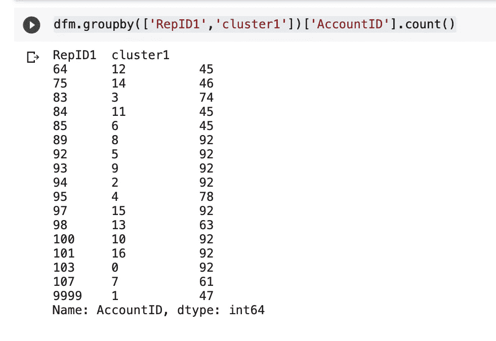
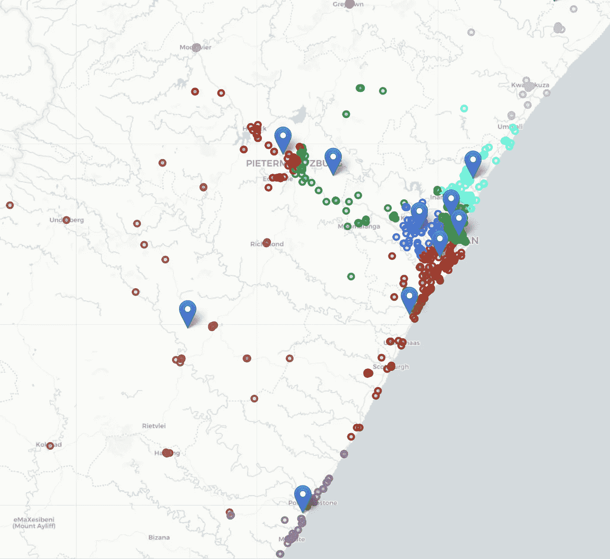
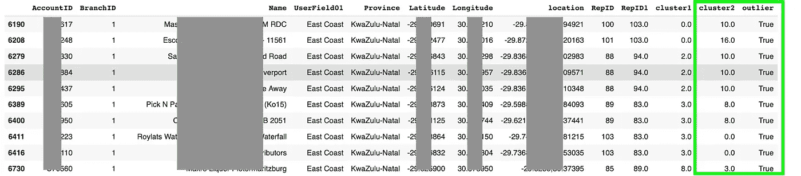
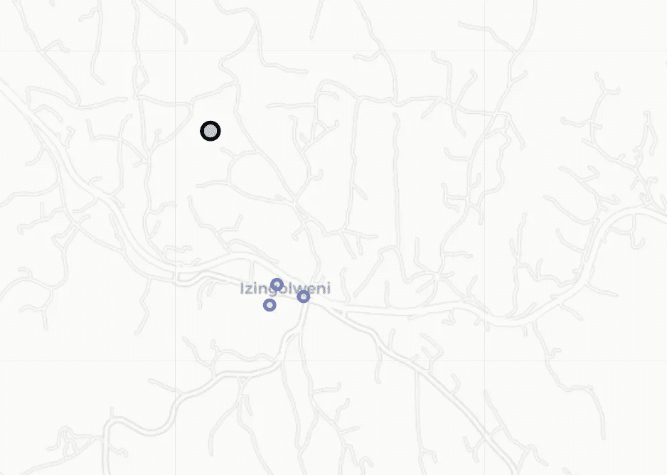

# 使用 KMEAN/KNN 优化您的销售人员客户的地理位置

> 原文：<https://medium.com/geekculture/use-kmeans-knn-to-optimise-your-customers-geographically-82d8f1d71923?source=collection_archive---------15----------------------->

## 通过在地理上优化您的销售区域，节省数千美元和数小时的挡风玻璃时间。这是您将机器学习付诸实践的机会，并为您的销售团队带来切实的好处。


Source: unsplash.com

# 介绍

大多数公司的情况是，你的销售队伍中有大量的客户。然后，随着时间的推移，水变得浑浊，几年后，您可能会看到类似于图 1 的内容。注意不同的颜色，表示不同的代表，看看他们有多少重叠。这篇文章将解决这个混乱的问题。

如果您没有使用过 KMEAN 的，那么这里有一篇很好的文章。



Figure 1: sales force geographically spread

# 必需的包

我们将使用 KMEAN 作为初始算法，根据客户的位置对他们进行分组。然而，通常的 KMEAN 在我们的场景中并不完全有效，因为 KMEAN 可能会导致非常不平衡的区域。一个销售代表可能有 20 个客户，另一个可能有 150 个客户。所以 k-的意思是-限制救援。我们可以给出每个区域的最小值和最大值。因此，首先，使用 pip 安装。

```
pip install k-means-constrained
```

现在，让我们导入我们需要的包

```
import numpy as np
import pandas as pdimport matplotlib.pyplot as plt
import foliumfrom k_means_constrained import KMeansConstrained
```

# 导入您的数据

现在将您的数据导入到一个数据框中，如下图 2 所示。我已经屏蔽了一些数据，但你得到了要点，你需要以下字段:

*   AccountID —客户账号
*   RepID —与客户关联的销售代表
*   纬度
*   经度
*   位置——纬度、经度


Figure 2: Dataframe once its populated

# 绘制初始数据

您可以使用下图，用不同的颜色描绘每个代表的现有客户群。

```
lst_reps = sorted(list(dfm.RepID.unique()))
k = len(lst_reps) - 1# Get our list of unique clusters
lst_elements = sorted(list(dfm.RepID.unique()))# Now make up random colors for each unique RepID
lst_colors = ['#%06X' % np.random.randint(0, 0xFFFFFF) for i in range(len(lst_elements))]# Add color column to dataframe and apply colors
dfm["color"] = dfm["RepID"]
dfm["color"] = dfm["color"].apply(lambda x:
lst_colors[lst_elements.index(x)])m = folium.Map(tiles="cartodbpositron", zoom_start=11)
for index, row in dfm2.iterrows():
  folium.CircleMarker(
    location=[float(row['Latitude']),    
    float(row['Longitude'])],radius=4,
popup=str(row['AccountID']+'|'+str(row['RepID'])+'|'+row['Name']+'|'+row['UserField01']),
    color=row['color'],
    fill=True,
    fill_color=row['color'],
).add_to(m)m
```



Figure 3: note the overlap of representatives

# 训练参数

让我们设置训练参数。

*   k 表示代表人数
*   我们希望每个代表至少有 45 个客户
*   每个代表最多 92 个客户

```
lst_reps = sorted(list(dfm.RepID.unique()))
k = len(lst_reps) -2
min_customers = 45
max_customers = 92
```

# 我的意思是把我们的客户聚集在一起

现在，让我们设置 KMEAN 的参数并运行 fit_predict。重要的是，我们需要保存每个簇的质心。

> 在我们的例子中，每个质心将是每个代表区域或领地的中心位置。

```
## Create a new dataframe with latitude/longitude
X = dfm[['Latitude','Longitude']]
df_X = X.copy()### KMeansConstrained parameters
clf = KMeansConstrained(
  n_clusters=k,
  size_min=min_customers,
  size_max=max_customers,
  random_state=0
)
clf.fit_predict(df_X)# save results
th_centroids = clf.cluster_centers_
df_clustercentroids = pd.DataFrame(th_centroids)
df_clustercentroids.columns = ['Latitude','Longitude']
print(clf.inertia_)# send back into dataframe and display it
dfm['cluster1'] = clf.labels_
dfm.head()
```

您的结果如下，请注意我们数据框中的新字段

*   集群 1 —集群



Figure 3: Results of KMEANS

# 将每个集群分配给最常见的代表

有点像最大公分母，让我们使用 APPLY 来查找一个集群中最常见的代表，并将它们分配给整个集群。

```
# get a copy of the dataframe
dfn = dfm.copy()
clusters = dfn.cluster1.unique()# Remove unwanted reps
dfn = dfn.loc[dfn['RepID'] != 2195]
dfn = dfn.loc[dfn['RepID'] != -1]# Iterate through the unique clusters
for cluster in clusters:
  # find the most common rep in the cluster
  repid = dfn.loc[dfn.cluster1 == cluster].RepID.mode() #.loc[0]
  if repid.size == 1:
    repid = int(repid.loc[0])
  else:
    repid = 9999 # assign the cluster to its repid
  print(str(repid) + ':' + str(cluster))
  dfm.loc[dfm.cluster1 == cluster,'RepID1'] = repid # Remove rep from dataframe copy so that its not used again
  dfn = dfn.loc[dfn.RepID != repid]
dfm = dfm.astype({"RepID1": int})
```

您还可以看到每个代表聚集了多少客户:

```
dfm.groupby(['RepID1','cluster1'])['AccountID'].count()
```



# 更新质心

让我们也将 repID 更新到质心，只是为了提供信息

```
df_clustercentroids['cluster'] = df_clustercentroids.indexdf_clustercentroids['RepID'] = df_clustercentroids.apply(lambda row: -1 if dfm.loc[dfm.cluster1==row.cluster].RepID1.mode().size == 0 else dfm.loc[dfm.cluster1==row.cluster].RepID1.mode()[0],axis=1)df_clustercentroids.head(20)
```

# 标绘结果

现在，让我们绘制结果，看看我们如何光顺

```
# Get our list of unique clusters
lst_elements = sorted(list(dfm.cluster1.unique()))# Now make up random colors for each unique cluster
lst_colors = ['#%06X' % np.random.randint(0, 0xFFFFFF) for i in
range(len(lst_elements))]
  # Add color column to dataframe and apply colors
  dfm["color"] = dfm["cluster1"]
  dfm["color"] = dfm["color"].apply(lambda x:
  lst_colors[lst_elements.index(x)])m = folium.Map(tiles="cartodbpositron", zoom_start=11)for index, row in dfm.iterrows():
  folium.CircleMarker(
  location=[float(row['Latitude']), float(row['Longitude'])],
  radius=4,
  popup=str(row['cluster1']),
  color=row['color'],
  fill=True,
  fill_color=row['color'],
  tooltip=str(row['cluster1']) + '|' + row.AccountID
).add_to(m)# Plot centroids
for index, row in df_clustercentroids.iterrows():
  folium.Marker(
    location=row,
    popup=str(index),
    tooltip=str(index) + '|#=' +
    str(dfm.loc[dfm.cluster1==index].groupby(['cluster1']
    ['AccountID'].count().iloc[0])
).add_to(m)m
```

正如你所看到的，我们已经做得更好了，绘制质心也给了我们每个区域的中心位置。



Figure 4

# 那么，有什么问题呢？

嗯，KMEANS-constrained 很好，但约束现在会导致一些异常值，我们可以使用 KNN 来解决。图 5 为您突出了这个问题。你能看到一个客户被分配给棕色代表，但这没有意义…其实应该是和紫色代表在一起。

很容易在地图上找到，让我们用 KNN 来解决这个问题。如果你不知道 KNN 算法，那么看看这篇文章。


Figure 5

# KNN 来了

首先，让我们设置一个训练和测试数据集。

```
# Import train_test_split function
from sklearn.model_selection import train_test_split# Split dataset into training set and test set
X_train, X_test, y_train, y_test = train_test_split(dfm[['Latitude','Longitude']], dfm[['cluster1']], test_size=0.3) # 70% training and 30% test
```

现在，我们已经使用 KMEAN 对数据进行了分类，让我们训练一个 KNN 模型来根据 KMEAN 的结果进行预测。这将在以下方面帮助我们

1.  由于 KMEAN 的最小/最大约束，识别 KMEAN 中的异常值。
2.  有一个模型，我们可以用它来预测应该将客户分配给哪个代表。

既然我们已经训练过了，让我们在测试集上运行一个预测，然后测量准确性。我们应该看到我们的模型有 92%以上的准确性

```
#Import knearest neighbors Classifier model
from sklearn.neighbors import KNeighborsClassifier
from sklearn import metrics#Create KNN Classifier
knn = KNeighborsClassifier(n_neighbors=k)#Train the model using the training sets
knn.fit(X_train, y_train)#Predict the response for test dataset
y_pred = knn.predict(X_test)# Model Accuracy, how often is the classifier correct?
print("Accuracy:",metrics.accuracy_score(y_test, y_pred))
```

# 根据所有数据进行预测

我们有一个 KNN 模型，所以让我们在整个数据集上预测纬度/经度。这将有助于向我们展示一些异常值，在这些异常值中，由于每个代表的最小/最大客户数的限制，KMEAN 做出了一个奇怪的选择。

```
y_pred = knn.predict(dfm[['Latitude','Longitude']])
```

当 KNN 不同意 KMEANS 时，将预测更新到我们的数据框架，并将失败的 knnfailer 标记为 true。新的集群将位于集群 2 列中。

```
dfm['cluster2'] = y_preddfm['outlier'] = dfm.apply(lambda row: False if row.cluster1 == row.cluster2 else True, axis=1)dfm[dfm.cluster1 != dfm.cluster2]
```

请注意图 6 中我们的两个新列的结果。方便的异常值字段告诉我们，KNN 是否将客户转移到了一个新的区域。



Figure 6

# 从集群中最常见的 RepID1 更新 RepID2

在这一步中，让在集群中创建的 repid2 都被分配给集群 1 中最常见的 RepID1。这确保了离群值将正确的 rep 代码放入 RepID2。

```
def getMostCommonRep(row):
  global dfm
  repid = dfm.loc[dfm.cluster1 == row.cluster2].RepID1.mode()
  if repid.size == 1:
    return repid.loc[0]
  else:
    return -1dfm['RepID2'] = dfm.apply(lambda row: getMostCommonRep(row), axis=1)dfm = dfm.astype({"RepID": 'int32'})
dfm = dfm.astype({"RepID1": 'int32'})
dfm = dfm.astype({"RepID2": 'int32'})
dfm = dfm.astype({"cluster1": 'int32'})
dfm = dfm.astype({"cluster2": 'int32'})
dfm.head(20)
```

# 让我们绘制新的结果

现在，让我们绘制我们的结果，看看 KNN 是否解决了我们的异常值问题:

```
# Get our list of unique clusters
lst_elements = sorted(list(dfm.cluster2.unique()))# Now make up random colors for each unique cluster
lst_colors = ['#%06X' % np.random.randint(0, 0xFFFFFF) for i in
  range(len(lst_elements))]# Add color column to dataframe and apply colors
dfm["color"] = dfm["cluster2"]
dfm["color"] = dfm["color"].apply(lambda x:lst_colors[lst_elements.index(x)])m = folium.Map(tiles="cartodbpositron", zoom_start=11)for index, row in dfm[dfm.outlier == False].iterrows():
  folium.CircleMarker(location=[float(row['Latitude']), float(row['Longitude'])],
  radius=4,
  popup=str(row['cluster2']),
  color=row['color'],
  fill=True,
  fill_color=row['color'],
  tooltip=str(row['cluster2']) + '|' + str(row['RepID2']) + '|' + row.AccountID
  ).add_to(m)# Plot centroids
for index, row in dfm[dfm.outlier == True].iterrows():
  folium.CircleMarker(location=[float(row['Latitude']), float(row['Longitude'])],
  radius=7,
  popup=str(row['cluster2']),
  color='black',
  fill=True,
  fill_color='black',
  tooltip= 'old=' + str(row['cluster1']) + '| new=' + str(row['cluster2']) + '|' + row.AccountID
).add_to(m)m
```

很好，如图 7 所示，我们的异常值已经被重新分配给紫色代表。请注意，我们给它一个黑色的边框，这样我们就可以很容易地挑选出离群值。



Figure 7

# 结论

我希望这篇文章能帮助你使用机器学习对你的客户进行地理聚类。和大多数机器学习一样，你可能需要不止一种算法来得到正确的结果。

# 来源

非常感谢这篇[文章](/thelorry-product-tech-data/the-clustering-algorithm-with-geolocation-data-d6dd07ed36a)，它让我了解了 kmeans-constrained。它帮了大忙。