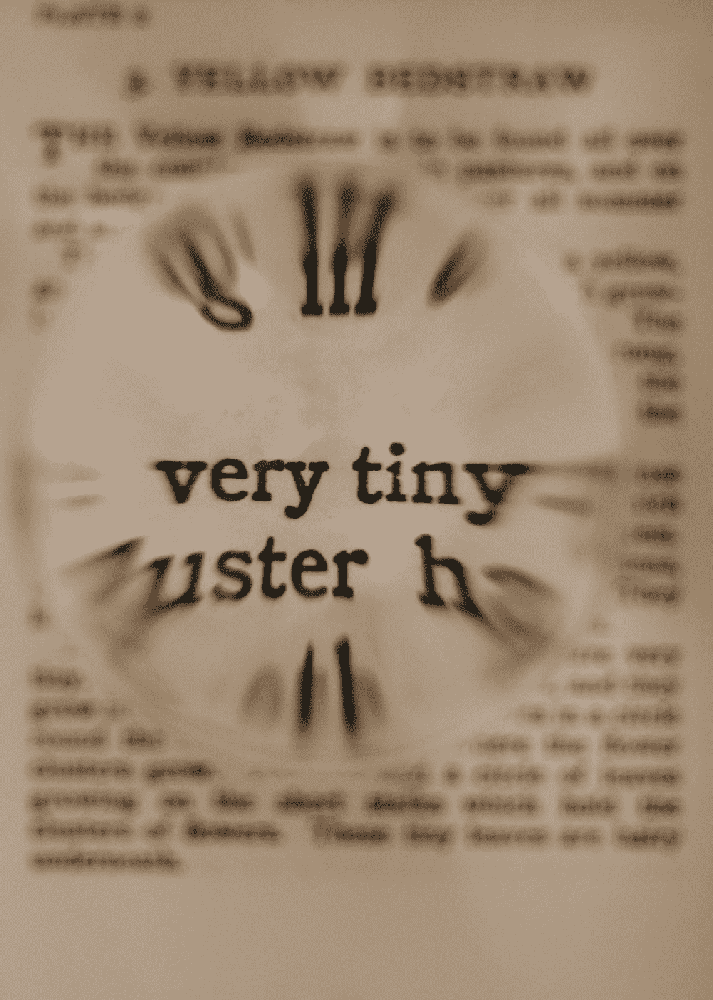

# 将 loadView 用于微型 ViewControllers

> 原文：<https://medium.com/geekculture/use-loadview-for-tiny-viewcontrollers-1144e4960b1e?source=collection_archive---------13----------------------->

## 没有一个架构需要一个巨大的视图控制器

## 用大约 30 行代码编写一个功能齐全的 ViewController

Tiny `ViewControllers`? **Very** tiny

所以你厌倦了巨大的视图控制器？我也是。许多架构试图用一种在我看来极其复杂的方式来解决这个问题…