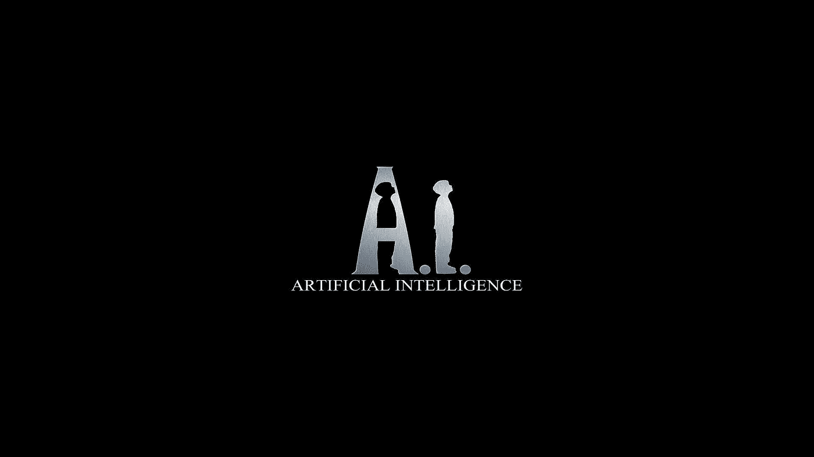
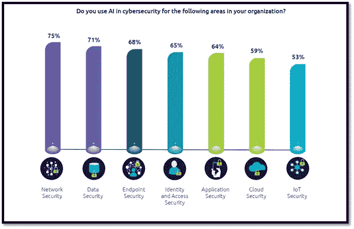

# 使用人工智能提高网络安全自动化

> 原文：<https://medium.com/geekculture/use-of-artificial-intelligence-for-the-improvement-of-cyber-security-automation-2899896edce?source=collection_archive---------16----------------------->

# 摘要

人工智能(AI)是指在机器中模拟人类智能，这些机器被编程为像人类一样思考并模仿他们的行为。这个术语也可以应用于任何表现出与人类思维相关的特征，如学习和解决问题的机器。[1]现在，人工智能广泛应用于科学、医疗保健、医学和机器人学领域。但是，即使是与计算机科学和人工智能完全无关的行业也从它的创新中受益。

网络安全专家作为一个人，每天解决数以百万计的安全漏洞是一个巨大的不可能和耗时的任务。因此，在没有任何网络安全自动化系统的情况下，人类分析师是不可能人工解决的。通过利用人工智能技术自动化这一过程，当警报进入系统时，它能够根据早期的类似事件立即检测出是否需要采取行动。这些措施因网络安全领域而异，如网络安全、数据安全、终端安全、身份和访问安全等。然而，黑客也在网络攻击中使用人工智能来获取需求和想要的东西，这些东西更复杂，更难检测。

本报告旨在概述计算机犯罪的历史以及网络安全自动化方面的改进，使用人工智能来提高现代网络空间的安全性。在对出版物和在线数据源进行调查后，我们可以得出结论，使用人工智能来提高网络安全自动化使网络空间成为更好的力量。

*关键词:人工智能；安全漏洞；网络安全自动化；数据安全；端点安全性；身份和访问安全性；网络空间；*

# 1.介绍

半个世纪前，甚至没有一个叫做网络安全的话题，但是现在，当我们看到最近的新闻和问题时，它几乎是每个人心中的头等大事，这是毫无疑问的。早期的安全不在大纲中。

超过 45 亿人使用互联网作为他们的日常活动，对足够的安全和隐私保护的需求是强制性的。作为网络安全专业人员，我们的责任是留在安全的背后，以减少黑客的行动，因为这种技术的快速发展而反复进行。当我们观察最近几年，黑客和任何其他网络罪犯正在创造他们的网络武器，以克服安全协议。

尽管网络安全成为互联网和其他媒体的热门话题，但我们缺乏足够的商业领域的网络安全专业人士来创造一个安全的网络空间。世界各地不同行业的大多数公司的主要目标是保护他们客户的数据并使其安全可靠，但不幸的是，由于合格的网络安全专业人员越来越短缺，这一目标很难实现。然后，为了最大限度地减少这种技能短缺的影响，这些公司一直在降低其业务流程的效率和生产力，最终将导致糟糕的发展和创新。应用安全专家、云安全专家、云安全专家和安全分析师的技能短缺最为严重。[2]

自动化和人工智能如何促进网络安全？网络罪犯总是尽力想出更先进的方法来锁定他们的受害者。尽管有很多解决方案和工具来阻止它们，但仍有很大的改进空间。尤其是如果我们考虑到自动化。只是人类更难从不同的数据源收集所有相关的数据资源并识别攻击，然后做出相关的动作和改变以在更短的时间内减轻攻击。然后网络安全自动化的作用迅速增加。之后，我们使用自动化工具来预防、检测和处理网络威胁，比人类更有效、更快速。后来，由于网络空间中新威胁的不断发明，人工智能和自动化的结合被用于多个行业。

本报告的下一部分介绍了人工智能随着网络安全自动化的发展是如何发生的，下一部分我们将重点关注人工智能集成网络安全自动化的未来发展。作为报告的结尾，我们用我们的决定和建议结束了一个简短的研究。

# 2.专题的演变

人工智能正在自我进化，这意味着它可以在没有人类输入的情况下一代又一代地改进。建立一个人工智能算法需要更长的时间，因此它需要神经网络。神经网络用来模仿大脑的结构，并通过改变人工神经元之间的连接强度来学习训练数据。较小的神经元子电路执行特定的任务。[3]

约翰·麦卡锡是人工智能的“创始人”之一，在 1956 年夏天。在移动和云平台的发展之后，它被定义为下一次重大的技术变革，受到了全球大多数科技公司的关注，在一些资源中，它被定义为第四次工业革命。我们可以简单地把人工智能理解为，一种可以做出智能决策的机器。深度学习是机器学习的子集，机器学习是 AI 的子集。[4]

开始人工智能激增有六个主要的设计目标。训练机器以实现人类的方式，教导和训练机器在世界各地规划和导航，教导机器执行复杂的脑力任务和知识表达，让机器与现实世界互动是一些主要的设计目标。现在人工智能逐渐实现，大多数公司都试图使用人工智能来更容易地解决问题，并在组织中建立人工智能战略。

1971 年，在阿帕网时代，第一次发现了一种叫做爬虫病毒的计算机病毒。尽管它被认为是一种病毒，但它只能在受害者的电脑上显示一条信息。爬虫是一种温暖的，另一种类型的病毒，它有自我繁殖的能力。当时，用户对病毒和如何防范病毒没有任何概念。

1983 年，美国第一个网络安全专利被授予麻省理工学院，而计算机开始进化。该专利引入了 Rivest-Shamir-Adleman (RSA)算法，这是最早的公钥密码系统之一。[5]1993 年，DEF CON，这是世界上最受欢迎的网络安全技术会议之一，由杰夫·莫斯在拉斯韦加斯发起，近 100 名与会者参加。今天，来自世界各地的 20，000 多名网络安全专业人士参加了会议。

网络安全的另一个里程碑是安全套接层(SSL)互联网协议的诞生。[5]它帮助人们安全地通过网上进行小额交易。SSL 2.0 成为安全使用 web 的语言的核心，称为超文本传输协议安全(HTTPS)，它通过加密与浏览器通信。

安全漏洞发生在 2010 年之前，在社会上被认为是极不寻常的。2010 年 1 月，谷歌宣布了其中国基础设施的重大安全漏洞之一“极光行动”。攻击者试图侵入中国人权倡导者的 Gmail 账户，并识别在美国的中国情报人员。这一攻击也影响到其他部门，如金融、技术、媒体和化工。这被认为是中国开发的高度复杂和有针对性的攻击之一，以窃取知识产权告终。

当我们查看以前的网络犯罪历史时，会发现一些重大案例。20 世纪 80 年代末电子邮件的激增是网络犯罪的主要浪潮，它允许大量的诈骗和恶意软件发送到我们的收件箱。1988 年，罗伯特·莫里斯是互联网上第一个蠕虫的创造者，名为“莫里斯蠕虫”。它自我传播的速度比莫里斯预期的要快得多，它的主要问题是，它被感染并再次感染到相同的计算机上。那么它就是一种恶意的拒绝服务攻击。

然后攻击者试图通过发送电子邮件附件来攻击他们的目标，这就是所谓的“宏病毒”。它于 1995 年被发现，并被嵌入到文字处理、电子表格、pdf 文档等应用程序中。这是黑客传播恶意软件的一种简单方式。宏病毒仍然存在于网络空间，这就是为什么打开未知的电子邮件附件会非常危险，而且它们仍然很难被检测到。1999 年的 Melissa 病毒就是这种宏病毒的一个例子。

2000 年晚些时候，犯罪团伙在网络犯罪领域引入了专业元素。我们不能再在网络空间寻找一个薄弱的剥削。犯罪分子试图利用计算机网络来通过它，并获得该计算机网络的其他用户的信任。2000 年以后，在线攻击呈指数级增长，分布式拒绝服务(DDoS)攻击开始出现。例如，加拿大 15 岁高中生 Michael Calce 对亚马逊、CNN、易贝和雅虎等几家知名商业网站发起了 DDoS 攻击。

然后在 2003 年，一种新的蠕虫病毒占领了互联网，并被称为“SQL Slammer”。它感染了大多数 Microsoft SQL 服务器，并造成了 DDoS 攻击，并且能够在不到 10 分钟的时间内感染 75，000 多台机器。有史以来传播最快的蠕虫。

除了其他病毒和蠕虫之外，Stuxnet warm 与它们不同，因为它被设计成对由计算机控制的设备进行物理破坏。因此，它被称为世界上第一个数字武器。[6]它的主要目标是用于监测工业设施的控制系统。它摧毁了伊朗核项目中五分之一的浓缩离心机。

早些时候，数百万人的个人数据泄露是一个大新闻。但是今天，它太普遍了，影响了数亿甚至数十亿人。例如，万豪国际数据泄露事件在 2014 年至 2018 年影响了 5 亿客户。[6]它最初出现在支持喜达屋酒店品牌的系统上。攻击者能够获取一些联系信息、护照号码、旅行信息和其他个人信息。

网络罪犯设法实施野蛮的攻击。现在，网络罪犯变得越来越狡猾，也越来越难追踪。他们还利用僵尸网络控制全世界数百万被感染的计算机系统。由于技术的快速发展，大量的数据泄露事件频繁出现。在没有任何授权的情况下访问信息的安全事件被简单地称为数据泄露。例如，2017 年的 Equifax 遭到黑客攻击，1.43 亿用户账户被泄露，它是美国最大的征信机构之一。[6]由于这次数据泄露而发生的数据泄露是极其敏感和重要的。同年，东欧的一个犯罪团伙利用网络钓鱼攻击窃取了数百万 Chipotle 客户的信用卡信息。[6]同样在 2017 年，WannaCry 是第一个通过 warm 运行的勒索软件，它会在 Windows 操作系统的早期旧版本中寻找漏洞。犯罪分子能够使用他们的 WannaCry 加密方法锁定 150 个国家的数千家企业和组织。[6]然后他们要求每台电脑支付 300 美元来解锁密码。勒索软件能够完全控制计算机，锁定计算机屏幕或用密码加密重要文件。

通过这些例子和之前发生的事件，我们可以发现网络犯罪活动变得越来越严重。现在，他们正在使用软件自动化、人工智能应用、量子技术、物联网等技术来满足自己的需求。具有巨大计算能力的超高速计算机正在被开发，用于人工智能应用、机器人和机器学习。未来的网络攻击将针对电力、能源、石油和核电等行业，并将影响到国家的关键信息结构。此外，他们滥用增强和虚拟现实进行社会工程攻击。由于这些技术的使用，网络犯罪率将会日益上升。

现在，我们已经将机器融入到我们的日常生活中，以轻松满足我们的需求，并在我们的商业环境中提高效率。为了充分利用机器，我们已经把大部分系统做成全自动或半自动的。网络安全专业人员将系统自动化与网络安全相结合，在有或没有人类交互的情况下以编程方式发现网络威胁，并最终及时做出响应，这就是目前所知的网络安全自动化。

一般来说，自动化可以被定义为一种技术，它通过编程命令与自动反馈控制相结合来执行一个过程，以确保指令的正确执行。最终的系统能够在没有人工干预的情况下运行。[7]

自动化技术已经达到了某种程度的地位和标准，因为大多数其他技术都是从它发展而来的。安全自动化被认为是安全领域的最新发展，网络空间的专业人士愿意使用自动化安全工具，如机器人流程自动化(RPA)、安全协调、自动化和响应(SOAR)产品等。

安全协调、自动化和响应(SOAR)将所有事件响应能力和不同的技术结合在一起，形成一道强大的防线。简而言之，它是一个兼容软件程序的解决方案，允许组织从不同来源收集有关安全威胁的数据，然后通过提高物理和数字安全的效率，在没有任何人工交互的情况下做出响应。明白什么是优先，什么不是。什么是通常的，什么不是。当威胁真实存在时，解放人类采取果断行动。您可以更快、更准确地分析威胁，以提供快速、果断的响应，并保护您企业的完整性及其声誉。

SOAR 系统允许识别、优先化和标准化响应网络安全事件的功能。为了提高效率，并使安全性更具自我操作性，系统经常被组织采用。由于无需任何人工协助就能更快地应对威胁和漏洞，员工可以管理自己的时间。

在安全协调、自动化和响应应对网络安全事件的同时，机器人流程自动化(RPA)技术能够提高网络空间的安全性。使计算机软件能够部分或全部自动化人工、重复性和基于规则的人类活动的技术应用。RPA 使公司能够规划出可定义、可重复且基于规则的业务流程，并指派软件“机器人”来管理该流程的执行

过程。简单地说，它是一个在机器人或软件的帮助下自动完成任务或流程的过程，以减少人工干预。RPA 软件运行在计算机系统的“表示层”(用户界面)，对应用程序来说就像是人类用户。

信息技术(IT)研究和咨询公司 Gartner 对机器人流程自动化(RPA)的定义如下:“RPA 工具对结构化数据执行[if，then，else]语句，通常使用用户界面交互的组合，或者通过连接 API 来驱动客户端服务器、大型机或 HTML 代码。RPA 工具通过映射 RPA 工具语言中的流程供软件机器人遵循来运行，运行时由控制仪表板分配来执行脚本。”(Tornbohm 2017)。[8] RPA 类似于 SOAR 系统，但主要区别是使用 AI 应用程序与流程自动化。RPA 系统在向其提供相关数据时可以做出准确的决策。

然而，随着网络安全自动化，网络空间中的一些预期安全问题已经被克服。网络犯罪分子不会停止寻找他们的方法，因为顶级的自动化解决方案仍然不存在。根据 Juniper 的研究，专业人士预计，随着大多数公司现在上线，2024 年数据泄露的总额将达到 5 万亿美元。[9]人工智能应该为这种增长负责，不仅大多数组织依赖人工智能，而且大多数威胁行为者也将采用与常规网络攻击相同的技术。

根据网络威胁的历史，这些都是可以预测的。但这将引发另一个问题，网络犯罪的未来是什么？在不久的将来，应该发展什么样的方法和技术来克服这些新的威胁？未来的网络犯罪分子将更加专注、计划更周密、装备更精良，并将与其他网络犯罪分子合作，对个人和企业发起更复杂的攻击。随着我们对未来的了解越来越多，发展就会越来越准确。

# **3。** **该地区未来的发展**

纵观调查出版物和在线数据来源，我们可以看到网络安全的未来与自动化紧密相连。由于技术的快速发展，网络安全已成为最关键的需求。

网络犯罪分子对人工智能应用程序的使用，网络安全专业人员在网络空间仍有一个大问题。因此，为了保护和抵御这些未来的攻击，他们应该使用自动化来改变这些当代技术。他们需要寻找更多与自动化集成的创造性人工智能技术，以应对即将到来的网络攻击。

今天，新的人工智能算法嵌入了机器学习(ML)，以适应时间的推移。Bromium 的联合创始人兼首席技术官 Simon Crosby 写道，机器学习有助于对新的网络安全漏洞做出反应。随着传统网络安全技术的使用，很难检测到新一代的漏洞和网络攻击，因为它们是随着时间的推移而产生的。当然，当使用 ML 应对新的网络攻击时，也有相同的可能性。

人工智能有助于识别直接的威胁和攻击。所以，那些直接的攻击通常有快速修复和人工智能系统修复问题本身。

网络安全专家如何使用 AI？他们依赖智能自动化。[10]而且，人工智能将有助于根据威胁程度对网络攻击进行分类。将深度机器学习原则集成到系统中可以随着时间的推移而改变，这也为网络犯罪分子提供了积极的边界。

基于规定的议程，人工智能系统将自己处理威胁，并且每个系统都以充分和适当的方式做出响应。尽管人工智能总是会有限制，这就是为什么 McAfee 的 CTO grob man 说，“人机团队将是解决日益复杂的网络安全挑战的关键”[10]通常，机器学习和人工智能会随着时间的推移而改进。天气预报就是一个例子。由于飓风预测的特殊预测模型，随着时间的推移，它们将继续变得更好。

即使异常的预测模型足以检测威胁和攻击，网络罪犯也在试图分散模型的注意力。这被称为对抗性机器学习，或对抗性人工智能。然后，网络犯罪分子了解底层预测模型的工作原理，并试图转移模型的注意力，这就是所谓的规避方法，他们必须找到一种方法来绕过预测模型。

尽管我们已经将人工智能提高到了一个更好的水平，但我们仍然不足以将人性的伦理形式集成到机器中。如今，人工智能正被集成到大多数应用程序和系统中，但大多数时候会出现错误。因此，人工智能将需要更多的时间来实现下一次工业革命。

通过人工智能的发展，有监督的最大似然算法与历史数据相结合，以识别普通基于规则的模式无法识别的模式，而无监督的最大似然算法则发现异常、相互联系和即将出现的方面。充分的连接可以减少对交易的异常接近，保证交易的安全性。

***截至 2019 年选定国家组织中网络安全的顶级人工智能用例【11】***

根据 Statistica，[11]网络安全在网络安全中部署人工智能最高，因为网络是任何技术流的主干，然后是数据安全和端点安全。

*Figure 1: Top Artificial Intelligence Use Cases for Cybersecurity in Organizations in Selected Countries as of 2019*

今天，大多数电子设备一般都连接到网络，那么被感染治疗或攻击的概率与日俱增，这就给制造商或开发公司制造了机会，即销售智能产品和工具。网络安全领域的大多数顶级组织已经通过集成人工智能和其他最新技术获得了这一机会。[12]

例如，Digital Ghost [12]技术为用户提供了一个人工智能集成保护层，以保护关键基础免受针对其工业控制系统开发的网络攻击。它不仅有助于检测即将到来的网络攻击，而且有助于克服即将到来的网络威胁和攻击，即使在网络攻击发生时也能保持运营安全无害。[13]当它正常运行时，它可以检测到机器是否确实正在遭受网络攻击。

作为另一种方法，行业异常检测技术[12]使用人工智能来检测异常，即网络中明确授权接受的通信中的任何差异，这可能是由于某人的入侵或数据窃取而发生的。该解决方案可以评估网络中的数据流量，识别任何类型的威胁，同时持续监控以检测网络中的异常情况。除了基本的安全解决方案之外，这并不局限于检测已知的威胁或漏洞，它能够实现对故障检测的全面检测，确保工作效率并保证数字透明度。[14]

Champaign Hunting 是一款预测威胁情报软件工具，集成了 Check Point Software Technologies 开发的人工智能。[15]这个软件能够发现的威胁比网络安全专家一天发现的还要多。基本上，这可以在一天内找到数百万个相关的威胁和漏洞，还可以暴露未知的 CnC 和恶意域，并实现将 Check Point Software Technologies 公司的威胁情报增加 10%。这一成果成为网络安全领域的一个伟大里程碑，他们正在进一步改进这一软件工具概念，将威胁情报从 10%以上。[15]

如今，由于人工智能的非正常使用，从通过工作自动化对就业的威胁到“深度伪造”视频的创作，我们正在受益于人工智能的积极影响。英国电信安全研究负责人 Ben Azvine 教授表示，人工智能将对大多数公司和行业产生变革性影响，网络安全也不例外。[16]因此，为了做好准备，他的团队不仅在持续研究网络攻击和防御的短期发展，也在研究人工智能可能提供的长期发展。

作为另一个方法示例，Palo Alto Networks 公司在其网络应用程序中使用人工智能与自动化技术集成，并在自动化应用程序中使用机器人流程自动化技术来提供 AI 相关的安全功能。[17]

沃森助手是一个集成了人工智能技术的对话平台，通过为用户的问题提供直接、快速和最准确的答案来与用户互动。[18]它是由 IBM Security 公司开发的，它是与人工智能相结合以促进网络安全未来的主要公司之一。根据 IBM 的说法，认知安全和人工智能的使用有助于实现这一成就。认知计算[19]是使用计算机化的模型来简单地模仿人类的思维和过程，例如，答案有一个以上的含义。这种认知计算与人工智能相结合，产生了诸如专家系统、神经网络、机器人和虚拟现实(VR)等认知应用。沃森助手不同于基本的聊天机器人，因为它们大多数都试图模仿人类的互动，但这个沃森知道何时从其知识库中搜索和回答，以及如何与人类互动。[20]

利用这一成果，IBM Security success 与 Watson 一起开发了 IBM QRadar Advisor[21]，它与 AI 一起构建，供一线安全分析师与用户合作，并增强安全运营团队的正确性，克服网络安全世界中安全技能的缺乏。因此，这可以减少调查花费的时间。[22]

如今，大多数网络安全行业巨头都使用用户/机器行为分析(IoT)和人工智能，它允许组织实时检测最复杂的网络威胁和攻击并采取行动。这些新应用和工具的开发可以克服网络空间的不完整性。

例如，欧洲自主航天飞机公司 ISFM 与 SafeRide 技术公司合作，保护飞行器免受网络攻击。为此，它使用 SafeRide 的 vSentry 网络安全软件堆栈，保护车辆的电子控制单元(ECU)免受黑客攻击。[23] vSentry 是各种技术的组合，如高级防火墙、基于 IDPS 和云的人工智能、机器学习和深度学习，以防止和检测零日漏洞和攻击。

由于使用了人工智能，检测网络空间中的威胁、违规和漏洞所需的总时间减少了 12%。[12]根据上述信息，我们可以预测，网络安全的未来肯定会走向自动化技术世界，而自动化技术世界基本上是基于人工智能的。

# 4.结论

在对在线出版物进行深度分析后，我们可以预测人工智能在网络安全自动化中的集成应用有助于提高生产力、改善销售或增强体验。除了基本的传统技术和工具，人工智能是防御网络攻击、威胁和漏洞的更强大的工具。因此，大多数行业巨头已经开始研究这项伟大的技术将如何帮助缓解传统漏洞，以及零日漏洞。人工智能的采用率日益增加。在古代，大多数网络安全专业人员主要只关注如何解决日常的小漏洞和威胁，在这项技术创新后，人工智能用于自动化解决日常漏洞的过程。它为那些网络安全专业人员开辟了一条道路，让他们能够利用自己的时间、资源和创造性思维，更加专注于复杂的网络攻击，提出大量创新和技术来减轻网络攻击。

根据马里兰大学的一项研究，他们预测每 39 秒钟就有网络攻击发生在世界的某个地方。因此，在没有任何安全自动化系统的情况下，人类分析师不可能手动解决它们。通过利用人工智能技术自动化这一过程，当警报进入系统时，它能够根据早期的类似事件立即检测出是否需要采取行动。如果需要采取任何措施，系统可以自动修复威胁并保护系统。

在对出版物和在线数据源进行调查后，我们可以得出结论，使用人工智能来提高网络安全自动化使网络空间成为更好的力量。

# 参考

[1] J .弗兰肯菲尔德《人工智能(AI)》Investopedia.com。【在线】。可用:[https://www . investopedia . com/terms/a/artificial-intelligence-ai . ASP](https://www.investopedia.com/terms/a/artificial-intelligence-ai.asp)【2020 年 10 月 5 日访问】。

[2]乔恩·奥尔特西克，“2018 年网络安全职业的生活和时代”，ESG，不适用，
2019 年。

[3] E. Gent“人工智能正在独自进化”sciencemag.org[在线]。可用:

[https://www . science mag . org/news/2020/04/artificial-intelligence-evolving-all-self](https://www.sciencemag.org/news/2020/04/artificial-intelligence-evolving-all-itself)

[4] S .马南德哈尔《人工智能的进化》lftechnology.com[在线]。可用:[https://www . lf technology . com/blog/ai/ai-evolution/#:~:text = In % 20 过去% 20 几年，In % 20 mobile % 20 和% 20cloud %平台](https://www.lftechnology.com/blog/ai/ai-evolution/#:~:text=In%20the%20past%20few%20years,in%20mobile%20and%20cloud%20platforms)。

[5] T. Mattews《网络安全简史》cybersecurity-insiders.com[在线]。可用:[https://www . cyber security-insiders . com/a-brief-history-of-cyber security/](https://www.cybersecurity-insiders.com/a-brief-history-of-cybersecurity/)

[6] R. Herjavec《网络安全首席执行官:网络犯罪的历史，从 1834 年至今》herjavecgroup.com[https://www.herjavecgroup.com/history-of-cybercrime/](https://www.herjavecgroup.com/history-of-cybercrime/)

[7] M .格罗佛《自动化》britannica.com[在线]。可用:[https://www.britannica.com/technology/automations](https://www.britannica.com/technology/automations)

[8] W. Aalst，M. Bichler 和 A. Heinzl《机器人过程自动化》link.springer.com[在线]。可用:[https://link.springer.com/article/10.1007/s12599-018-0542-4](https://link.springer.com/article/10.1007/s12599-018-0542-4)

S. Poremba“网络犯罪的未来:我们将走向何方？”securityintelligence.com[在线]。可用:[https://security intelligence . com/articles/the-future-of-cyber crime-where-we-head/](https://securityintelligence.com/articles/the-future-of-cybercrime-where-are-we-headed/)

[10]infosecurity-magazine.com·r·Kh《人工智能如何成为网络安全的未来》[在线]。可用:[https://www . info security-magazine . com/next-gen-infosec/ai-future-cyber security](https://www.infosecurity-magazine.com/next-gen-infosec/ai-future-cybersecurity)

[11] Statista“截至 2019 年选定国家组织中网络安全的顶级人工智能(AI)用例”statista.com[在线]。可用:[https://www . statista . com/statistics/1028823/ai-security-use-cases-in-organizations/](https://www.statista.com/statistics/1028823/ai-security-use-cases-in-organizations/)

[12] R. Tolid，G. Linden，L. Delabarre，J. Theisle，Y. Khemka，A. Thieullent，A. Frank，J. Buvat，S. Cherian《用人工智能重塑网络安全》capgemini.com[在线]。可用:[https://www . capgemini . com/WP-content/uploads/2019/07/AI-in-cyber security _ Report _ 2019 07 11 _ v 06 . pdf](https://www.capgemini.com/wp-content/uploads/2019/07/AI-in-Cybersecurity_Report_20190711_V06.pdf)

[13]GE research“GE 推出面向工业控制系统的实时、主动网络防御解决方案，名为“数字幽灵”ge.com[在线]。可用:[https://www . ge . com/research/news room/ge-unveils-real-time-active-cyber-defense-solution-industrial-control-systems-called #:~:text = Digital % 20g host % 20 is % 20a % 20 first，assets % 20 operating % 20 safety % 20 and % 20 reliable](https://www.ge.com/research/newsroom/ge-unveils-real-time-active-cyber-defense-solution-industrial-control-systems-called#:~:text=Digital%20Ghost%20is%20a%20first,assets%20operating%20safely%20and%20reliably)

[14]雷波“异常检测”rhebo.com[在线]。可用:[https://rhe bo . com/en/service/glossar/anomaly-detection-en/#:~:text = Short % 20 facts，any % 20 anomaly % 20 in % 20a % 20 network。](https://rhebo.com/en/service/glossar/anomaly-detection-en/#:~:text=Short%20facts,any%20anomaly%20in%20a%20network.)

[15] O. Gan，“人工智能基因:网络安全的银弹？CPX 360 主题演讲，“Check Point 软件技术有限公司，维也纳，2018

[16] CBR 计算机商业评论“人工智能和网络安全的未来”，cbronline.com[在线]。可用:[https://www . CBR online . com/opinion/the-future-of-ai-and-cyber security](https://www.cbronline.com/opinion/the-future-of-ai-and-cybersecurity)

[17] K. Lee，“网络安全自动化”，在“未来的安全会议”中，

2019 年，DC 华盛顿州

[18]维基百科“沃森(计算机)en.wikipedia.org[在线]”。可用:[https://en . Wikipedia . org/wiki/Watson _(计算机)#:~:text = Watson % 20 is % 20a % 20 question % 2d answering，Watson](https://en.wikipedia.org/wiki/Watson_(computer)#:~:text=Watson%20is%20a%20question%2Danswering,Watson) 。

[19] M .劳斯《认知计算》searchenterpriseai.techtarget.com[在线]。可用:[https://search enterprise ai . tech target . com/definition/cognitive-computing](https://searchenterpriseai.techtarget.com/definition/cognitive-computing)

[20] IBM“沃森助手”ibm.com[在线]。可用:【https://www.ibm.com/cloud/watson-assistant/ 

[21] IBM“用 AI 为一线安全分析师打造”ibm.com[在线]。可用:【https://www.ibm.com/products/cognitive-security-analytics】T4

[22] IBM“沃森的 QRadar 顾问”ibm.com[在线]。可用:[https://www . IBM . com/support/knowledge center/ss 42 vs _ SHR/com . IBM . Watson app . doc/c _ QA PPS _ advisor _ intro . html](https://www.ibm.com/support/knowledgecenter/SS42VS_SHR/com.ibm.Watsonapp.doc/c_Qapps_advisor_intro.html)

[23] MILLA“利用本周在凡尔赛门举行的 Mondial Tech dynamic 展会，ISFM 宣布与 Saferide Technologies 建立合作伙伴关系。”millagroup.fr [Online]。可用:[https://milla group . fr/blog/2018/10/05/isfm-and-safe ride-technologies-announce-thier-technology-and-commercial-partnership-to-protect-autonomous-shuttle-from-cyber attack/](https://millagroup.fr/blog/2018/10/05/isfm-and-saferide-technologies-announce-thier-technology-and-commercial-partnership-to-protect-autonomous-shuttle-from-cyberattacks/)