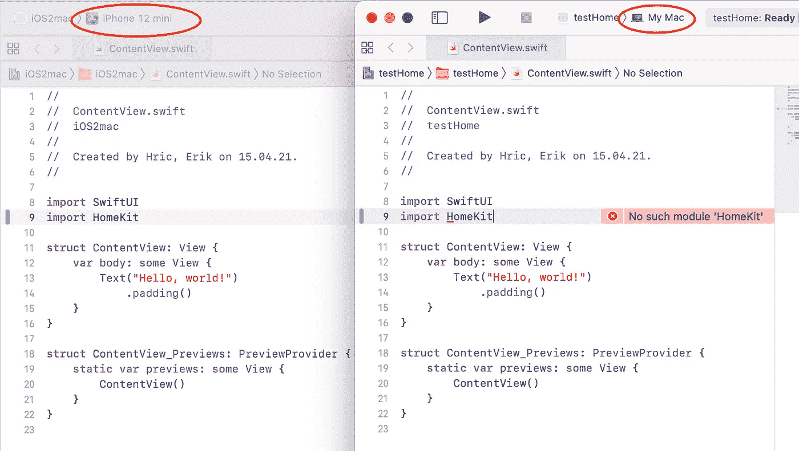
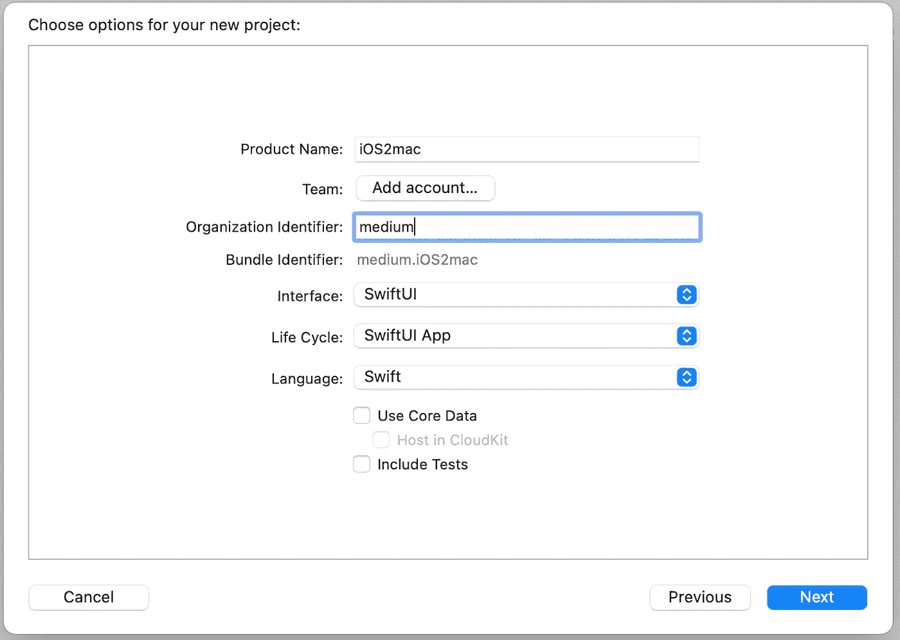
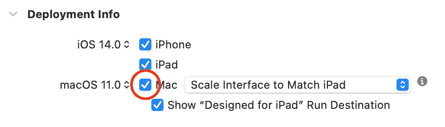
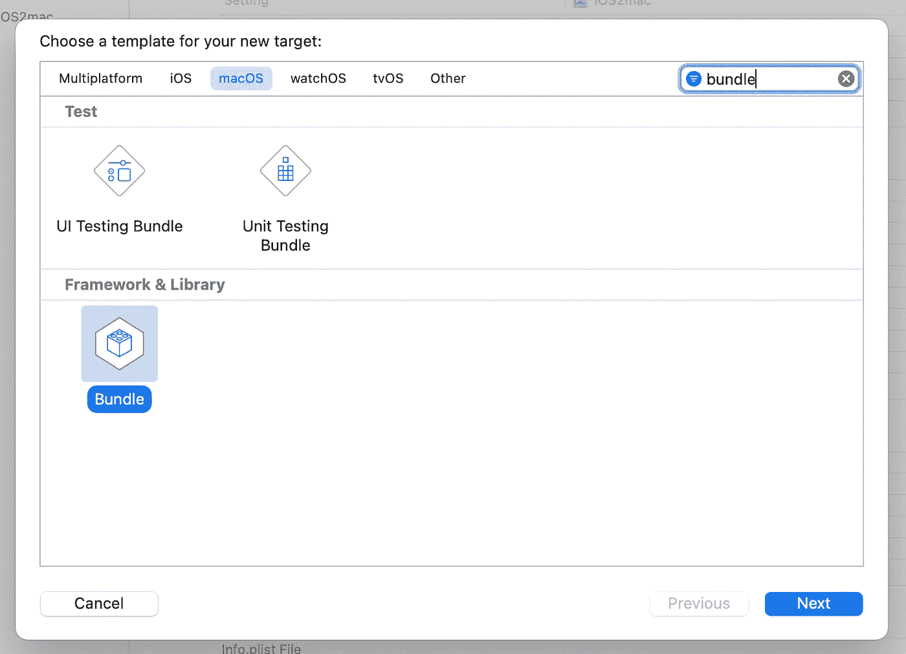
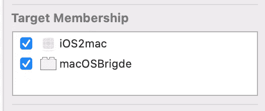
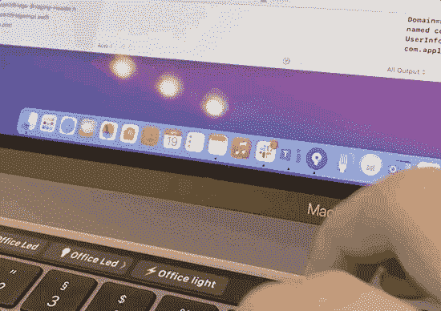

# 如何在 macCatalyst 应用中使用特定于 macOS 的 API(反之亦然)

> 原文：<https://medium.com/geekculture/use-of-macos-specific-api-in-maccatalyst-apps-and-vice-versa-e7082a007b7c?source=collection_archive---------10----------------------->

Mac Catalyst 允许开发者快速将他们的 iOS 应用移植到 macOS。但是在不添加任何 mac 特定功能的情况下迁移它们与运行 iOS simulator 没有什么不同。

## 动机

Home 是苹果从 iOS 移植的首批应用之一。它可以让你从 mac 上控制 homekit 配件。当你尝试在你的 macOS 应用中使用 HomeKit API 会发生什么？



你可以想象一下，当你尝试使用`NSStatusItem`时，iOS 中也会出现同样的情况。在本文中，我们将了解如何同时使用 iOS 特定的 API 和 macOS 特定的函数。(如果你不想遵循一步一步的过程，你可以在这篇文章的末尾找到完整的源代码。)

# 项目设置

首先，我们需要创建一个新的 iOS 应用程序项目。我们将使用以下设置:



并在项目设置的“常规”选项卡中的“部署信息”下启用 mac 支持。



我们需要做的第一件事是在应用程序启动时初始化 macOS 和 iOS 之间的通信。为此，我们将创建一个实现“UIApplicationDelegate”的新类，并在我们的主应用程序结构中声明它。

```
**import** SwiftUI
**@main****struct** iOS2macApp: App { @UIApplicationDelegateAdaptor(AppDelegate.**self**) **var** appDelegate **var** body: **some** Scene {
      WindowGroup {
        ContentView()
      }
   }
}
```

现在到了魔法发生的部分…

## macOS 套装设置

为了在我们的应用中运行 macOS 代码，我们需要创建一个新的目标——MAC OS Bundle。我将其命名为`macOSBridge`,但是你可以选择你喜欢的任何东西，并将其余的设置保留为默认设置。



这将用你选择的名字创建一个新文件夹，在其中你只能找到一个`Info.plist`文件。这个文件的最后一行是这个包的主体类，所以让我们创建一个！在创建一个新类的时候，你会看到创建一个新的桥接头的选项，所以你一定要同意这样做。

在我们定义了主类(`MacOSBridge`)之后，我们需要将它的名字添加到`Info.plist`的最后一行。我们的类名会这样定义
`$(PRODUCT_MODULE_NAME).MacOSBridge`

# 准备通信接口

在这个例子中，我们将通过创建`NSStatusItem`并在应用程序的 iOS 端对其点击做出反应来演示双向通信。为此，我们需要如下定义的两个接口。

```
**@objc(iOS2Mac)
public protocol** iOS2Mac: NSObjectProtocol {
   **init**()
   **var** iosListener: mac2iOS? { **get** **set** }
   **func** createBarItem()
}**@objc(mac2iOS)
public protocol** mac2iOS: NSObjectProtocol {
   **func** barItemClicked()
}
```

我们的`MacOSBridge`类需要实现`iOS2Mac`协议。



确保在两个目标(mac Bundle 和 iOS App)中都有目标成员的文件中定义这两个接口。

## 从包中加载和使用代码

有必要加载包并实例化它的主体类。在本文中，我们将在`AppDelegate`中实现，但是您可以在任何适合您选择的架构的地方实现。app 确实这样启动完 looka 后手动加载。我们保留了对 iOS2Mac 实现的引用，以便以后使用，并且我们将实现`mac2iOS`协议的`AppDelegate`类设置为 macOS 事件的监听器。

```
**var** ios2mac: iOS2Mac?**func** application(**_** application: UIApplication,
     didFinishLaunchingWithOptions
     launchOptions: [UIApplication.LaunchOptionsKey : **Any**]? = **nil** ) -> Bool {
   loadPlugin()
   **return** **true** }**func** loadPlugin() {
 **let** bundleFile = "macOSBridge.bundle"
   **guard** **let** bundleURL = Bundle.main.builtInPlugInsURL?.appendingPathComponent(bundleFile),
   **let** bundle = Bundle(url: bundleURL),
   **let** pluginClass = bundle.principalClass **as**? iOS2Mac.Type 
   **else** { **return** } ios2mac = pluginClass.init()
   ios2mac?.iosListener = **self //respond to mac events** }
```

# 结束循环

在我们的例子中，我们将通过`SwiftUI`的`@EnvironmentObject`传递对`AppDelegate`的引用。(请记住，我们这样做是为了简化代码，以便进行指导。)我肯定你知道你想把你的**电话放在什么地方。您可以在本文末尾找到带有完整代码的 Github 链接。点击按钮将触发`createBarItem()`,在我们的例子中是这样的:**

```
**let** statusItem = NSStatusBar.system.statusItem(withLength:NSStatusItem.squareLength)**func** createBarItem() {
 **if** **let** button = statusItem.button {
    button.title = "🏠" //since we control home 🙂
    button.target = **self** button.action = **#selector**(MacOSBridge.statusItemClicked)
  }
}**@objc** **func** statusItemClicked() {
  iosListener?.barItemClicked()
}
```

## 最后的魔法

正如开始时所承诺的，当点击`NSStatusItem`时，我们将通过控制 HomeKit 设备来关闭循环。所以让我们开始吧…

我们将做一件非常简单的事情=打开列表中的第一个设备。让我们从在一个简单的阵列中存储具有功率控制特性的器件开始。

```
**func** setUpHomeManager() {
  mgr = HMHomeManager()
  mgr?.delegate = **self** }**func** homeManagerDidUpdateHomes(**_** manager: HMHomeManager) {
  **var** supportedAccessories:[HMAccessory] = []
  **for** home **in** manager.homes { **let** powerControls = home.accessories.filter {
      $0.services.contains {
          $0.characteristics.contains {
             $0.characteristicType == HMCharacteristicTypePowerState
          }
       }
    }
    supportedAccessories.append(contentsOf: powerControls)
  }
  allPowerControllableAccessories = supportedAccessories
 }
}
```

拼图的最后一块是将值`1`写入列表中第一个附件的功率特性。我们在`HMAccessory`扩展中这样做:

```
**extension** HMAccessory {**func** turnOn() {
  **_** = **self**.services.map {
    $0.characteristics.map {
      **if** ($0.characteristicType == HMCharacteristicTypePowerState) {
        $0.writeValue(1) { (e) **in** print("error while turning on the device \(e?.localizedDescription ?? "")")
        }
      }
    }
  }
 }
}
```

## 解决纷争

沿途您可能会看到一些错误消息..

```
**This app has crashed because it attempted to access privacy-sensitive data without a usage description.  The app's Info.plist must contain an NSHomeKitUsageDescription key with a string value explaining to the user how the app uses this data.**
```

你知道该怎么做；)所以在 iOS App 里做`Info.plist`

如果您看到以下错误…

```
**Sync operation failed with error: Error Domain=NSCocoaErrorDomain Code=4097 "connection to service on pid 0 named com.apple.homed.xpc" UserInfo={NSDebugDescription=connection to service on pid 0 named com.apple.homed.xpc}**
```

…您忘记将 HomeKit 功能添加到您的 iOS 目标或拒绝访问家庭数据的权限。

# 包裹

添加 macOS 特定的控件和功能会将移植的应用程序提升到另一个层次。但是有时存在 API 可用性悖论，比如 HomeKit，它迫使您为项目使用不同的设置。我用这种方法建立了一个 touchbar 应用程序来控制我办公室的灯，并从我的本地网络外部控制我的配件，而不用 iPad 或 HomePod 作为家庭中枢。



My ’Room8' app (lights are visible in reflection)

我希望这种变通方法能帮助你实现你的想法。完整的源代码可在[这里](https://github.com/erikhric/ios2mac)获得。如果你觉得这篇文章有帮助，给我一个⭐️。
祝你项目顺利:)