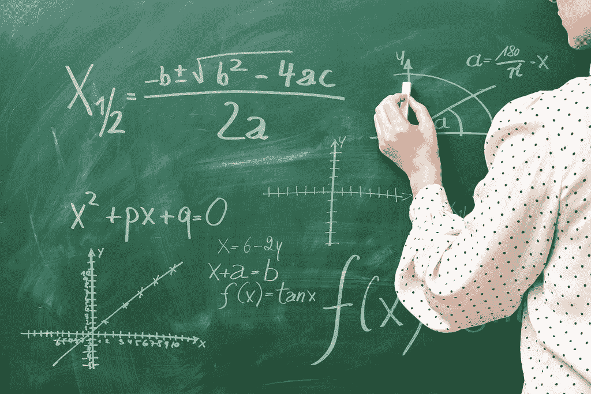
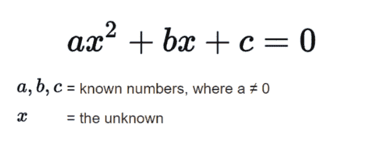

# 用 Python 解二次方程

> 原文：<https://medium.com/geekculture/use-python-to-solve-quadratic-equations-9a595be3d402?source=collection_archive---------8----------------------->

二次方程是一个可以用标准形式重新排列的方程，如下所示

其中 x 代表未知数，系数 a、b 和 c 代表已知数，a 不等于零。