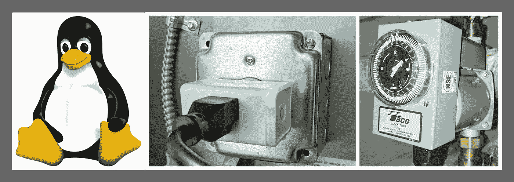

# 使用 Raspberry Pi 和 TP-link Kasa 来自动化您的设备

> 原文：<https://medium.com/geekculture/use-raspberry-pi-and-tp-link-kasa-to-automate-your-devices-9f936a6243c1?source=collection_archive---------0----------------------->

*~ ~不是赞助帖~~*

现在是 2022 年，现在有许多智能家居设备和生态系统。TP-link 系统的 [Kasa 已经有一段时间了；这是我最喜欢的，因为有一个 python SDK，他们制作了带有能源监控的智能插头，这是相当独特的。当你将 Kasa 组合与 Raspberry Pi(或任何 Linux /Windows 服务器)结合时，可能性是无穷的。下面是一些你可以做的事情。](https://www.kasasmart.com/us/products)

*   [在这篇博文中显示]你可以使用复杂的时间表运行设备，例如“脉冲模式”——它在一小时内以固定的时间间隔打开和关闭。例如，插入智能输出的水泵在一天的特定时间每隔 15 分钟启动并运行 5 分钟。我有一个 Taco Hot-link 水泵的设置，它插在 Kasa 智能插座上。



Automating a pump: Linux → Smart plug → Device

*   [显示在这篇博文中]通过 cron 控制所有调度设备。Kasa 应用程序虽然很棒，但目前每台设备只能有 31 个日程安排。与任何 GUI 界面一样，设置一个复杂的时间表需要多次“点击/触摸”。
*   [即将在未来的博客中发布]根据外部事件控制设备。例如，根据股票市场或密码今天的表现、天气或推文情绪来调整 led 颜色。

如果这种自动化听起来让你兴奋，请继续读下去。对于前两个，我们将使用 Cron 作业来完成。对于第三个问题，我们需要编写一个程序来轮询网站或 API，然后适当地控制设备。我将在以后的博客文章中讨论这个场景。

1.  **安装 python-kasa:**

Python-kasa 是围绕 TP-link Kasa 使用的 API 的 Python 包装器。截至 2022 年，这是一个相当活跃的项目，你可以在这里查看/贡献:[https://github.com/python-kasa/python-kasa](https://github.com/python-kasa/python-kasa)。

您可以通过运行下面的命令来安装它。

```
**pip3 install python-kasa**
```

命令完成后，启动一个新的终端会话，或者从现有会话注销/登录，然后运行命令 **kasa** 。如果一切顺利，您应该能够运行命令 kasa 来发现您网络中的设备(注意:您可能会得到一些发现错误—大多数情况下这可能会被忽略)。

如果你运行命令**kasa**，它会显示 python 程序的安装位置，在我的例子中是 **/home/pi/。local/bin/kasa** ，已经在我的 PATH 变量里了。

现在，使用您的设备别名运行一个更具体的命令，以确保您可以看到它的状态。在下面的命令中，我的设备名称是“水泵”，请适当替换。

```
kasa --type plug --alias "water pump"
```

运行命令`kasa --help`查看其他选项。例如，如果你想调整一个灯泡的颜色，你可以像这样运行一个命令(下一篇博文会详细介绍)

```
kasa --type bulb --alias "color lamp" hsv 118 100 73
```

**2。写一个控制器脚本:**

现在我们只需要写一个简单的脚本来打开或关闭设备。你可以使用下面的脚本。保存这个文件，并给它适当的权限，如下所示。

```
# Write file
echo <<EOF>kasa-pump.sh
#!/bin/bashif [[ ! -z $1 ]]; then
  operation=$1
else
  operation=state
fiexport PATH=/home/pi/.local/bin:$PATH
kasa --type plug --alias "water pump" ${operation}
EOF# Adjust permissions
sudo cp kasa-pump.sh /usr/local/bin/kasa-pump.sh
sudo chown pi:pi /usr/local/bin/kasa-pump.sh
sudo chmod +x /usr/local/bin/kasa-pump.sh
```

通过运行如下命令来测试脚本。您应该会看到设备打开/关闭。

```
kasa-pump.sh on
kasa-pump.sh off
```

**3。写一个 cron job:**

Cron job 是 OG Linux 的特性之一，有很多关于它的教程。我将在这里提供一个片段，说明我如何设置 cron 为脉冲模式，即 5 分钟打开，10 分钟关闭。

```
# Use this command to write/update a cron schedule
crontab -e# Pump pulse mode.
*/15 5,6,7,10,11,12,13,16,17,20,21,22 * * * /usr/local/bin/kasa-pump.sh on
5,20,35,50 5,6,7,10,11,12,13,16,17,20,21,22 * * * /usr/local/bin/kasa-pump.sh off
```

上面的表达式在选定的时间段内，每隔 15 分钟在上运行命令 **kasa-pump.sh。**

**/15 5，6，7，10，11，12，13，16，17，20，21，22 * * */usr/local/bin/kasa-pump . sh on*

和下面的表达式，在每小时的第 5、20、35 和 50 分钟运行命令 kasa-pump.sh off。

*5，20，35，50 5，6，7，10，11，12，13，16，17，20，21，22 * * */usr/local/bin/kasa-pump . sh off*

当然，我希望你会选择一个完全定制的时间表。与使用 Kasa 应用程序相比，使用 Cron 可以获得更多的粒度。

剩下要做的就是确保 cron 作业成功运行。请使用下面的命令检查 cron 的输出

```
# Ensure that the Cron service is running properly
sudo systemctl status cron.service# cat /var/mail/pi | grep -i pump
```

**结论**

在这篇文章中，我们看到了如何使用 Raspberry Pi 中的 cron 作业来自动化一个名为“pump”的设备。随着你获得更多的设备，以这种方式设置日程安排比应用程序更容易，这将需要你多次“触摸/点击”。

在下一篇博文中，我们将看到一些更有趣的东西，比如根据外部事件调整颜色。