# 使用 S3 桶与 API 网关代理集成来返回二进制文件

> 原文：<https://medium.com/geekculture/use-s3-bucket-with-api-gateway-proxy-integration-to-return-binary-files-29740ea75d62?source=collection_archive---------0----------------------->

让我们看看如何使用带有 API 网关的 S3 桶来创建一个 REST API，它将基于传递的 URI 路径返回所有类型的二进制文件。

我们可以通过 API 网关控制台在 Rest API 中添加对二进制文件的支持，也可以使用 YAML 文件。

我在最后附上了经过测试的 YAML 代码参考，如果你想通过 SAM CLI 脚本开发它，可以作为参考。

但是在这里，我们将研究如何通过 AWS 控制台实现它。

登录 AWS 控制台，转到 API 网关服务，并单击 create new Rest API。

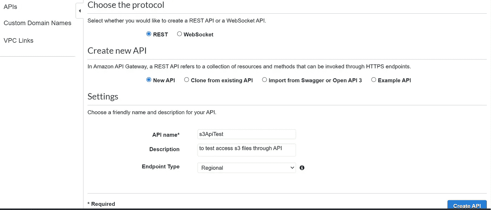

创建 API 后，根据您的需求创建资源路径，然后设置代理资源，如下所示

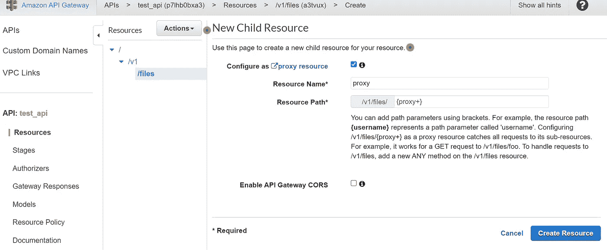

在代理上创建 Get 方法，并选择服务作为 AWS 服务。在 AWS 服务中选择简单存储设备(S3)。HTTP 方法作为 Get。在路径覆盖中，我们可以添加一个基本 S3 存储桶基本路径，其中包含我们的文件夹/文件，后跟{proxy}资源，这将确保如果我们尝试访问给定基本路径的文件夹中的文件，它将能够动态访问它。我们将通过这个例子来更好地理解。

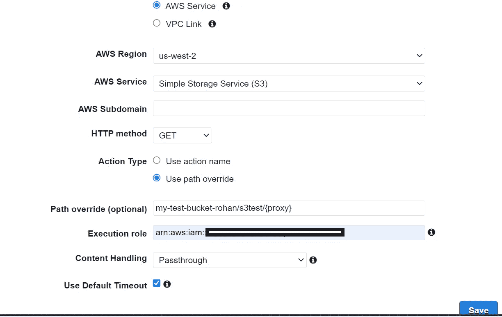

创建 S3 桶，你可以在你的文件夹中存储不同的文件，如 json，jpeg 等。我用 bucket my-test-bucket-rohan/s3test 创建了基本路径，它有两个文件夹属性和 static。在属性内部，我们有 test.json 文件，在静态内部，我们有 sample.jpeg 文件。

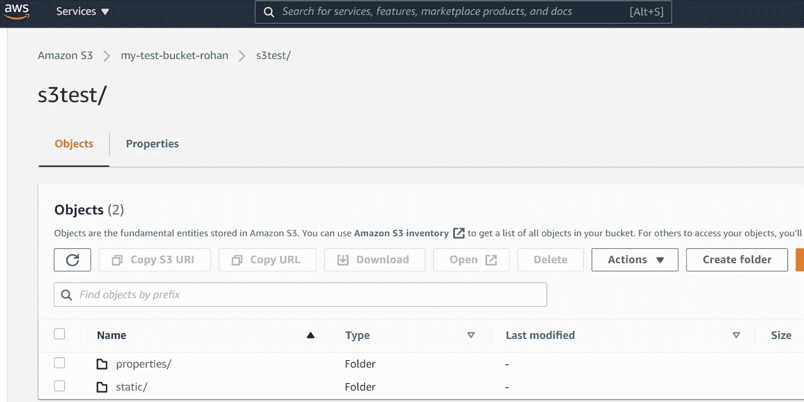

转到 API 的方法请求，并在请求路径中添加“Proxy ”,因为我们将使用代理资源路径。此外，在 HTTP 请求头中添加“Content-type ”,它将用于匹配所请求文件的内容类型。

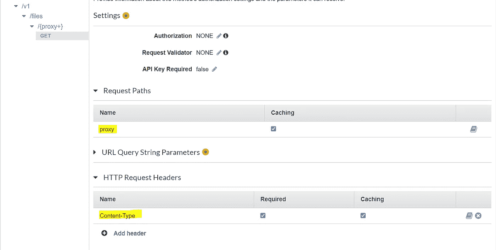

转到集成请求并映射请求路径和 HTTP 请求头，如下所示

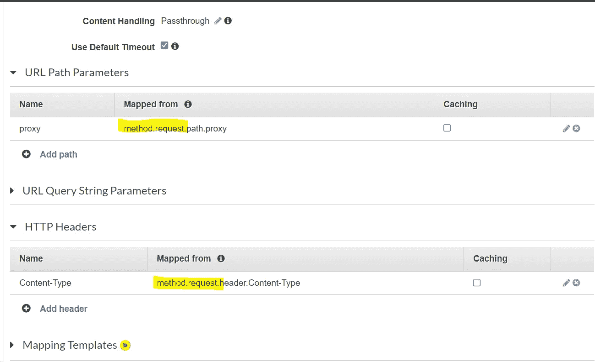

转到方法响应，并在响应头中添加“Content-Type ”,如下所示

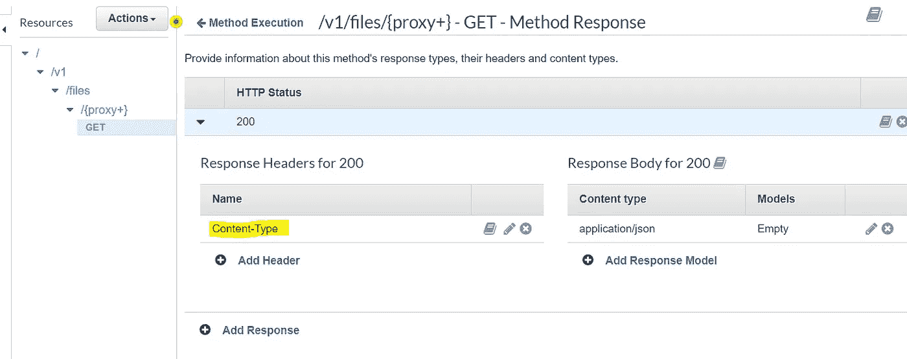

转到 Integration response，映射“Content-Type”头值，该值将告诉浏览器根据通过代理访问的文件的内容类型显示响应中的文件。

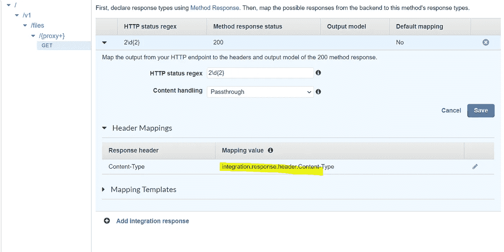

现在，最后一步是在 API 中添加二进制媒体类型，如下所示，这将确保支持基于通过 API 使用的文件的所有内容类型。一些内容类型，如 JSON、图像格式等。将在浏览器中呈现，而其他像 doc、CSV 等。会自动下载。

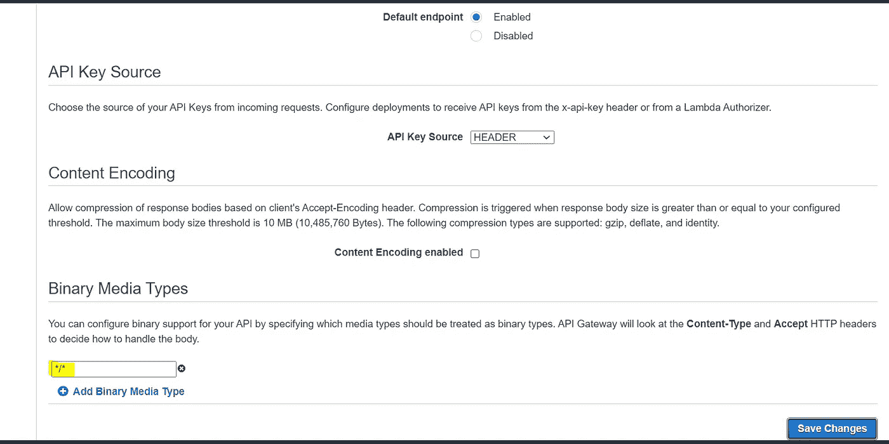

我们最终可以部署 API，并使用 S3 桶文件路径测试它。

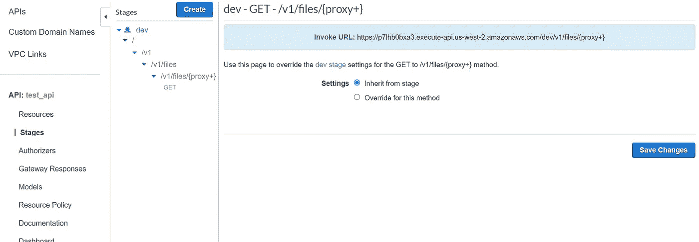

复制基本 API 路径，并将{proxy+}替换为我们在路径覆盖中给出的基本 S3 存储桶路径之后的 S3 文件位置。我们之前创建了 bucket 并存储了两个不同的文件，让我们尝试调用这些文件并观察行为

示例 1: static/sample.jpeg

示例 2: properties/test.json

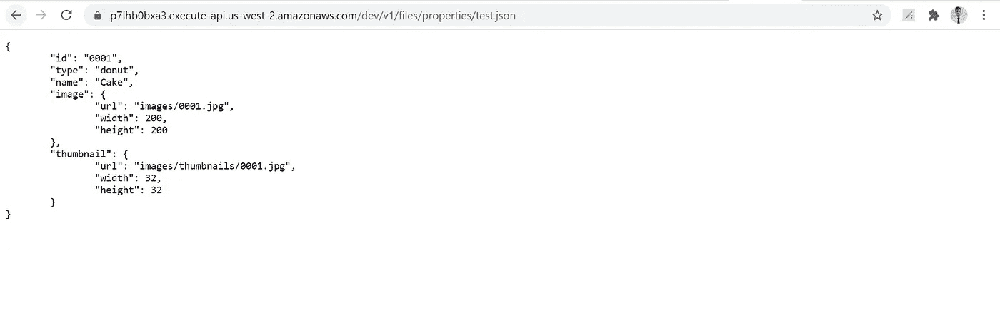

因此，正如您所见，我们可以在 AWS 中创建一个 REST API，通过 S3 获取不同的文件数据，这将非常有帮助。我们还可以使用 AWS 提供的不同服务来认证 API。

要通过 YAML 进行配置并通过 SAM CLI 脚本进行部署，请参考代码:[https://github.com/Rohan009/aws_s3_api_binary_files](https://github.com/Rohan009/aws_s3_api_binary_files)