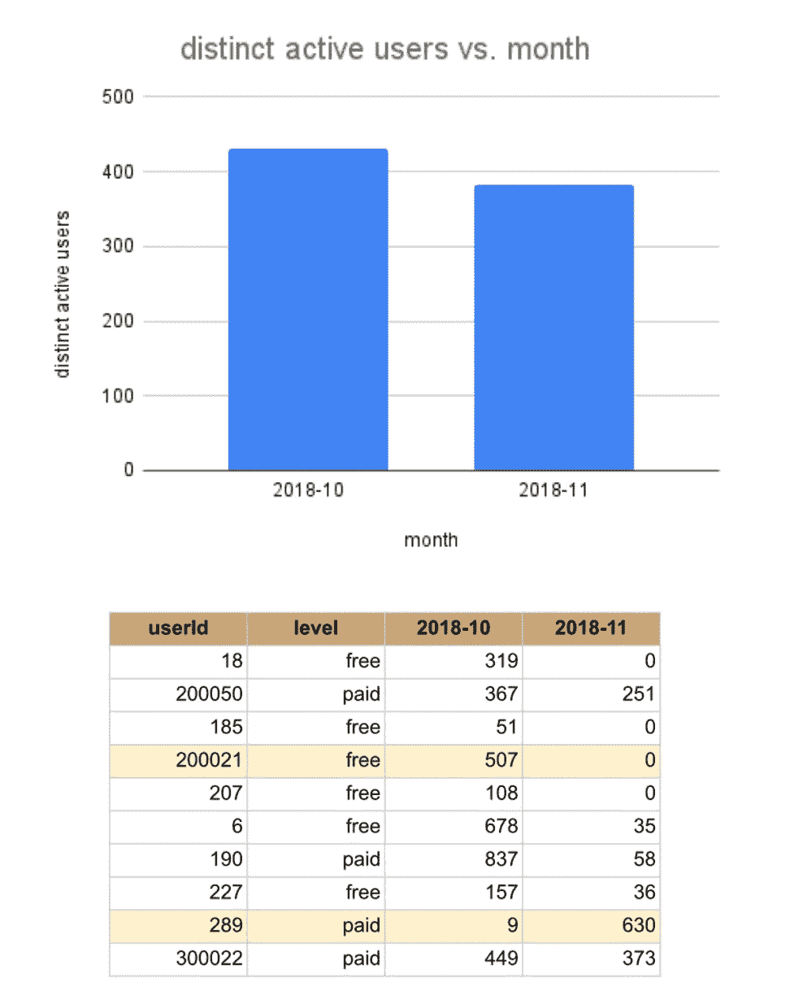
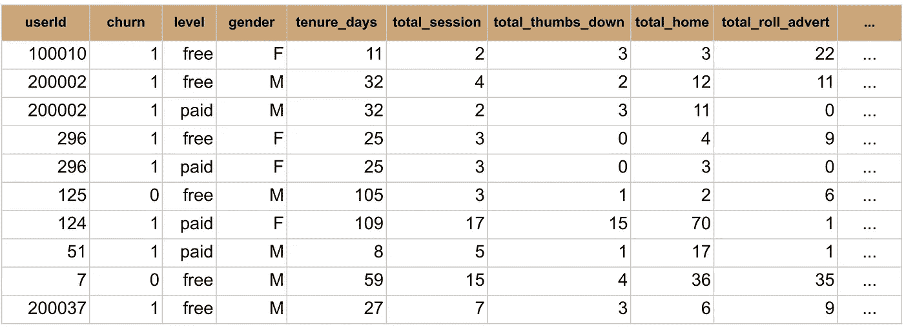
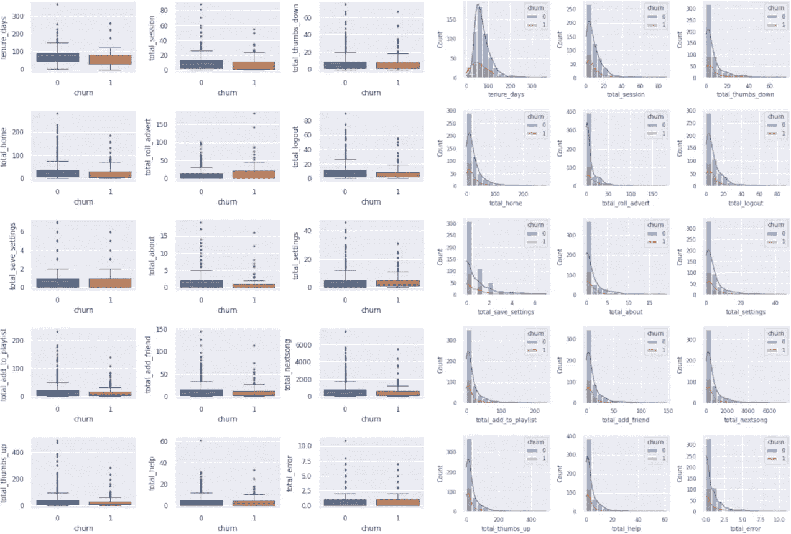
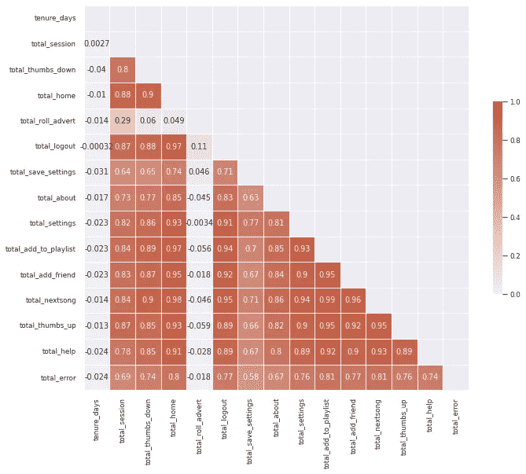
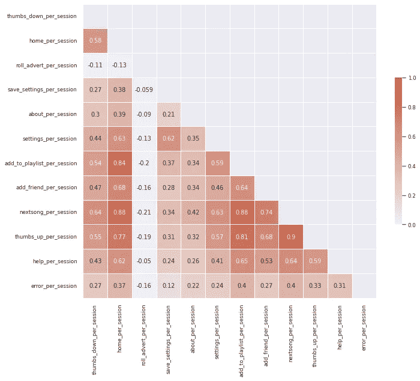
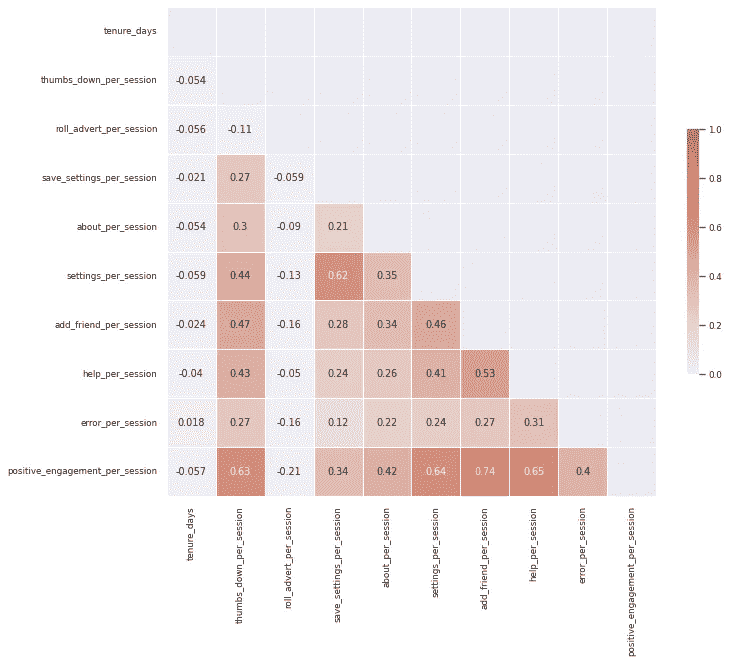
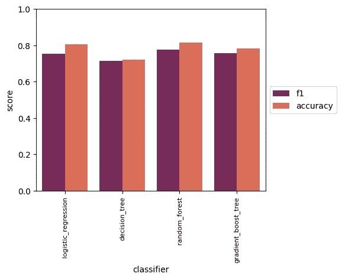
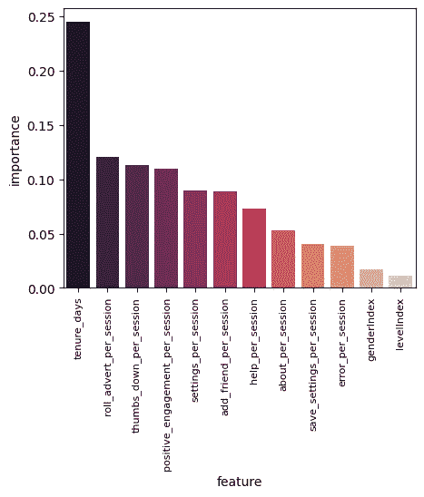

# 使用 Spark 和 ML 预测客户流失

> 原文：<https://medium.com/geekculture/use-spark-and-ml-to-predict-customer-churn-ba915a929eda?source=collection_archive---------19----------------------->


Image credit — [www.humanlytics.co](https://www.humanlytics.co/marketing-analytics/customer-churn-in-ecommerce)

# 什么是客户流失？为什么它很重要？

正如[韦氏词典](https://www.merriam-webster.com/dictionary/churn)所定义的，“客户流失”，从商业意义上来说，是一段时间内由于现有客户流失和新客户增加而发生的有规律的、可量化的过程或变化率。在大多数使用案例中，客户流失被视为客户对服务不满意以及选择降级或取消订阅的指标。从这个意义上说，客户流失直接关系到业务增长和利润。

为了量化客户流失水平，可以使用流失率，并将其计算为给定时间段内现有客户中客户流失的百分比。比如说，某月初，有现有客户主动认购。这个月底有 10 个客户退订，这段时间的流失率是 10%。

*流失率表示失去客户的比率。另一方面，增长率跟踪客户增长的速度。*这两者共同决定了客户群的扩大或缩小。

当特定产品的流失率高于增长率时，客户群会随着时间的推移而萎缩。因此，对于企业来说，了解这一措施并制定适当的策略以维持现有客户群并实现增长是非常重要的。

需要注意的是，*流失率是一个量化指标，没有感情色彩*。找到适当的客户流失水平，平衡客户流量和收入增长，这取决于个体企业。

# 数据科学能提供什么？

由于客户流失高度依赖于客户满意度，因此可以使用数据科学工具来分析客户使用数据，提取与客户满意度相关的信号，并使用这些信息来获得业务洞察力。

统计分析可以提供整个人群中用户行为的整体情况，机器学习算法将有助于预测每个客户的流失趋势。

# 这个项目是关于什么的？

Sparkify 是一种虚构的音乐流媒体服务，类似于 Apple Music、Spotify 等。当客户使用流媒体服务时，提供的数据集是以事件日志的形式，包括艺术家、歌曲、地理位置、时间戳、人口统计信息、用户操作等。

这个项目的主要目标是分析事件日志数据，并建立一个机器学习模型来预测更有可能取消服务的用户(流失)，从而在广告活动中使用这些信息来减少客户外流。

此外，由于使用的数据量，我们利用 spark (pySpark)、spark SQL、spark ML 和 IBM 提供的云服务来执行数据争论、探索和机器学习任务。

# 数据探索

整个数据集包含 543705 行，以下各列对应于事件日志中的记录。在这些行中，有 15700 行带有来自“已注销”和“来宾”用户的空 userId。首先通过删除那些行来清理数据集，并且只考虑具有有效 userId 的行。

```
root
 |-- artist: string (nullable = true)
 |-- auth: string (nullable = true)
 |-- firstName: string (nullable = true)
 |-- gender: string (nullable = true)
 |-- itemInSession: long (nullable = true)
 |-- lastName: string (nullable = true)
 |-- length: double (nullable = true)
 |-- level: string (nullable = true)
 |-- location: string (nullable = true)
 |-- method: string (nullable = true)
 |-- page: string (nullable = true)
 |-- registration: long (nullable = true)
 |-- sessionId: long (nullable = true)
 |-- song: string (nullable = true)
 |-- status: long (nullable = true)
 |-- ts: long (nullable = true)
 |-- userAgent: string (nullable = true)
 |-- userId: string (nullable = true)
```

在进一步探索数据之前，有必要定义一下“流失”对每个用户意味着什么。与取消服务时的客户流失指示相关，在“页面”列(如下所示)中获得不同的操作后，我们定义当用户有“取消确认”操作时客户流失事件的发生。该定义适用于付费和免费客户。

```
['Cancel', 'Submit Downgrade', 'Thumbs Down', 'Home', 'Downgrade', 'Roll Advert', 'Logout', 'Save Settings', 'Cancellation Confirmation', 'About', 'Settings', 'Add to Playlist', 'Add Friend',
'NextSong', 'Thumbs Up', 'Help', 'Upgrade', 'Error', 'Submit Upgrade']
```

对于有流失事件的用户，用户在名为“流失”的单独列中标记为 1。有了定义，我们可以根据 Sparkify 客户是流失客户还是剩余客户，对他们与服务的互动方式进行更多分析。



Figure 1\. (top) Trend of distinct active users over month. (bottom) Number of actions for selected users in Oct and Nov 2018.

**大势**

呈现的数据集从 2018 年 10 月初到 2018 年 12 月初。首先了解一下 Sparkify 业务在月活跃用户方面的表现会有所帮助。

图 1(上图)显示，从 2018 年 10 月到 11 月，月活跃用户略有下降。根据手头的大量数据，这种变化是否显著还没有定论。然而，这确实表明了关注客户流失的必要性。在个人层面上，图 1(底部)显示了一些用户从 10 月到 11 月增加的服务使用；其他人减少甚至根本不使用这项服务。

**被搅动的用户按类别特征分类**

搅动用户在所有不同用户中的比例(搅动比例)约为 0.2210 或 22.10%。

通过性别等人口统计信息分解流失客户和剩余客户，发现*女性用户的流失比例略高于男性用户(p_female=0.2273 vs p_male =0.2160)。*然而，在运行双边比例 z 检验后，**使用 0.05 的显著性水平，女性和男性用户之间的搅拌比例差异并不显著**。

同样，我们可以通过付费或免费层级来划分流失客户群和剩余客户群。发现*免费层用户的流失率略低于付费层用户(p _ free = 0.2216 vs p _ paid = 0.2336)。*运行假设检验后，**使用 0.05 的显著性水平，免费层和付费层用户之间的流失比例差异并不显著**。

**被搅动的用户按数字特征细分**

本项目中使用的数字特征选自列的子集(“ts”、“registration_time”和“page”)。结合流失事件的时间戳，使用“注册时间”来计算以天为单位的使用权或客户生命周期。“页面”列用于生成用户对服务的操作，并汇总每个级别的每个用户的每个操作的总数。使用了以下数字特征，图 2 中显示了具有数字特征的选定行。**注:** *有多个用户因升级降级事件而同时成为付费和免费用户*。

```
'tenure_days', 'total_session', 'total_thumbs_down', 'total_home', 'total_roll_advert', 'total_logout', 'total_save_settings', 'total_about', 'total_settings', 'total_add_to_playlist', 'total_add_friend', 'total_nextsong', 'total_thumbs_up', 'total_help', 'total_error'
```



Figure 2\. Numerical features for selected row.

首先，让我们来看看这些数字特征的一些统计数据，这些数据是针对流失用户和剩余用户的。



Figure 3\. (left) Boxplots showing variabilities and (right) histplots showing distributions of numerical features for remaining (0) and churned (1) users.

图 3 显示了这些数字特征的可变性和分布。剩余用户和流失用户的中值在所有数字特征上都是相似的，它们都有一定数量的异常值，表明分布是偏斜的。

分布图也表明了偏斜度。偏度的方向也值得研究。对于某些功能，如任期天数、total_add_to_playlist、total_add_friend、total_nextsong，客户停留时间越长，对服务的参与度越积极，就越倾向于采用左偏分布。显然，对于来自所展示的数据集的分布来说，情况并非如此。另一方面，对于 total_error 和 total_thumbs_down 这样的特征，右偏分布是首选的，表示较少的负面体验。

一般来说，与流失用户相比，剩余用户在所有事件中与服务的交互更多。由于聚集属性的性质和页面动作之间的潜在相关性，需要探索不同特征之间的相关性。



Figure 4\. Correlation matrix among different numerical features.

图 4 显示了不同数字特征之间的相关矩阵。我们可以看到强相关性的存在！为了减少多重共线性和使用回归模型时的潜在问题，需要适当的特征工程来减少相关性。

# 特征工程

首先通过 total_sessions 标准化聚集特征来执行特征工程。归一化后，得到的相关矩阵如图 5 所示。



Figure 5\. correlation matrix after normalization.

有些功能还是高度相关的，比如 add_to_playlist_per_session，home_per_session，thums_up_per_session，next_song_per_session。这些都与暗示积极用户体验的事件有关。我们可以将这些功能一起添加到一个新功能中，命名为 postive_engagement_per_session。更新后的相关矩阵如图 6 所示。



Figure 6\. Updated correlation matrix after combining several normalized features.

特征工程后的数字特征显示出较少的相关性。然后，转换后的数据集被输入机器学习管道，以训练模型来预测客户流失。

# 建模

转换后的数据集首先被分成训练集、测试集和验证集。几个机器学习分类器，包括逻辑回归、决策树、随机森林和梯度提升树，用于训练。由于与剩余用户相比，流失用户的比例较小，即数据集不平衡，因此使用 F1 分数作为各种模型准确性的主要衡量标准。



Figure7\. Baseline performances of various ML models on validation set.

在将训练集输入 ML 模型之前，通过标准化进行特征缩放。首先使用 Spark ML 库中的默认设置获得上述模型的基准性能。结果如图 7 所示。

从基线得分结果来看，随机森林分类器在验证集上表现最好，F-1 得分为 0.7761，准确度为 0.815。在测试集上使用相同的训练的随机森林分类器，我们得到 0.7007 的 F-1 分数和 0.76 的准确度。为了提高其性能，对该模型进行了超参数调整，对训练集进行了 5 重交叉验证。



Figure 8\. Feature importance ranking extracted for tuned random forest classifier.

在超参数调整之后，新训练的随机森林分类器在测试集上的性能略有提高，F-1 分数为 0.7066，准确度为 0.768。

功能重要性也是从优化的模型中提取的(如图 8 所示)。查看功能重要性排名，我们可以看到客户使用时间是最重要的，其次是用户行为，如接收广告、点赞和积极参与(添加到播放列表、nextsong、竖起大拇指)。另一方面，性别和服务水平是最不重要的，这与我们得出的差异不显著的假设检验相一致。

# 结论

在这个项目中，我们利用 Spark 分析大量用户日志，并建立机器学习模型来预测客户流失，目的是使用训练好的模型来潜在地服务于未来的广告活动。

通过执行超参数调整，我们使用调整后的随机森林分类器在测试集上实现了 F-1 分数的轻微改善。有限的性能提升可能是由于以下原因:

*   不平衡的数据集(99 个变动用户对 349 个剩余的唯一用户)。即使我们使用 F-1 分数作为度量来减少不平衡数据的偏差，也可以执行再平衡来进一步改善模型性能。
*   特征工程阶段的信息损失。为了减少多重共线性，我们对一些特征进行了归一化和合并。尽管它可以减少回归模型的问题，但使用对多重共线性更具弹性的模型(如随机森林、决策树)的现有功能进行研究可能是值得的。
*   需要从事件日志中提取更多功能。事件日志中有更多信息未在此项目中使用，如地理位置标记和降级/升级相关事件。这些新功能可以提供更多维度来正确预测客户流失。

*要查看更多关于这个分析的内容，请直接到我的 Github 资源库* [*这里*](https://github.com/hengli700/spark-machine-learning-sparkify) *。*

*请随意在* [*这里*](https://www.linkedin.com/in/hengli700/) *通过 LinkedIn 连接。*

# 承认

1.  数据集由 Udacity 数据科学家纳米学位项目提供
2.  IBM Cloud 提供的云服务