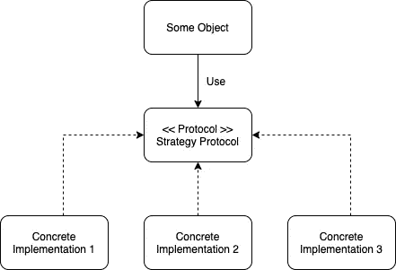
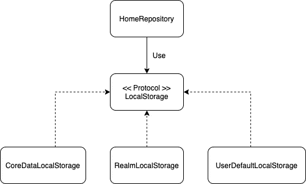
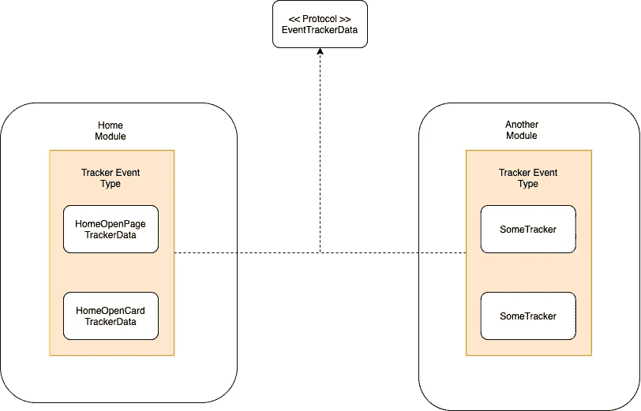
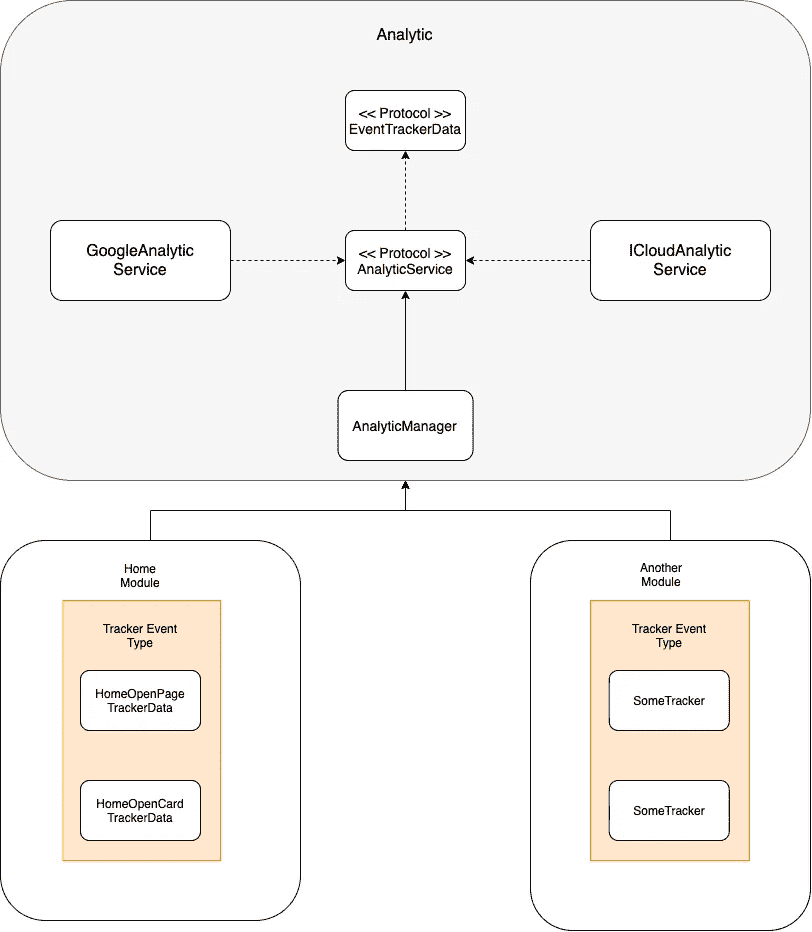

# 使用策略设计模式在 iOS 应用程序中创建分析功能

> 原文：<https://medium.com/geekculture/use-strategy-design-pattern-to-create-analytic-feature-in-ios-app-ae18277ed42f?source=collection_archive---------7----------------------->

策略设计模式是我们可以用来构建可伸缩系统的众多武器之一。

Photo by [Thom Bradley](https://unsplash.com/@thombradley?utm_source=medium&utm_medium=referral) on [Unsplash](https://unsplash.com?utm_source=medium&utm_medium=referral)

分析跟踪功能可能是当今许多移动应用程序最重要的功能之一。我们可以从用户使用我们的应用程序时的日常行为中获得许多数据，然后我们可以分析这些数据，使其成为有用的信息，以确定我们移动应用程序开发的下一步。

实际上，有大量的工具可以用来在 iOS 中实现分析功能。也许我们可以使用 Google analytic SDK，或者 iCloud analytic SDK，甚至我们可以自己开发分析跟踪器 SDK。那么，我们如何设计一个架构系统来实现分析跟踪功能是相当具有挑战性的。我们希望实现可扩展性，这意味着我们可以扩展我们的代码库，而不需要很大的成本。我们还希望我们的代码库可以在不破坏当前实现的情况下轻松扩展。也许我们也希望我们的代码库可以很容易地被测试。那我们怎样才能实现这个目标呢？

这就是为什么作为一名 iOS 工程师，甚至作为一名移动开发者，理解如何设计系统是我们需要具备的重要技能。从长远来看，我们的决定非常重要。理解设计原则和许多设计模式将帮助我们确定“我需要使用哪种武器来处理这个问题？”

## 引入策略设计模式

策略设计模式定义了一组可在运行时设置可切换对象。请看这张简单的图表:

必须存在的第一个组件是我们有一个依赖的对象，并且它符合策略协议。策略协议要求具体的实现对象应该实现它。为了实现这种策略模式，我们可以使用依赖注入技术。看一下这个示例实现:

我们有一个简单的对象叫做`HomeRepository`。它与类型`LocalStorage`有一个依赖关系，并且是一个协议。在现实世界中，我们可以实现具有许多选项的本地存储，如核心数据、领域、用户默认值等。我们可以从本地存储选项创建具体的实现，并使其符合`LocalStorage`协议。

上面代码中的图表如下所示:

## 战略设计模式的好处

*   它使我们能够对使用策略的对象隐藏具体的实现。我们可以在不破坏根对象实现的情况下改变实现。
*   它是可测试的，使用策略协议，我们可以创建一些用于单元测试目的的对象，如符合策略协议的模拟或间谍对象。
*   你可以认为策略模式有点类似于委托模式。它使用另一个对象来帮助这个对象完成它的任务。然而，策略模式的目的是我们可以定义可切换的具体实现，并且系统可以容易地扩展或改变。

那么我们如何使用这种策略模式来帮助我们开发 iOS 中的分析功能呢？首先我们需要定义完整的需求，然后我们可以直接设计系统。

## 追踪器事件

通常任何类型的事件跟踪器都需要一个我们需要提供的公共数据。例如，当用户打开主页时，我们需要发送时间戳、设备版本、操作系统版本和事件类型名称。另一个例子是，当用户点击列表中的一张卡片时，它需要与我之前提到的相同的数据，但也许我们需要发送额外的信息，如卡片中的数据序列？还是卡里的某个状态？

为了在系统中表示跟踪器数据，我们可以使用一些选项，如 enum、struct 或 protocol。哪个更好？
我会按照协议解决。为什么我们不使用枚举？通常在一个大型应用程序中，有数百个事件跟踪器实现。如果我们使用 enum，基本上它会违反开闭原则，因为每当我们添加一个新的 tracker 事件类型时，它会破坏 switch 语句的实现，我们需要修改它。Struct 比 enum 好，但是 protocol 更强大。我将告诉你如何使用协议来实现这个目标。

就像我之前说的，事件类型是我们需要提供的一组相似的数据。我们可以创建一个协议来表示这种事件类型，如下所示:

然后，如果我们想添加新的分析跟踪器，我们可以创建新的类型，并符合它上面的例子。使用这种实现，我们的图表将如下所示:

我们表示跟踪器事件类型的协议现在完成了。下一步是我们如何创建一个具有一个职责的对象，该职责是将事件类型发送到分析服务。就像我们之前已经讨论过的，分析服务可以是 Google Analytic SDK，或者其他的分析 SDK。你猜怎么着？是时候实施战略模式了！

像我们之前的讨论一样，策略模式需要一个协议作为策略抽象，它有一个功能需求，即发送分析跟踪数据。我们的具体策略实现是`GoogleAnalyticService`和`ICloudAnalyticService`需要实现策略协议需求。最后一步是创建使用策略协议作为其依赖项的对象。

我们最终的系统图如下所示:

## 要点

策略设计模式是我们可以用来创建可伸缩系统的最强大的模式之一。它定义了一个可切换具体实现，我们可以在运行时使用它。但是作为一名软件工程师，如果你学习另一种设计模式和设计原则会很好，这将使你有更多的武器来解决现实世界的问题。谢谢大家，编码愉快:]