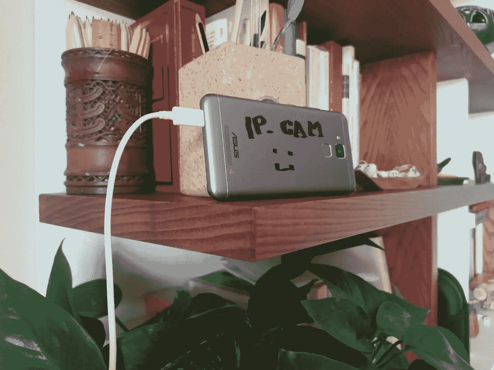

# 使用你的旧安卓手机作为 IP 摄像头

> 原文：<https://medium.com/geekculture/use-your-old-android-phone-as-an-ip-camera-6080d20e7ebb?source=collection_archive---------3----------------------->

## 我们每个人的抽屉里都至少有一部半旧的旧手机。在这篇文章中，我描述了我是如何改变这种旧技术的。从网上下载到一个功能齐全的安全摄像头。

My old Asus Zenphone with broken display. It has a very good camera :)