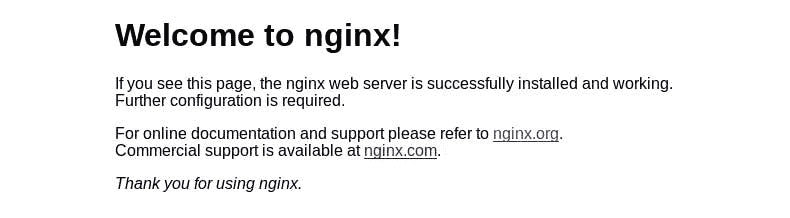

# 将您的 Raspberry Pi 用作本地服务器

> 原文：<https://medium.com/geekculture/use-your-raspberry-pi-as-a-local-server-93bd0702946e?source=collection_archive---------14----------------------->

是不是新买了一个树莓 Pi，想在上面设置一个本地家庭服务器，不知道怎么设置？嗯，你正在查看正确的博客文章。当我得到一个树莓派时，我不知道除了将它用作 WiFi 路由器之外，我还能做什么。但是随着我不断地尝试，我意识到我可以用它做的事情太多了。在本文中，我将指导您在您的 Raspberry Pi 上设置家庭服务器。

# 我的案子

我住在大学宿舍。我住的街区的 Wi-Fi 信号很差，尤其是我的房间，所以我们房间里有一个 RJ45 端口。我的校园网络有一个限制，即只能注册三台设备，而且一次只能连接一台设备。但问题是，我有 4 台设备需要连接到互联网，有时是同时连接。我知道，这有点复杂。另一件让人头疼的事情是，其中涉及到一个强制门户。所以每次换设备都要登录。

# 我想到的解决方案

在我想到弄个树莓派之前，我想到了其他方法。一种方法是将我的电脑连接到以太网端口，然后打开热点。很简单，对吧？但这意味着我不得不整天开着电脑，笔记本电池也不便宜。这也意味着我不得不告别我的笔记本电脑的便携性。

另一个解决方案是购买一个路由器并将其连接到端口。我差点就要买这个了，但是我想要更多的功能，我想要一个足够好的信号给我的房间，但不是给住在走廊对面的人。一个笔记本电脑热点对此很好，但你显然知道那里的限制。我还想要一台支持 NAS 的路由器。嗯，我的预算完了。然后我偶然发现了树莓派。一台运行 Linux 且完全可编程的微型计算机。我为自己找到了完美的玩具。

# 设置

我最后买了一个树莓 Pi 4 型号 b。它有 4 GB 内存，一个千兆以太网芯片，2 个 USB 2.0 端口和 2 个 USB 3.0 端口。这里可以买到[。我用 RJ45 电缆将我的 Raspberry Pi 连接到以太网端口，将其连接到电源，并将我的外置硬盘连接到其中一个 USB 端口(用于制作 NAS)。我本可以使用](https://www.thingbits.in/products/raspberry-pi-4-model-b-4-gb-ram)[树莓操作系统](https://www.raspberrypi.org/software/)，但我想要一些清淡的。所以我继续使用 [Ubuntu 服务器](https://ubuntu.com/download/raspberry-pi)。

# 入门指南

对于本教程，我假设您的发行版是最新的，并且设备运行的是 Ubuntu 的最新稳定版本。目前，您要么需要将您的 Pi 连接到外部显示器，要么可以使用 VNC 连接到它。如果它们连接到同一个网络，您也可以 SSH 到它。所以现在，让我们开始吧。

# 设置服务器

现在一切都明白了，让我们开始设置服务器。

## 设置 R-Pi 主机名

您可以使用 URL `raspberrypi.local`在本地网络上访问您的 Raspberry Pi。但是您可以通过编辑`/etc/hosts`文件将其更改为任何内容，比如`myserver.local`或`mypi.local`。更多关于那个[这里](https://www.slicethepi.co.uk/modify-host-file/)。一旦你这样做了，你就可以走了。

## 将您的 Pi 设置为接入点(AP)

将以太网电缆连接到 Pi 和端口。下一步是安装名为`raspap-webgui`的软件，它可以帮助你设置无线接入点。

> *RaspAP 可以让你快速建立并运行一个 WiFi 接入点，以共享许多流行的基于 Debian 的设备的连接，包括 Raspberry Pi。我们受欢迎的快速安装程序创建了一个已知良好的默认配置，该配置在当前所有带有板载无线功能的 Raspberry Pis 上“正常工作”。反应灵敏的界面使您能够控制相关的服务和网络选项。包括高级 DHCP 设置、OpenVPN 客户端支持、SSL、安全审计、主题和多语言选项。*

前往 [github](https://github.com/billz/raspap-webgui#quick-installer) 了解如何在您的设备上安装它。

安装完成后，您可以在支持无线功能的设备上看到作为无线 AP 的`raspi-webgui`。您还可以在这里找到 AP 的默认密码和路由器设置。您路由器的默认 IP 将是`10.3.141.1`。您可以通过访问 http://10.3.141.1 并使用 GitHub 库的自述文件中提供的默认密码和用户名来访问您的路由器设置。

在此阶段，您已经使用您的覆盆子成功创建了一个无线 AP。

## 在您的 PI 上托管网站

现在，您已经连接到您的 Pi 网络，让我们让它更加可用。我在手机上设置了我的个人日志。只有当我连接到 raspi-webgui AP 时才能访问它。你可以在这里找到它[。为了设置这个，我安装了](https://github.com/canaryGrapher/Open-Journal) [Nginx](https://www.nginx.com/) 。利用这个，我可以在我的 Pi 上建立多个网站。因为我已经有了 raspberrypi.local 作为我的 pi 的主机名，所以我可以设置多个子域来托管不同的网站。如果你不知道如何设置 Nginx，你可以看看这里的。

为了确保您的 Nginx 安装正确，请在连接到新创建的 AP 时浏览 raspberry.local。您应该会看到类似这样的页面。

假设我设置 Nginx 使用 journal 作为子域来托管我的 journal 网站，我可以在连接到`raspi-webgui`的同时在浏览器的地址栏输入 journal.raspberrypi.local 来查看我的网站。通过创建更多的 Nginx 配置文件和使用更多的子域，我可以在这个服务器上建立更多的网站。

## 在 Pi 上设置 SMB

我的外置硬盘上有很多学习资料、电影、照片和视频。每当我来到我的房间，我首先要打开我的笔记本电脑，然后把它连接到我的硬盘驱动器来访问这些文件。如果我想躺下来用我的手机看一些视频，我首先要把它们传输到我的手机上，然后再看。我知道。这听起来不像是太多的工作，但是我很懒。我喜欢用尽可能少的步骤做事。也许这就是我不擅长下棋的原因。回到刚才的讨论，我将硬盘连接到 Pi 并安装了 Samba，以便在连接到 Pi AP 的任何设备上访问硬盘上的文件。[本指南](https://pimylifeup.com/raspberry-pi-samba/)提供了一种在您的 Pi 上安装 Samba 的简单方法。在继续之前，一定要记住安装驱动器。您可以在 Pi 上安装任意数量的驱动器，并在连接到 AP 的任何设备上访问它。

# 接下来你能做什么？

这就是本教程的内容。但这并不是可能性的终结。这些是你可以添加到你的服务器上的其他东西。

*   使用温度和湿度传感器获取天气报告。
*   使用连接在同一网络上的 Pi 控制一些物联网设备。
*   建立宿舍房间保安服务。
*   在你的 Pi 上安装 Alexa。
*   您可以联系您的 ISP 为您提供一个**静态公共 IP 地址**，这样您就可以从世界任何地方访问您的 Pi。(这可能有风险。如果您不具备保证服务器安全的技能，您可能会将本地网络中的每一台设备置于危险之中。这完全取决于你的创造力。

希望你发现这篇文章信息丰富，耐人寻味。如果它对你有帮助，就像🧡一样给它一个名字，并与可能会发现它有用的人分享。还可以查看我的 [Instagram](https://www.instagram.com/encodable/) 和[脸书](https://www.facebook.com/enc0dable)页面了解更多内容。

*原载于*[*https://blogs.yasharyan.com*](https://blogs.yasharyan.com/use-your-raspberry-pi-as-a-local-server)*。*