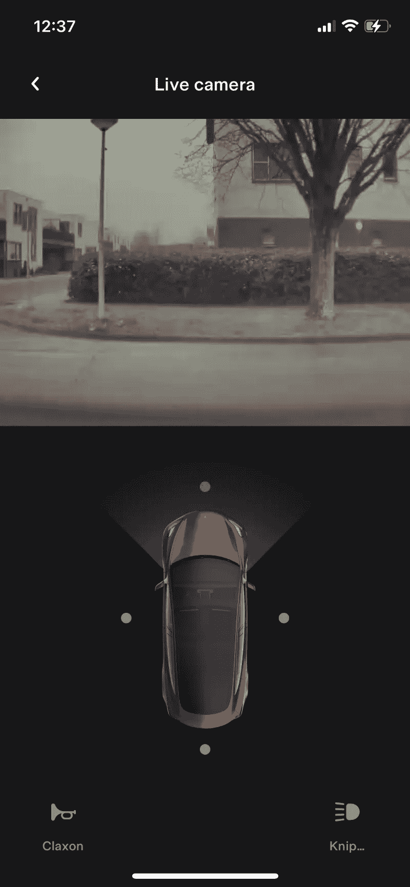

# 使用你的特斯拉 M3 作为一个现场安全摄像机！

> 原文：<https://medium.com/geekculture/use-your-tesla-m3-as-a-live-security-camera-cafe9e84fb67?source=collection_archive---------25----------------------->

特色终于来了…

每辆特斯拉都配备了摄像头，以实现完整的自我和自适应驾驶选项。我一直想知道为什么我不能从特斯拉应用程序访问摄像头。看起来这一直是可能的，但这个应用程序仍然没有这个功能，但不要哭泣，它终于来了！

# 如何启用该功能？