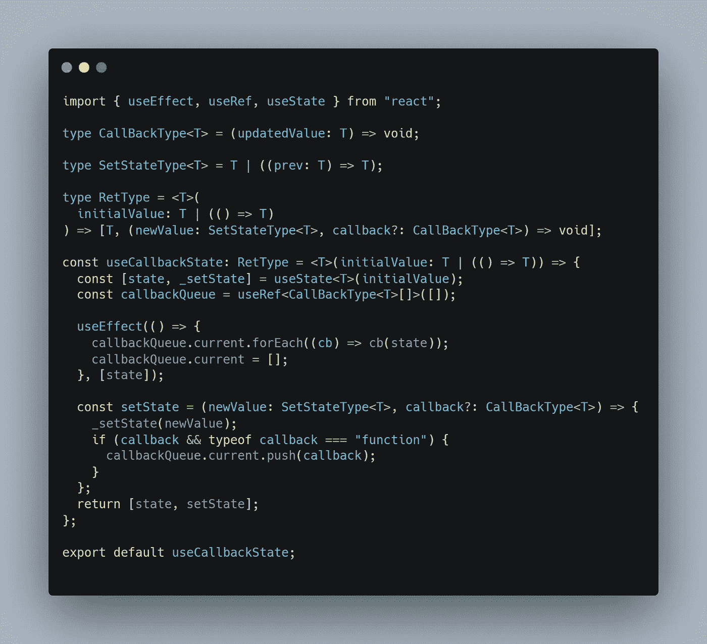

# useCallbackState:让您在 setState 操作完成后运行代码的钩子。

> 原文：<https://medium.com/geekculture/usecallbackstate-the-hook-that-let-you-run-code-after-a-setstate-operation-finished-25f40db56661?source=collection_archive---------4----------------------->



React 中功能组件的状态由 useState 挂钩管理。这个钩子返回一个 tuple(一个有两个元素的数组，但是你知道 tuple 看起来更专业)，其中第一个元素是状态变量，第二个元素是这个状态的 setter。

这是不可避免的，因为这就是 React 处理反应的方式。React 可以知道它需要重新渲染，因为您已经使用了 setState 函数来改变状态，如果您试图直接改变状态变量，它将不会重新渲染。

setState 函数的另一个注意事项是它是异步的:如果你正在运行一个函数并且你正在设置状态，你不能在同一个函数中访问更新的值。更重要的是，如果你必须在变量设置后运行一些代码，你没有办法在函数内部运行。你需要做的是创建一个依赖于你正在设置的状态变量的 useEffect，并在 useEffect 中执行你的逻辑。

这不仅可读性差得多，而且还有一个小小的警告，在某些特定的情况下可能并不可取。只有在运行特定的 setState 时，您才无法运行代码。使用 useEffect，你的代码将在每次变量改变时运行，不管是谁改变了它。

假设你有可以设置你的状态的按钮，你只想在按钮 A 设置状态后运行代码，而不想在按钮 B 设置状态时运行。使用 useEffect 方法无法做到这一点。

好吧，今天一切都变了！

# useCallbackState 挂钩

我创建了一个定制的钩子来解决这个问题。初始 api 与 react 中的 useState 挂钩相同，唯一的区别是 setState 函数也可以接受回调作为输入。这个回调保证在状态更新后被调用，并且新的状态也作为输入被传递。

让我们看一下代码，然后我们可以评论它做了什么。

它做的第一件事是创建一个传递 initialValue 的状态变量。然后，它在 ref 中创建一个回调队列，该队列以空数组开始。

然后我们找到了钩子的核心:有一个 useEffect 钩子，它在每次状态改变时再次运行，遍历回调数组并调用每个传递新状态的回调。在循环之后，它刷新队列。

然后是 setState 函数，最后 get 返回给用户:它接受新值和回调作为输入，设置新的状态，如果有回调并且是函数，就把回调添加到队列中。这确保了当 useEffect 运行时，只有设置了回调的 setState 会执行他的代码。

最后，我们将元组返回给用户。

用法相当简单:

```
import useCallbackState from "./hooks/useCallbackState";import "./styles.css";export default function App() {const [test, setTest] = useCallbackState<boolean>(true);return (
    <>
        <button onClick={() => { setTest((prev) => !prev,
            (newVal) =>{
                console.log("The value changed", newVal);
            });}}>
                Change
        </button>
        <button onClick={() => { setTest((prev) => !prev);}}>
                Change noCallback
        </button>
    </>
);}
```

第一个按钮将在更改后触发控制台日志，第二个按钮不会。

如果你想让一个类型安全的钩子与你的精彩的类型脚本项目一起工作，我还准备了一个类型脚本版本的钩子。

如果你想快速地使用钩子，这里有一个代码沙箱供你使用。