# 二手汽车价格预测-完整的机器学习项目

> 原文：<https://medium.com/geekculture/used-carprice-prediction-complete-machine-learning-project-d25559cf2d2a?source=collection_archive---------0----------------------->

# 汽车价格预测机器学习项目的分步指南！

在本文中，我将带您了解我们如何训练一个模型来帮助我们预测汽车价格。您将练习到目前为止所学的机器学习工作流，使用汽车的属性来预测汽车的市场价格。我们将使用的数据集包含各种汽车的信息。

**潜在的业务问题**--

这个项目的主要目的是根据各种特征预测二手车的价格。

关于汽车数据集，请访问 https://www.kaggle.com/nehalbirla/motorcycle-dataset

> Github 链接:[https://github.com/TEJASHREE8/car-price-prediction](https://github.com/TEJASHREE8/car-price-prediction)

该数据集包含二手车的信息。给定数据集中的列如下:

姓名，年份，售价，

公里驱动，燃料，卖方类型

变速器，所有者

该数据由大约 301 辆汽车和 9 个特征的记录组成。

# 数据科学项目的整个生命周期分为四个部分:

1.  [探索性数据分析](https://medium.com/p/d25559cf2d2a/edit#f327)
2.  [特征工程](https://medium.com/p/d25559cf2d2a/edit#d304)
3.  [功能选择](https://medium.com/p/d25559cf2d2a/edit#7edb)
4.  [模型部署](https://medium.com/p/d25559cf2d2a/edit#61e6)

— — — — — — — — — — — — — — — — — — — — — — — — — — — — — —

现在，让我们从使用回归预测汽车价格的机器学习任务开始。

1.  [**探索性数据分析**](https://medium.com/p/d25559cf2d2a/edit#f327)

现在，让我们从使用回归预测汽车价格的机器学习任务开始。首先，我将导入完成该任务所需的所有必要的库，并导入数据集。

1)导入库

2)导入数据集

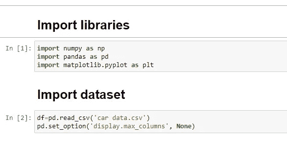

在处理数据科学问题时，我们可以做的第一件事是了解您正在处理的数据集。记录下数据中的主要观察结果和趋势。监控变量和输出'*销售价格*'之间的所有相关性。为此，您可以使用 **df.info** 、 **df.head()等。**

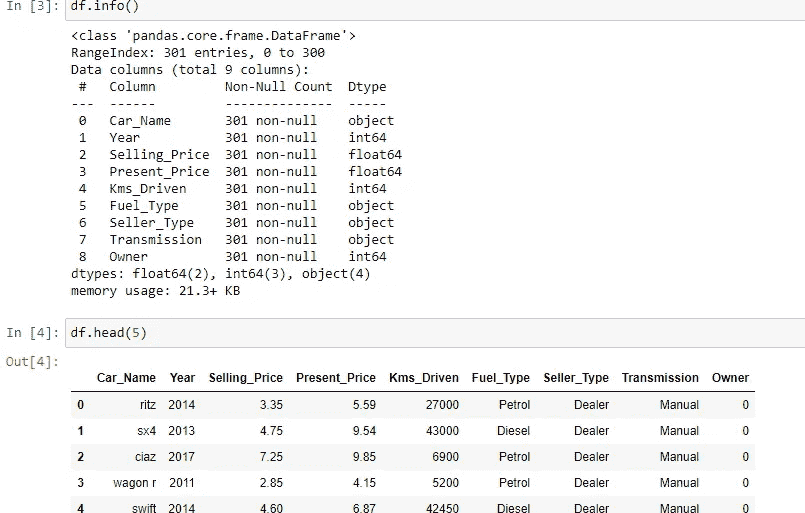

## 在数据分析中，我们将尝试找出以下内容

1.  数据集中缺少值。

2.所有的数值变量和数值变量的分布。

3.分类变量

4.极端值

5.独立特性和从属特性之间的关系(*销售价格*)

— — — — — — — — — — — — — — — — — — — — — — — — — — — — — — —

[**2。特色工程**](https://medium.com/p/d25559cf2d2a/edit#d304)

您可以看到数据的样子，但是在使用它之前，我们需要对它进行定制。我们将在特征工程中执行以下所有步骤

*   **缺失值的处理**

如果该列不在我们的模型中，我们将删除它，或者我们可以使用**集中趋势度量，如平均值、中值或**数字特征的模式**。**

这里我们删除了*‘Car _ Name’列，因为它对我们的模型没有帮助。我们的数据集中没有缺失值。*

*   **分类变量的替换**

为了能够使用分类数据，我们使用了 **pd.get_dummies()** 也称为 **one hot encoding。**这实质上是将变量的每个唯一值转换成它自己的二进制变量。

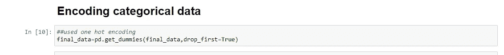

这里，我们还在数据集中增加了一个新的特征，即*‘no _ year’*，它是从*‘year’*列派生出来的，以便于分析数据。

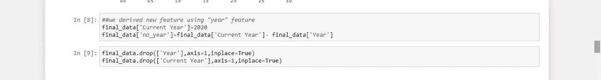

# 可视化变量和关系

清理完数据后，我们可以将数据可视化，更好地理解不同变量之间的关系。您可以做更多的可视化工作来了解数据集，如散点图、直方图、箱线图等。使用 **sns.heatmap()** ，我们可以看到' *Present_Price'* 与' *Selling_Price'* 和' *Fuel_Type_Petrol'* 和' *Fuel_Type_Diesel'* 与'*Selling _ Price '【T33]负相关*

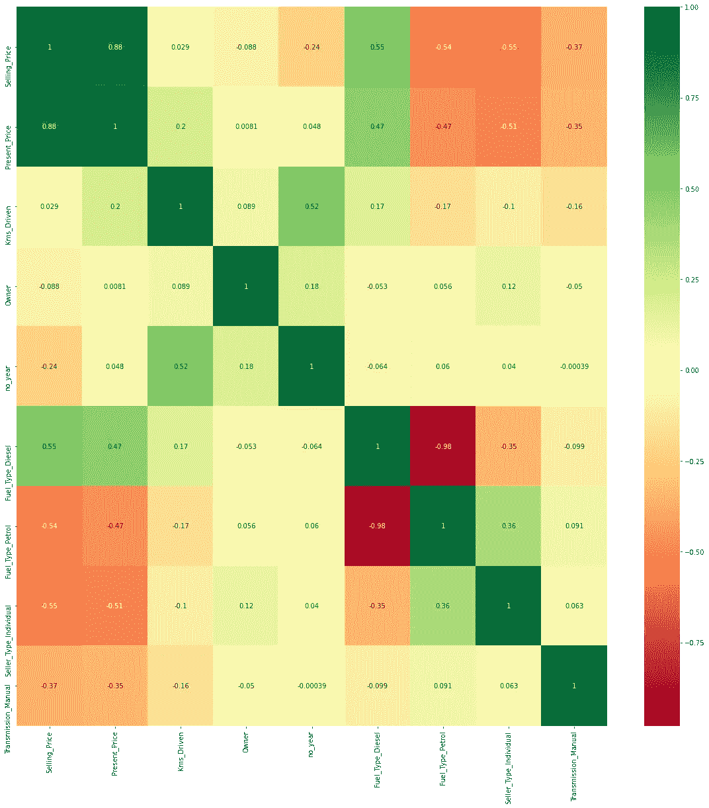

## 3.[功能选择](https://medium.com/p/d25559cf2d2a/edit#7edb)

**模型训练:**

进行了列车测试数据分割。在这种情况下，我们将数据分为训练集和测试集，然后在训练集上拟合候选模型，在测试集上评估和选择它们。

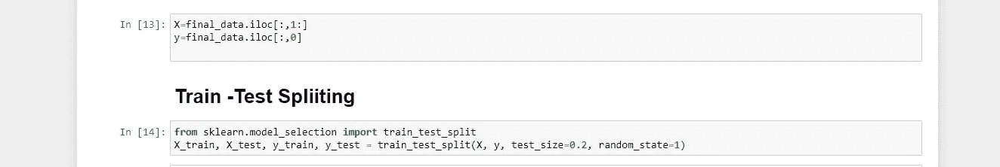

*   我们事先不知道哪个模型在这个问题上表现最好，因为它是不可知的。因此，我们在这个问题上拟合和评估了一套不同的模型。我们在训练集上使用随机森林回归和线性回归模型(特征选择)。我们还检查哪个模型给我们最好的结果。您可以尝试任意数量的回归模型，并从中选择一个最合适的模型。
*   我们使用随机网格来搜索最佳超参数。参数的随机搜索，在 100 个不同的组合中使用 3 折交叉验证搜索。

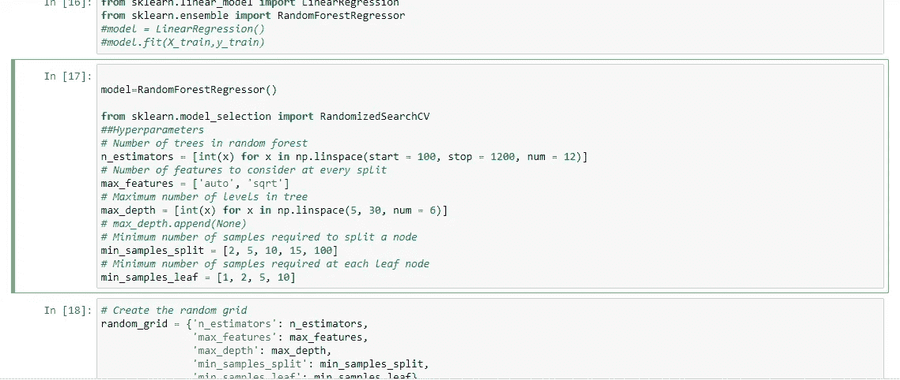

*   模型选择是从预测建模问题的众多候选模型中选择一个模型的过程。在分析了这两个模型之后，我们选择了随机森林回归模型。

**拟合参数分布**

您还可以使用`**distplot()**`来拟合数据集的参数分布，并直观地评估它与观察数据的对应程度。它应该是一个封闭的高斯分布图，并且“y_test”(真实值)和“预测值”之间的差异也应该是最小的。

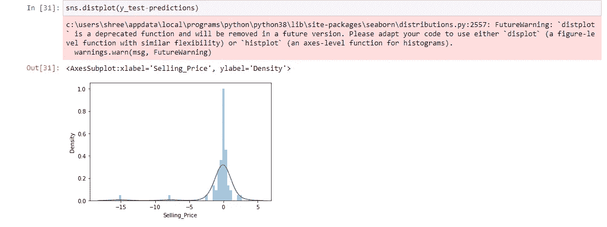

散点图用于观察变量之间的关系，并用点来表示变量之间的关系。这里的点几乎排成一条线。

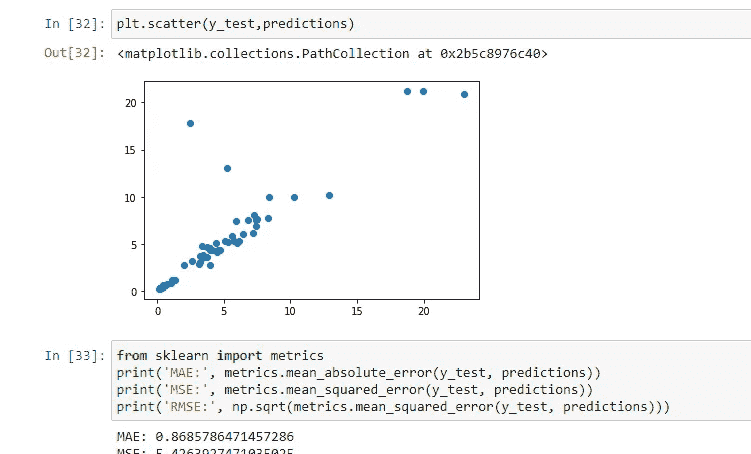

## 检查模型的准确性

评估模型准确性是创建机器学习模型以描述模型在预测中表现如何的过程中的一个重要部分。MSE、MAE 和 RMSE 度量主要用于评估回归分析中的预测误差率和模型性能。

*   **MAE** (平均绝对误差)代表原始值和预测值之间的差异，通过对数据集的绝对差异进行平均来提取。
*   **MSE** (均方误差)代表原始值和预测值之间的差异，通过对数据集的平均差异进行平方来提取。
*   **RMSE** (均方根误差)是以 MSE 的平方根表示的误差率。

回归器保存为 pickle 文件，以便将来加快执行速度。

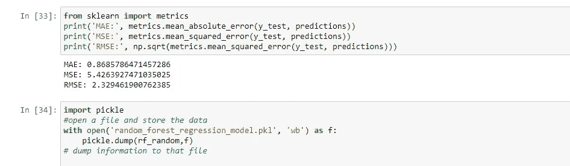

— — — — — — — — — — — — — — — — — — — — — — — — — — — — — — —

## [4。模型部署](https://medium.com/p/d25559cf2d2a/edit#61e6)

模型部署是任何机器学习项目的最后阶段之一。在这里，我们将设计一个用户界面。我们用一个烧瓶制作了一个 HTML 文件，用于汽车价格预测。这将获取每个要素的输入值，并计算二手车的销售价格，如下图所示。

您可以通过 GitHub 链接在 Heroku 上部署您的模型。

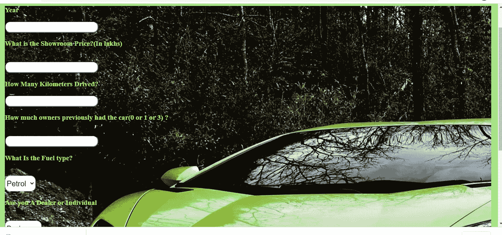

我希望你喜欢这篇关于如何用机器学习预测二手车价格的文章。[给出了 Github 的链接](https://medium.com/p/d25559cf2d2a/edit#422d)，在那里你会找到所有的源代码。欢迎在下面的评论区提出你有价值的问题:)