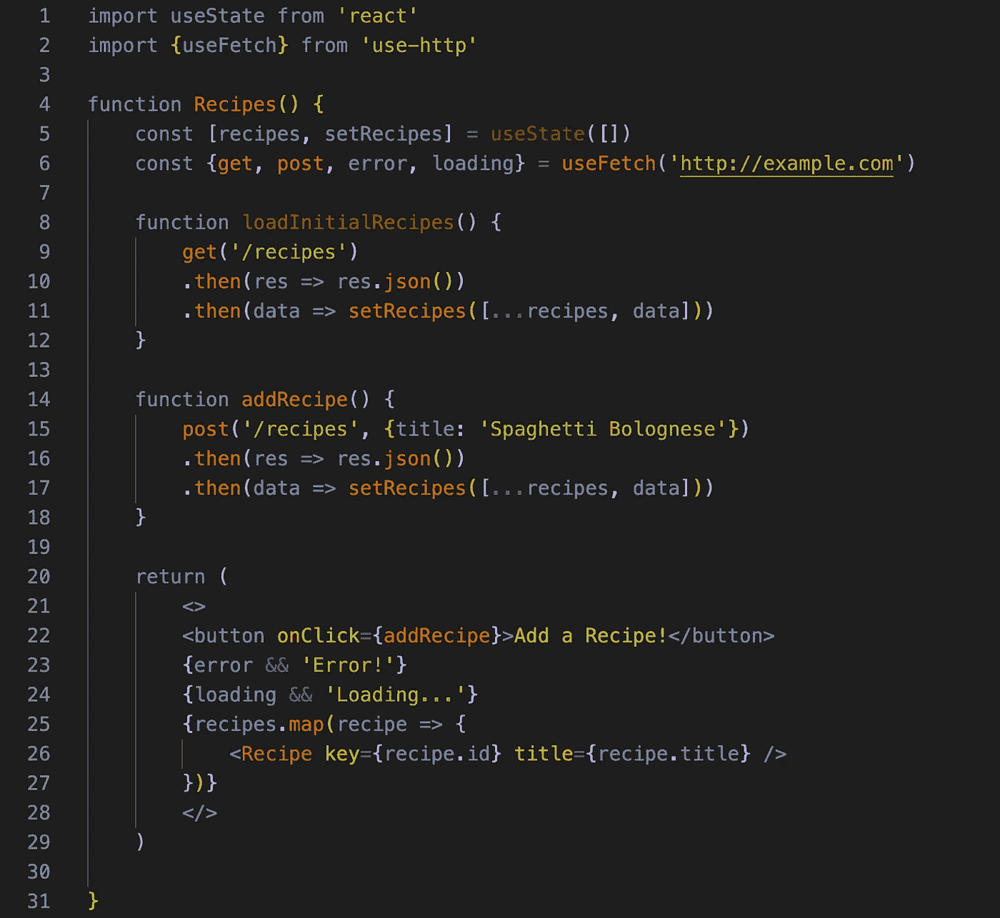
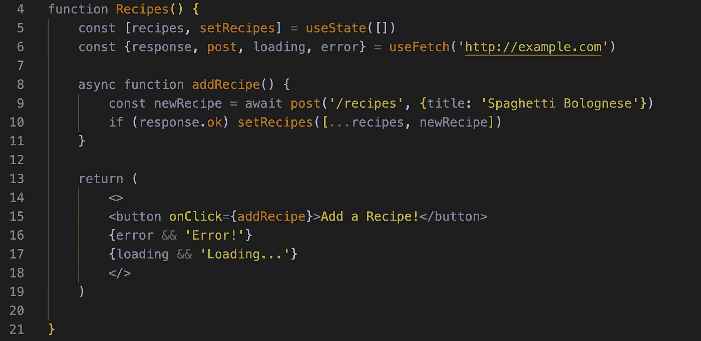

# UseFetch 挂钩，解释

> 原文：<https://medium.com/geekculture/usefetch-hook-explained-4e11d7cf9ee3?source=collection_archive---------10----------------------->

## 一个方便的自定义“反应”挂钩的简单指南。


The ‘React’ Logo

脸书的“React”库使得用 JavaScript 开发前端组件变得更加简单和程序化。因为它是一个开源库，所以会不断地创建自定义特性，这使得开发人员的工作变得更加容易。

其中一个自定义特性是 useFetch 挂钩。对于那些门外汉来说，钩子是 React 的一个相对较新的附加功能，它允许用户访问库特性的状态和生命周期特性，而无需编写一个全新的类。你可以在这里阅读基本概况:[https://reactjs.org/docs/hooks-overview.html](https://reactjs.org/docs/hooks-overview.html)

# 使用 Fetch —简介

```
yarn add use-http    or    npm i -S use-http
```

第一步是在您的终端中使用上面的命令之一来安装钩子库。一旦安装了这个包，就可以使用这个钩子了。

useFetch 的主要特性之一是，它允许你抽象出向服务器发出“Fetch”请求的许多繁琐的方面，并更容易地获得对数据和元数据的访问。

让我们看一个实际例子。



哇哦。这里发生了很多事。看看能不能分解一些关键部分。

您会注意到在第 6 行，我们将 useFetch 挂钩初始化为“www.example.com”，并能够从中获得一些非常常见的属性，如“get”和“post”请求，以及任何“errors”和“loading”属性。

我们在回调函数中使用“get”和“post”来避免重复写出我们的 URL(稍后您将看到我们如何抽象处理它们返回的承诺)。

“错误”和“加载”属性有助于条件呈现。&&运算符在计算右侧值之前检查左侧值是否为真。这允许我们执行一个“短路”操作，该操作将有条件地呈现“加载”或“错误”字符串，仅当来自我们的获取的响应认为这些值为真时。

我们已经可以看到 useFetch 钩子在保持代码干燥方面很有用(不要重复)。您还会注意到，我们定义但从不调用我们的“loadInitialRecipes”函数，这意味着我们的食谱还不会显示出来！让我们看看是否可以使用给我们的可选参数来重构我们的代码。

# 参数:“选项”和依赖数组


Automatic fetch.

您会注意到，在这次迭代中，我们不必编写一个完整的函数来描述我们的“get”请求并处理作为结果返回的承诺。“数据”键为我们保存该值，并允许我们将其直接映射到组件上。

但是等等，我们也从来没有调用过这个函数，那么数据是如何更新的呢？这就是依赖数组的用武之地。

如果您曾经使用过 useEffect 钩子，那么您会对依赖数组非常熟悉。它在 useFetch 中的操作方式相同。每当依赖数组中的状态或变量更新时，就会调用 fetch。因为在我们的例子中它是空的，这意味着当组件被挂载时 fetch 被调用。

如果根本没有声明依赖数组，则在代码中的其他地方调用类似“get”或“post”的方法之前，useFetch 不会触发。

options 参数将接受任何本机提取选项，因此您可以使用它来重构您的“patch”、“post”和“delete”提取。

让我们再看一个例子，它稍微重构了一下我们的“post”方法。

# 异步/等待和响应



Using the ‘response’ key

你可能注意到的第一件事是我们去掉了依赖数组。那就好！因为我们只希望在单击“添加食谱”按钮时触发 fetch，所以我们不需要它。

您应该注意的另一件事是 addRecipe 函数中的“async/await”关键字。这些都很简单。在一个函数之前声明“async”仅仅意味着你计划异步地使用那个函数(像所有的 fetch 请求一样),而在 post 请求之前放置“await”则意味着只有在 post 请求通过后才设置“newRecipe”的值(跳过承诺的语法)。

你可能注意到的最后一件事是我们的 useFetch 钩子中新的“response”键。这只是允许我们在添加新食谱到我们的列表之前，检查返回给我们的“200 OK”响应。

您可能倾向于像这样析构响应对象:

```
const { ok } = response
```

不要这样做。

析构响应对象将返回一个过时的值，该值不与当前获取的状态保持一致。所以，虽然你可能认为你的回答是“好”，但实际上并不是“好”。

# 结论

总而言之，useFetch 是我们工具包中的另一个工具，它使得在 React 中使用 Fetch API 变得更加直接和灵活。无论您是使用一个依赖数组将您的获取与其他函数和事件联系起来，还是仅仅使您的代码变得更加枯燥，useFetch 挂钩在所有情况下都是有用的，并且是对 React 应用程序的一个很好的补充。

更多信息的有用资源:[https://use-http.com/#/](https://use-http.com/#/)