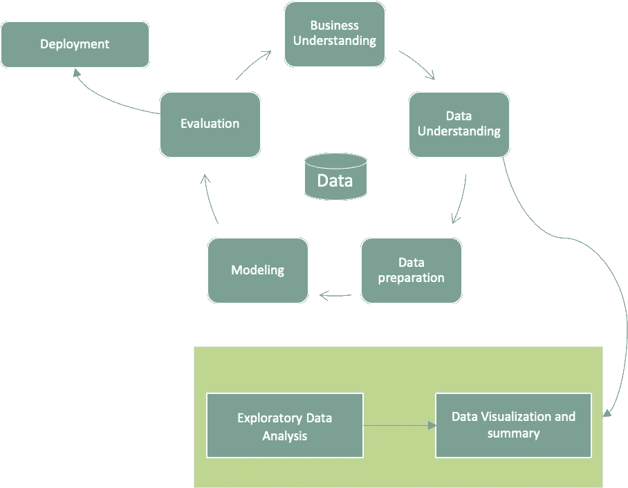
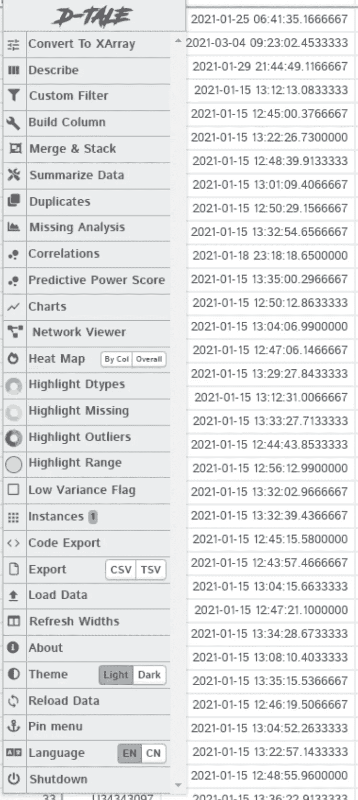
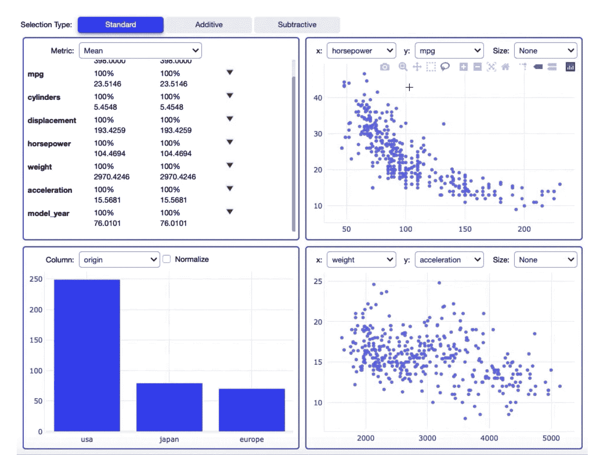
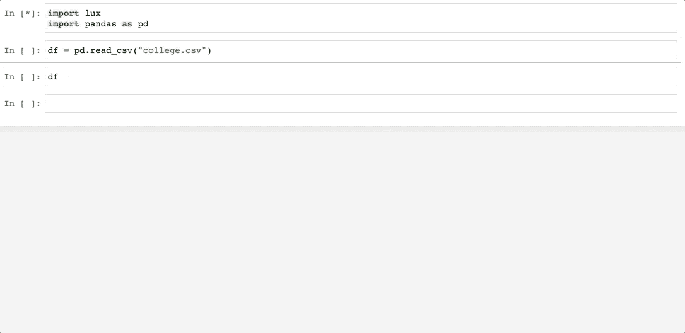

# Python 中有用的探索性数据分析包

> 原文：<https://medium.com/geekculture/useful-exploratory-data-analysis-packages-in-python-f54e14b79cc9?source=collection_archive---------2----------------------->

探索性数据分析对于理解您的数据非常重要，通过它您可以做出任何假设或设想。总的来说，它澄清了以下问题

***“我们问的问题对吗？”***

EDA 提供了以下几点，但不限于此:

*   任何数据分析的重要部分
*   数据质量
*   分析和调查数据集
*   数据汇总(主要包括可视化)
*   初始模式或异常发现
*   离群值、缺失值、重要变量检测

CRISM DM(数据挖掘的跨行业标准流程)在数据理解部分找到了它，如下所示:



CRISM-DM

然而，这需要数据科学家和机器学习工程师投入大量的时间和精力。这可以通过利用可用的 Python 包来克服。以下是使用软件包的一些优势:

*   节省了大量时间。
*   只需对数据进行初步了解，就能节省精力。
*   减少多余的任务。
*   自动发现一些常见的异常和问题。

本文的目的是讨论几个可以用来探索数据的 Python 包。希望这篇文章能帮助你选择适合自己的套餐。让我们开始吧。

# 熊猫简介


Pandas Profiling ([Source](https://github.com/pandas-profiling/pandas-profiling))

## 提供的功能:

*   检测类型、唯一值计数、缺失值。
*   **描述性统计**:均值、中位数、标准差、偏度、峰度、变异系数。
*   检测**最频繁的值**。
*   识别基数
*   **直方图**
*   **相关性**，**高度相关特征，Spearman，Pearson 和 Kendal 度量**。
*   **缺失值的热图和树状图**。
*   列中值的文本分析

## 装置

```
pip install pandas-profiling[notebook] 
OR 
pip install https://github.com/pandas-profiling/pandas-profiling/archive/master.zip
```

## 示例代码

```
import pandas as pd
from pandas_profiling import ProfileReportdf= pd.read_csv('YOURDATA.csv',header='infer',index_col=[0])
profile = ProfileReport(df, minimal=True,explorative=True)
**# for large dataset minimal is True, and explorative as True**
profile.widgets()**# Saving file to in JSON and HTML format**# **To HTML**
profile.to_file("your_report.html")# **To JSON**
json_data = profile.to_json()
# As a file
profile.to_file("your_report.json")
```

参考资料:

1.  [熊猫剖析 GitHub](https://github.com/pandas-profiling/pandas-profiling)
2.  [文档](https://pandas-profiling.github.io/pandas-profiling/docs/master/rtd/)

# Sweetviz


Sweetviz ([Source](https://pypi.org/project/sweetviz/))

## 提供的功能:

*   显示目标变量和另一个特征变量之间的关系。
*   **可视化和比较数据集(如训练和测试数据集)。**
*   提供与关联相关的信息，如**数值相关性、分类-数值相关性、不确定系数。**
*   检测缺失值、分类值、文本特征。
*   提供关于唯一值、重复行、最常见值、最小值/最大值/范围、四分位数、平均值、中值、众数，
*   标准差，中位数绝对偏差，变异系数，峰度，偏斜度。
*   **可以生成交互式 HTML。**

## 装置

```
pip install sweetviz
```

**示例代码**

三个主要功能:

1.  **分析:**进行总结。
2.  **比较:**比较数据集。
3.  **Compare_intra:** 在单个数据集中进行比较。

```
**# Analyze Datafram** # Label is the column name of target column
report = sv.analyze(df, "Label")# save file in html format
report.show_html('report.html')**# Compare** # splitting dataset
df1= df[0:500]
df2=df[500:]
report_comp=sv.compare([df1,'Label'],[df2,'Label']) #[dataframe, columnName]
# Saving report
report_comp.show_html('Compare_Results.html')**# Compare_Intra**# format is like (dataframe, column1 condition,[other columns], target feature)report_comp_intra = sv.compare_intra(df, df["column1"] < 0, ["Column2",'column3'], "Target_column")# Saving Report
report_comp_intra.show_html('sweetviz_report_compare_intra.html')
```

## 参考:

1.  [Sweetviz-PyPI](https://pypi.org/project/sweetviz/)

# Dtale



Dtale

## 提供的功能:

*   提供**大范围的图表。**
*   完成**探索包。**
*   提供**预测分数。**
*   **代码提取**。👏🏻
*   转换为 **Xarray。**
*   **可定制的过滤器。**

**最好的工具之一，强烈推荐。如此多的东西可以提供和探索。**

## 装置

```
!pip install dtale
```

**示例代码**

```
import pandas as pd
import dtale
# Backend TkAgg is interactive backend. Turning interactive mode on.
df= pd.read_csv('YOURDATA.csv', header='infer', nrows=1000)
dtale.show(df)
OUTPUT # link to open in browser
```

## 参考

1.  [Github](https://github.com/man-group/dtale)
2.  [进一步教程](https://github.com/man-group/dtale)

# Autoviz


Autoviz ([Source](https://autoviz.io/))

## 提供的功能

*   可以读取 CSV、txt 和 JSON 格式的文件
*   成对的特征图。
*   检测缺失值、分类值、文本特征。
*   直方图，散点图，连续变量的小提琴图，热图。

## **安装**

```
pip install autoviz
```

## 示例代码

```
from autoviz.AutoViz_Class import AutoViz_ClassAV = AutoViz_Class()
dft = AV.AutoViz(“ “,
 sep=”,”,
 depVar=””,
 dfte=df,
 header=0,
 verbose=1,
 lowess=False,
 chart_format=”svg”,
 max_rows_analyzed=150000,
 max_cols_analyzed=30,
 )
```

根据我的说法，Autoviz 软件包与上述软件包相比提供的功能较少，而且统计数据的呈现方式需要一些改进。

## 参考

1.  [Autoviz 网站](https://autoviz.io/)
2.  [Github](https://github.com/AutoViML/AutoViz)

# 熊猫视觉分析



Pandas Visual Analysis

提供的功能

*   生成一个交互式可视化分析小部件来分析 **Jupyter 笔记本中的熊猫数据帧。**
*   在交互式小部件中显示不同类型的图形，支持链接刷。
*   这使得数据探索和认知变得简单，即使是复杂的多元数据集。
*   无需创建和设计情节或交互性——无需任何配置即可完成。

## 装置

```
pip install pandas-visual-analysis
```

## 示例代码

```
from pandas_visual_analysis import VisualAnalysisVisualAnalysis(df)# for particular columnscategorical = ["name", "origin", "model_year", "cylinders"]
VisualAnalysis(df, categorical_columns=categorical)# if you want to see particular layoutsVisualAnalysis(df,layout=[["Scatter", "Scatter"],["ParallelCoordinates"]])
'''Possible Layouts are
 ['Scatter',
 'ParallelCoordinates',
 'BrushSummary',
 'Histogram',
 'ParallelCategories',
 'BoxPlot'] '''
```

根据我的经验，我在处理由超过十万行和一百列组成的大型 CSV 文件时遇到了这个问题。

## 参考

1.  [熊猫视觉分析](https://pandas-visual-analysis.readthedocs.io/en/latest/index.html)
2.  [PyPI](https://pypi.org/project/pandas-visual-analysis/)

# 勒克斯



Lux ([source](https://github.com/lux-org/lux))

## 装置

```
!pip install lux-api# activating notebook or vscode extension
jupyter nbextension install --py luxwidget
jupyter nbextension enable --py luxwidget# for jupyter hub in corporate network
# go to your virtual environment folder then
jupyter nbextension install --py luxwidget
jupyter nbextension enable luxwidget --user --py
```

## 提供的功能

*   通过自动化可视化和数据分析流程，快速轻松地进行数据探索。
*   突出显示数据集中有趣的趋势和模式。
*   通过交互式小部件显示
*   可视化导出工具。

然而，对于大型数据集，可能需要很长时间才能显示进度。

希望上面提到的包对你在 EDA 方面有帮助。

## 祝你分析愉快。

## 谢谢大家！