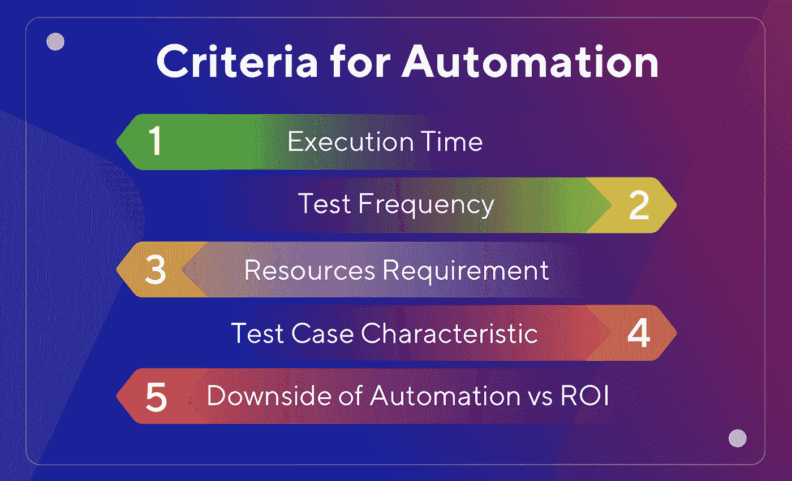
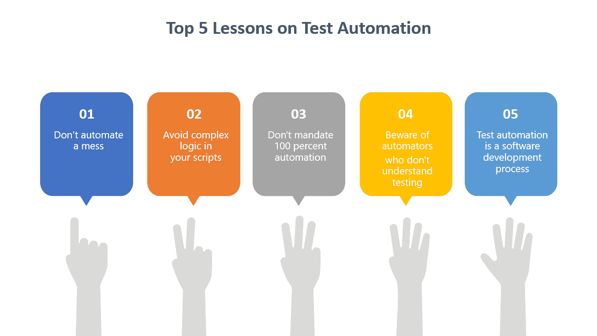

# JavaScript 测试自动化的有用技巧

> 原文：<https://medium.com/geekculture/useful-tips-for-javascript-test-automation-e57b329899f4?source=collection_archive---------47----------------------->

[Source](https://labs.sogeti.com/test-automation-is-it-about-recording-or-engineering/)

测试对于任何产品或应用的成功都是至关重要的。没有用户想使用一个坏的产品。测试是确保我们的产品正常工作的方法。主要有两种测试方式——手工测试和自动化测试。

今天我们将探索 JavaScript 的自动化测试。我们将学习一些有用的技巧，它们将有助于为 JavaScript 应用程序创建健壮的自动化测试方案。

# 什么是测试自动化？

[测试自动化](https://www.perfecto.io/blog/what-is-test-automation)是一种软件测试机制，它使用其他软件、工具和脚本来运行预定义的测试用例。它通过自动化测试过程减少了人工工作，因此在更短的时间内提供了更多的覆盖率。有许多不同类型的测试可以自动化，比如单元测试、回归测试、冒烟测试、集成测试等等。

# JavaScript 测试自动化技巧

## 1.选择正确的工具

市场上有各种各样的自动化工具，因此选择最适合我们应用的工具是一项至关重要的任务。JavaScript 是最流行的编程语言之一。因此，有许多自动化工具可用于测试 JavaScript 网站和应用程序。

一些最常用的 JavaScript 测试框架有 [WebdriverIO](https://webdriver.io/) 、 [Cypress](https://www.cypress.io/) 、 [Selenium](https://www.selenium.dev/) 等。

要选择 JavaScript 自动化测试框架，需要考虑的一些重要事项是:

*   开发和维护脚本的成本是多少？
*   需要哪些平台支持，如 web、移动等？是否也需要支持跨浏览器测试？
*   该工具可以与我们的 CI/CD 流程集成吗？

## 2.计划并决定要自动化的测试用例

[Source](https://www.katalon.com/resources-center/blog/choose-automation-test-cases/)

在我们开始自动化之前，我们需要定义自动化的范围。某些标准可以帮助我们决定哪些测试用例需要自动化。

*   常见和常用的场景应该尽可能自动化。
*   核心业务逻辑应该通过自动化来测试。
*   自动化应该包括用例的不同路径。例如，当用户试图结帐时，会发生什么？如果用户已登录，他们应该被导航到 checkout 视图。但是如果用户没有登录，他们应该被导航到登录/注册页面。
*   使用好的测试数据来创建自动化测试
*   避免自动化不稳定的功能

## 3.为测试用例编写有意义的名称

正确的命名是编写健壮测试用例的一个基本但重要的部分。为测试用例创建有意义的、自我解释的名称有助于开发人员、测试人员以及其他团队成员。

**例如:**如果用户没有登录，点击结帐按钮应该导航到登录/注册页面。

一个合适的测试用例名称可以解释:

*   我们在测试什么？—当用户点击结帐按钮时会发生什么
*   测试的条件是什么？—用户当前未登录。
*   测试的预期结果是什么？—用户被导航到登录/注册页面

## 4.测量测试覆盖率

测试覆盖率衡量测试用例所覆盖的代码或功能的数量。虽然数字不能证明测试的质量，但是测量测试覆盖率是必不可少的。测试覆盖有多种工具，像[伊斯坦堡](https://istanbul.js.org/)。伊斯坦布尔为最流行的 JavaScript 测试框架提供支持，并被广泛使用。

我们还可以将覆盖报告与我们的持续集成系统相集成，以跟踪和管理测试覆盖。

## 5.向测试用例提供逻辑数据输入

使用真实的输入有助于提高测试用例的准确性。如果我们使用与现实生活中的数据完全不接近的虚拟数据，测试用例可能不会评估实际的输出，因此在捕捉潜在问题时不会非常有效。

例如:

*   如果我们测试一个地址的文本区域，我们需要用有效地址的不同可能值来测试它。
*   如果我们有一个最小字符验证，例如 7 个字符。那么如果用户添加了 7 个空格，就不应该被接受为有效。

现实世界的场景可能是意想不到的，并且应用程序可能不总是以预定义的方式使用。因此，使用尽可能接近真实世界数据的测试数据将使测试更加健壮和防失败。

## 6.选择正确的选择器

这是专门针对用户界面(UI)自动化测试用例的。在测试 UI 时，必须为 DOM 中的元素使用正确的选择器。它有助于确保自动化测试挑选正确的元素来执行操作，并减少错误。我还必须指出，选择器的顺序很重要，这也有助于更快地找到正确的元素。

例如:对 HTML 元素使用 data-testid。即使我们改变该元素的原始 class/id，它也将保持不变。

## 7.编写小而独立的测试用例

每个测试用例应该针对一个特定的用例，这将有助于使它们更小更快。此外，如果我们创建多个小的独立测试用例，我们可以并行运行它们，并且更快地接收测试结果。更快的反馈还可以更快地检测到任何问题，并更快地交付质量更好的产品。

# 结论

[Source](/javarevisited/my-top-5-lessons-on-test-automation-ad4dec93ae2f)

测试自动化减少了重复或复杂工作的人力，从长远来看，使其成本和时间有效。在自动化测试之前，我们需要决定预算、工具、要自动化的用例、自动化它们的可行性，以及所需的努力和技能。互联网上有一些开源工具，我们可以用它们来创建高效、强大的自动化测试，确保最终产品/应用的质量。

测试愉快！！