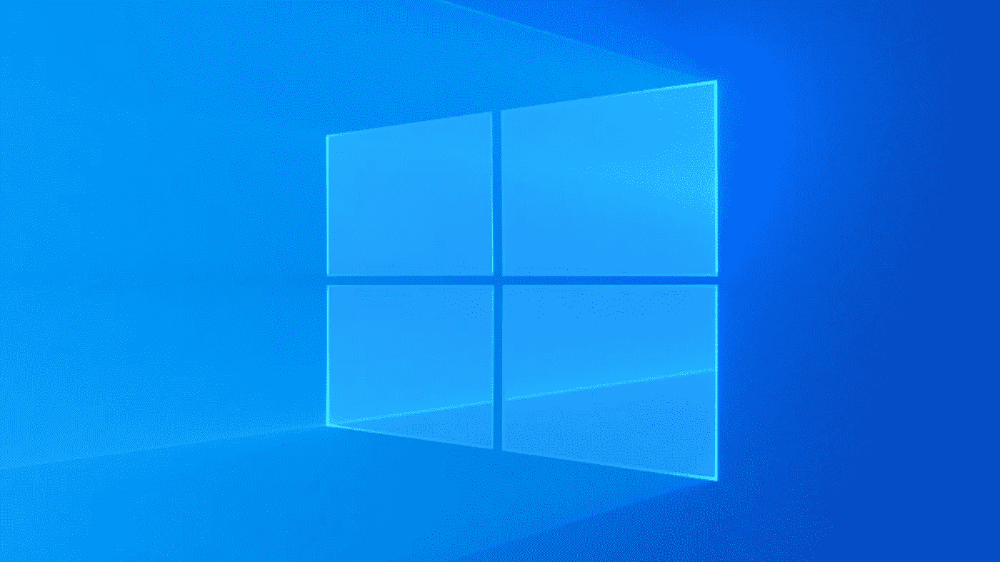

# 对每个人都有用的 Windows CMD 命令

> 原文：<https://medium.com/geekculture/useful-windows-cmd-commands-for-everyone-4d5a1d93a4d1?source=collection_archive---------15----------------------->

## windows 命令行的重要命令

通常，人们在基于 Linux 的系统中使用读取命令和命令选项。但是作为一个使用 windows 的开发者，有一些重要的命令。立即让我们看看它们是什么。

[Source](https://www.howtogeek.com/343979/what-is-the-latest-version-of-windows-10/)

为了尝试命令，请进入开始菜单并选择`cmd`或者您可以…