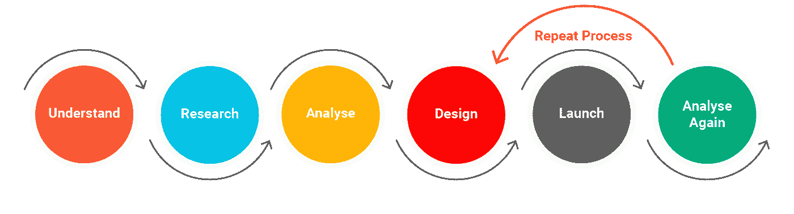
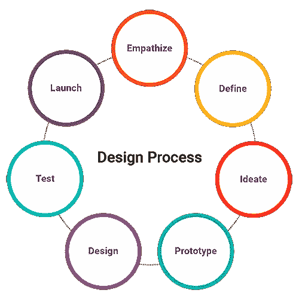

# 以用户为中心的设计及其重要性

> 原文：<https://medium.com/geekculture/user-centered-design-and-why-it-is-important-29e9e8bcbe60?source=collection_archive---------10----------------------->

## ***“为你的客户开发产品，而不是为了你的自我愉悦。”***

当我们设计任何产品时，了解谁以及人们将如何使用它总是很重要的。如果不理解这一点，你的产品很有可能会失败。因为如果你不能理解你的目标受众，很有可能你最终会为他们创造出错误的解决方案。

***【忽略人的设计忽略人的设计】*** 是 ***Frank Chimero*** 的名言。这句话完美地总结了以用户为中心的设计的重要性。

如果公司在设计过程中遵循 UCD 的做法，如考虑用户第一**和关注用户需求**和**产品结果将会成功并符合用户期望。**

在这篇文章中，我们将讨论以用户为中心的设计，UX 过程及其重要性。

> ***什么是以用户为中心的设计(UCD)？***

UCD 是一个迭代的设计过程，设计师在设计过程的每个阶段都关注用户及其需求。它会考虑用户的故事、情绪和你收集的关于用户的见解。

满足用户的需求，每一个设计决策都是在它是否给用户带来价值的背景下进行评估的。以用户为中心的设计给你的产品增加了潜在的影响。

User-Centered Design Illustration

> ***UX 设计过程***

设计过程定义了每个设计师解决痛点的旅程，以了解用户如何体验产品。

你的过程将取决于你正在设计的产品类型。不同的项目需要不同的方法。

基本上，这个过程有七个阶段:**移情、定义、构思、原型、设计、测试和启动。**

大多数设计过程都源于这个概念。

UX Design Process

**注:**请记住，每一个 UX 设计流程都可能是您的企业和产品所独有的。

> ***为什么 UX 设计对消费者和企业很重要***

*   用户体验是用户在与产品交互或体验产品时的感受。
*   用户体验是关于提高可用性或使一些东西更容易使用。这意味着每个人都清楚产品的设计、结构和用途。
*   用户体验也是为了让东西用起来愉快，这在用户和产品之间建立了积极的联系。因为人类需要有用的产品。

基本上，当人们喜欢一个产品时，他们会大量使用该产品，并向他们的朋友推荐，使用该产品的人越多，公司的业务就越好。

> ***结论***

***说到 UX 设计&流程，无论你遵循什么流程，每个设计流程的目标都是一样的，为你的用户创造一个伟大的产品。***