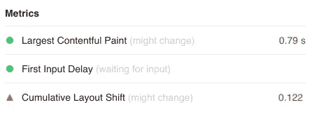
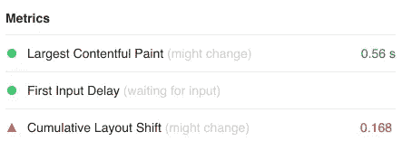
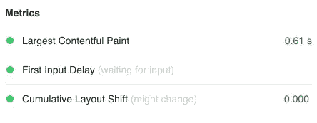

# 用户体验和核心网站生命优化。

> 原文：<https://medium.com/geekculture/user-experience-and-core-web-vitals-optimization-angular-universal-7ef44cfad364?source=collection_archive---------1----------------------->

在本文中，我将使用 Angular Universal 在服务器端呈现一个示例 web 应用程序。这将有助于改善用户体验，并提高核心网站的重要分数。与此同时，我将向您展示，仅仅启用服务器端渲染，而不采取任何进一步的措施，会对这些核心 Web 关键要素产生负面影响，尤其是 CLS。


# 衡量用户体验的核心网络指标和 CLS

在我们开始之前，如果你想知道更多关于核心网站的重要信息，你可以访问这个页面[https://web.dev/vitals/](https://web.dev/vitals/)。接下来，我将提供一个出现在那篇文章中的简短定义。

> *Web Vitals 是 Google 发起的一项计划，旨在为质量信号提供统一的指导，这些信号对于提供卓越的网络用户体验至关重要。*
> 
> [*菲利普·沃尔顿*](https://web.dev/authors/philipwalton)
> 
> *核心网络生命指标是适用于所有网页的网络生命指标的子集，应由所有网站所有者进行衡量，并将在所有谷歌工具中出现。每一个核心的 Web 生命都代表了用户体验的一个独特方面，可以在现场进行测量，并反映了以用户为中心的关键结果的真实体验。*
> 
> [*菲利普·沃尔顿*](https://web.dev/authors/philipwalton)

从上面来看，核心 Web Vitals 帮助我们测量和优化 Web 应用程序的用户体验。在本文中，我将重点关注这些重要因素的一个特定信号，即 CLS(累积布局偏移)。

CLS 衡量 web 应用程序的“视觉稳定性”，它反映了您的页面有多稳定，并且受到用户通读时内容的突然移动或意外变化的影响。CLS 的理想值在“0.1”以下**。你可以在这篇关于 https://web.dev/cls/的文章中找到更多关于 CLS 的信息。**

# 没有 SSR 的简单应用

让我们首先创建一个简单的客户端渲染应用程序，我们的应用程序将只有一个功能，它将从服务器获取一篇文章，然后在视图中显示文章。我们通过运行以下命令来创建应用程序:

```
ng new cls-measuer-app
```

现在让我们将 app.component.html 的`app.component.ts`更新如下:

*   在`AppComponent`中，我们有一个可观察的`article$`，它将保存要显示的文章对象。
*   在`ngOnInit`中，我们将`getArticle()`方法的返回值赋给属性`article$`。
*   `getArticle()`模拟 API 调用从服务器获取商品数据。它从一个 json 文件返回一个被嘲笑的`IArticle`对象，延迟 500 毫秒。这里注意文章的内容应该足够大，可以填满整个页面。这对于模拟一篇文章的真实例子是必不可少的。
*   我们用属性 title、body 和 imageUrl 定义了`IArticle`接口。
*   在模板中，我们使用异步管道订阅了`article$`,一旦解析，我们就显示返回的 article 对象的数据。指定图像的`height`属性很重要。否则，它将对 CLS 价值产生非常大的负面影响。
*   当物品仍在装载时，我们显示装载指示器。

一旦我们提供和浏览应用程序，我们将看到页眉、页脚和一个加载指示器。半秒钟后，文章内容将被加载，加载指示符将被文章内容替换。

# 测量核心网络生命周期

现在是度量的时候了，首先我们需要在生产模式下服务我们的应用程序，我们通过运行

```
ng serve --prod
```

为了测量 CLS，我使用了 [Web Vitals Chrome 扩展](https://chrome.google.com/webstore/detail/web-vitals/ahfhijdlegdabablpippeagghigmibma)。我将在生产模式下运行应用程序，并触发测量，这将产生以下结果:



请注意，CLS 的值(0.122)高于理想值(0.1)。这意味着我们在应用程序中没有提供良好的用户体验。这背后的原因是我们正在用文章内容替换加载指示器。这被认为是内容的意外变化，并对 CLS 信号增加了负面影响。

幸运的是，这个问题在角度应用中是可以解决的。解决方案是通过尽可能快地向用户提供页面的最终状态(文章加载后)来避免内容的这种变化。我们可以通过使用 Angular Universal 在服务器端呈现页面来做到这一点。

# 带有 Angular Universal 的服务器端渲染(SSR)可改善用户体验

现在我们将开始解决上述问题。我们首先将 Angular Universal 添加到我们的应用程序中，以允许初始页面加载的服务器端呈现。因此，让我们运行以下命令:

```
ng add @nguniversal/express-engine
```

这将准备项目，安装 universal/express-engine，并创建服务器端 app 模块和许多其他文件，你可以在 [Angular 官方文档](https://angular.io/guide/universal)中找到更多关于这个命令及其生成的文件。

在这一点上，我们的应用程序支持服务器端呈现，您可以通过使用:

```
npm run dev:ssr
```

打开浏览器并导航到应用程序 url，您会注意到文章内容会立即显示出来。

# 这还不够

现在，我们的应用程序是服务器端呈现的，并且立即向用户提供页面内容。然而，我们仍然有一个问题。当您运行应用程序时，即使您立即看到了文章内容，您也会注意到在一小段时间后，加载指示器会闪烁一会儿，文章内容会再次充满页面。这是以下执行序列的结果:

1.  Angular Universal 将在服务器端呈现应用程序，并将最终的 HTML 发送给客户端。
2.  客户端接收呈现的 HTML 并立即显示给用户。
3.  浏览器加载了所有的 javascript 文件，并重新调整了我们的应用程序。此后，应用程序触发商品加载过程并显示加载指示符，并在加载完成时用商品内容替换该指示符。

如果我们此时试图测量 CLS，结果将会比以前的事件更糟。首先，我们构建我们的应用程序:

```
npm run build:ssr
```

那我们就上菜吧:

```
npm run serve:ssr
```

现在，我们运行应用程序并再次进行测量，结果如下:



请注意，CLS 现在是(0.168)，高于启用 SSR 之前的值。换句话说，通过启用 SSR，我们使事情变得比以前更糟，幸运的是，这个问题有一个解决方案。

# 转移状态到救援

我们面临的问题的主要原因是，我们的应用程序加载了文章两次，一次在服务器端，然后在浏览器重新调整应用程序后在客户端再次加载。为了解决这个问题，我们可以使用`TransferState`，根据定义，TransferState 是:

> *从服务器端的应用转移到客户端的应用的键值存储。*
> 
> [*棱角分明官方文档*](https://angular.io/api/platform-browser/TransferState)

TransferState 允许我们存储服务器从 API 获取的 Article 对象，并将其传递给客户端应用程序，因此我们不必在客户端再次调用服务器，为此我们实现了以下更改:

1.  我们在`AppModule`中导入了`BrowserTransferStateModule`，在`AppServerModule`中导入了`ServerTransferStateModule`，因为在这些模块中提供了 TransferState 服务。
2.  我们检查应用程序是否运行在服务器端`if(isPlatformServer(this.platformId))`，我们从 API 加载文章，并将其存储在传输状态`this.transferState.set(this.stateKey, article)`。
3.  如果应用程序运行在客户端，我们检查`transferState`是否有来自服务器`this.transferState.hasKey(this.stateKey)`的值。
4.  如果`transferState`有值，我们直接使用它，否则，我们从 API 重新加载文章。

就这样，让我们再次构建和服务我们的应用程序，并测量:



而现在 CLS 下降到 0，那是因为页面的内容在最初的渲染之后从来没有改变过。

总的来说，如果你想提高你的搜索引擎优化，不要只是在你的应用程序中启用 Angular Universal，并假设服务器渲染你的页面将解决你所有的搜索引擎优化问题。启用角度通用只是第一步。您需要采取进一步的措施来确保您的应用程序按预期运行。不要忘记先测量，然后改变和比较。