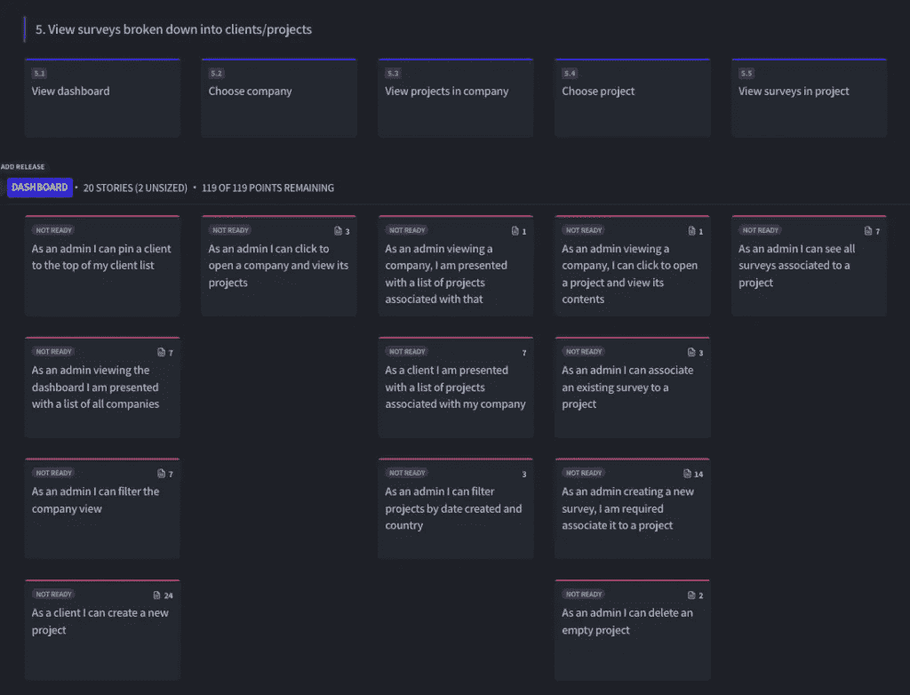

# 用户故事映射改变了我们交付项目的方式

> 原文：<https://medium.com/geekculture/user-story-mapping-changed-how-we-deliver-projects-3041c55acac3?source=collection_archive---------19----------------------->

那是 2021 年 3 月的一个星期二的早上，我们对眼前的任务感到不知所措。

在设计一个复杂的新应用程序时，我们抬头看着高高耸立在我们头顶的一面(虚拟)便利贴墙。看，一个深入的，为期三周的探索阶段的成果。我们经历了竞争对手调查、[用户访谈、](https://www.browserlondon.com/blog/2021/11/17/user-research-the-most-important-part-of-your-digital-build/)、研讨会、 [UI 草图、](https://www.browserlondon.com/blog/2018/02/20/research-discovery-shape-ui-thinking/)和需求收集，所有这些过程都被浓缩成了一座措辞谨慎的标签山。

我们怎么能把这里的一切都拿来，创造出一个能把所有这些积累的洞察力发挥到极致的产品呢？

典型的方法，事实上，也是我们在以前的大规模项目中采用的方法，是将笔记写在一个列表中，该列表在成为[产品待办事项](https://www.browserlondon.com/blog/2021/10/20/what-is-a-product-backlog-and-how-does-it-work/)之前将经过[的优先化过程](https://www.browserlondon.com/blog/2019/11/04/power-of-moscow-method/)。这将被进一步分割成 sprints 和 stories，以备我们的开发团队使用。

但是，老实说，看着三周的对话、想法和灵感被切碎并打包成小任务的想法…我们感觉就像是拿了一块漂亮的肉，放入绞肉机，然后被吐在糊状的汉堡肉饼中。

杰夫·巴顿在 2008 年也有类似的感受:

> “我们花了大量时间与客户合作。我们努力理解他们的目标，他们的用户，以及我们可以构建的系统的主要部分。然后我们最终进入细节——我们想要构建的功能。在我的脑海中，我看到一棵树，它的主干是由驱动系统的目标或期望的利益构成的；大树枝是用户；小树枝和细枝是他们需要的能力；最后叶子是足够小的用户故事，可以放到开发迭代中。在所有这些工作之后，在建立了所有的共同理解之后，我觉得就像我们把树上所有的叶子都摘下来，装进一个叶子袋里——然后把树砍倒。这就是扁平积压对我的意义。一袋无上下文覆盖物。”
> 
> 来自[的新用户故事积压是一张地图](https://www.jpattonassociates.com/the-new-backlog/)

向开发团队交付一包上下文无关的覆盖物(即积压的用户故事),并期望他们将它拼凑成一棵盛开的樱桃树，这使得创建一个突出的产品变得更加困难。这就像试图做一个拼图游戏，却不知道最终的图像应该是什么样子。

从我们这里拿走。我们去过那里。几年前我们自己的发现和开发过程遇到了这个问题。一个详细的[发现过程](https://www.browserlondon.com/services/research-analysis/)会被分解成小的用户故事，然后被放入一个 backlog 中。当然，这些票上可能会有史诗般的名字，但开发三个月后，我们已经忘记了该功能的**为什么**和**谁**，只是专注于**什么**和**如何**。这不是创造成功的、以用户为中心的数字产品的秘诀。

# 用户故事映射是秘方

这里没有反对用户故事；我们仍在使用它们，它们很有用(重要？)使大而复杂的功能变得易于管理。但是我们很清楚，直接从发现到积压会产生问题。即:

*   用户故事缺乏上下文。这经常导致故事聚焦于交付特性而不是交付用户价值。
*   开发人员被排除在设计过程之外，风险变成了检票员而不是问题解决者。
*   整体产品策略模糊不清。脱离上下文编写故事会带来风险，即编写的代码不能转化为最终用户的价值。

为了解决这个问题，我们在项目过程中添加了用户故事映射。

Discovery 和往常一样运行，创建大量关于产品的业务目标、用户目标和想象的用户旅程的丰富信息，每个旅程的每一步都有很多细节。

但是现在，我们用用户故事映射来填补这个过程中的空白，而不是把一堆用户故事放到一个电子表格中。这里，我们从一个定义好的用户旅程开始，并列出用户完成旅程必须采取的步骤。他们在旅程中的每一步需要完成的较小的任务也被详细说明，为每个用户步骤提供上下文，并帮助我们的开发团队理解和看到用户旅程和目标的更大画面。

这里有一个例子(使用 [Avion](https://www.avion.io/) 创建):

以这种方式而不是线性积压的方式编写用户故事意味着功能必须被认为是用户目标的一部分，而不是孤立的。它:

*   防止忽略只能在上下文中看到的复杂性
*   给开发团队一个完整旅程的视图
*   专注于为用户创造最低限度的需求，以实现他们的目标

一年多来，我们一直在使用用户旅程地图作为我们设计和开发流程的一部分，我们发现它的好处超出了我们最初的设想。事实上，我们团队的几乎每个功能都受益于流程创造的额外信息。

## 设计师

当我们需要创建界面设计时，用户故事映射板为 UX 和 UI 设计师提供了现成的基础。它关注的是用户体验和整个产品，而不是视觉效果。我们可能会勾画出一些东西，并将其添加到步骤中，但我更喜欢保持这种低调，以免将设计师引入具体的 UI 决策。

## 开发商

Avion 与吉拉进行了双向集成，这意味着开发人员可以在看板/Scrum 板上完成这些步骤。在 sprint 评审期间，我们会将故事地图放在手边，以确保每个人都记得总体目标。

## 产品经理

当然，产品经理需要有一个“缩小”的产品视图，记住发布会如何进行以及用户的目标是什么

## 利益相关者

当向可能偶尔涉足项目的利益相关者展示进展和计划时，这些地图真的很有价值。这给了他们一个很好的想法，产品在哪里，它会去哪里。他们还可以利用自己的业务和客户知识来发现差距和疏漏。

# 综上

用户故事映射在项目的发现阶段和产品开发阶段之间提供了一个简洁的桥梁。它将用户需求转化为可行的步骤，同时让团队将用户最重要的[工作放在第一位。自从我们在设计和开发过程中加入用户故事映射后的一年多时间里，我们真的注意到了不同之处。映射文档是所有项目成员都要反复阅读的文档。](https://www.browserlondon.com/blog/2019/10/01/applying-jobs-to-be-done-framework-saas/)

因此，如果你正在创造一个新产品或在现有产品上构建新功能，并发现自己正盯着一个令人难以置信的长积压，并试图理解它，那么故事映射可能会有所帮助。

## 关于浏览器

我们为更好、更高效的工作场所创建企业网络应用。我们已经帮助壳牌、英国航空公司和英国政府等客户提高效率，简化业务。访问我们在[浏览器伦敦](http://www.browserlondon.com/)。

*原载于 2022 年 5 月 11 日*[*【https://www.browserlondon.com】*](https://www.browserlondon.com/blog/2022/05/11/user-story-mapping-changed-how-we-deliver-projects/)*。*