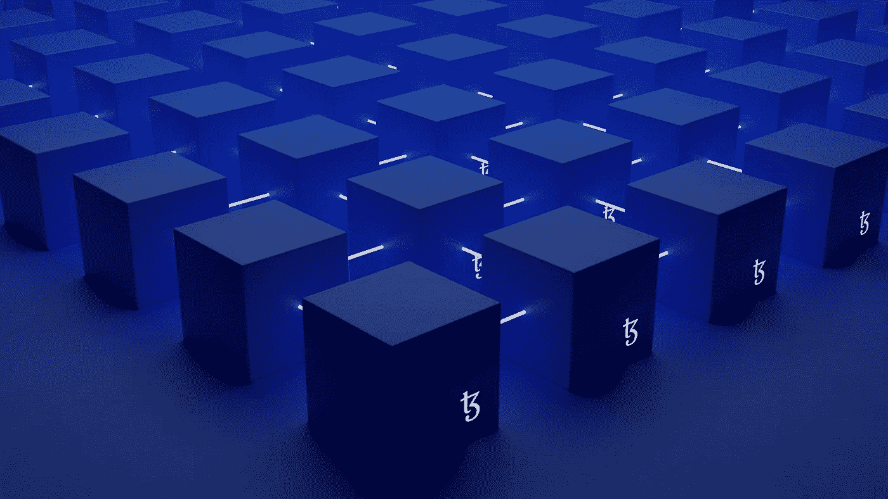

# 用户力量:道的突破

> 原文：<https://medium.com/geekculture/users-power-dao-breakthrough-3a0d8f5a356e?source=collection_archive---------17----------------------->

在基于区块链的大型世界中，cryptos 交易不是你可以执行的唯一任务。

Photo by [Shubham Dhage](https://unsplash.com/@theshubhamdhage?utm_source=unsplash&utm_medium=referral&utm_content=creditCopyText) on [Unsplash](https://unsplash.com/s/photos/blockchain?utm_source=unsplash&utm_medium=referral&utm_content=creditCopyText)

“*区块链*”、“ *Web3* ”和“ *Defi* ”一直是时下最常听到的流行语。其中， **dapps** 越来越多的采用和使用背后的原因不仅仅与过去几年疫情带来的数字转换需求有关，还与巨大的质疑有关——越来越多的数字转换需求