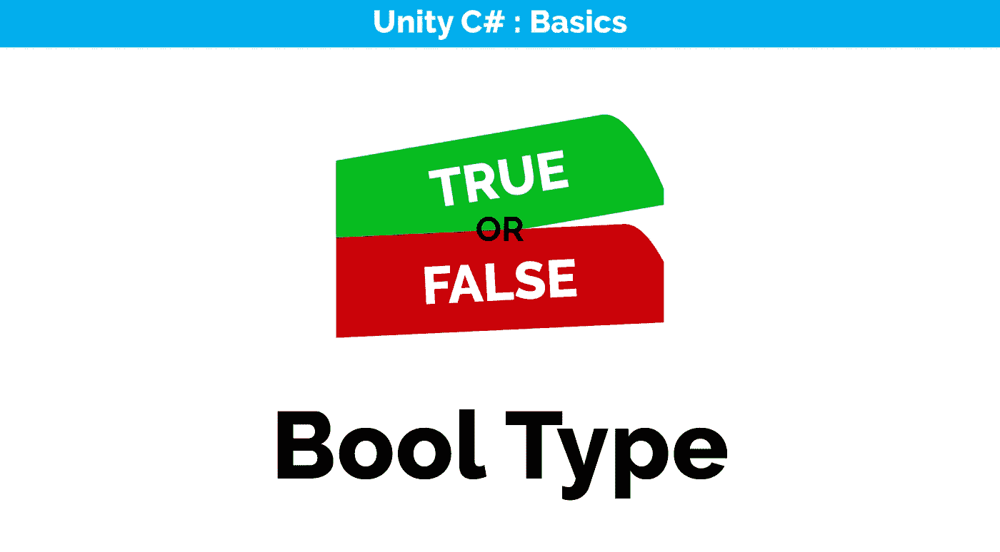
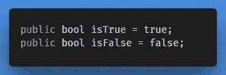
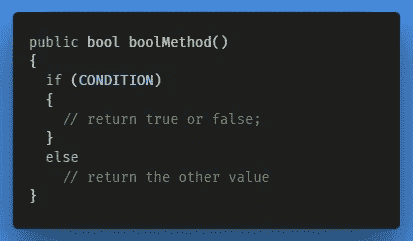
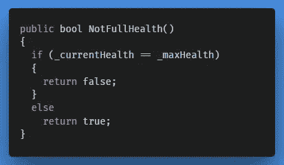
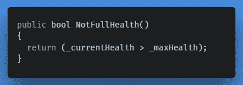
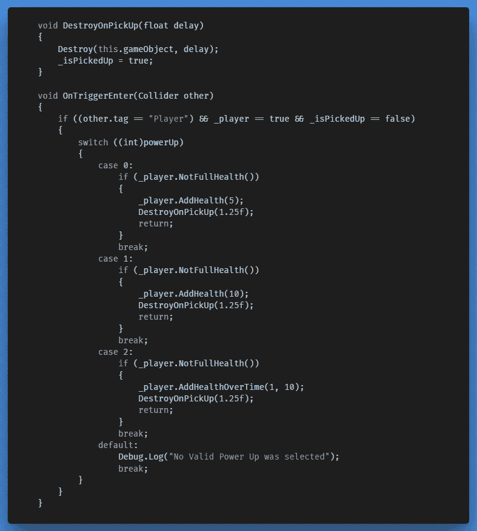

# 使用布尔逻辑运算符

> 原文：<https://medium.com/geekculture/using-a-boolean-logical-operator-20c8ea225b05?source=collection_archive---------27----------------------->

目前，如果玩家飞向一个物品，它总是会收集它。但这并不是我们真正想要的，相反，我们希望玩家只能在允许的情况下捡起一次物品。因此，举例来说，如果玩家已经完全健康，我们就不想执行健康启动逻辑。要解决这个问题，我们可以在 Player.cs 脚本中创建一个布尔逻辑运算符，并在 Item.cs 脚本中创建对它的引用。

## 布尔类型

> “bool”类型是 boolean 的缩写，是一种只能返回两个值(true 或 false)之一的数据类型。bool 类型是比较和相等运算符的结果类型，默认情况下为 false。它可用于控制条件表达式。

Boolean Values can only return true or false.

Boolean conditional expression

**应用于我们的 Players.cs 脚本；**

如果我们目前的健康水平等于我们的最大健康水平。健康，我们返回假，否则我们返回真。

然而，由于 bool 类型的默认值是 false，我们可以将其缩短为声明；结果总是假的，如果当前的生命值小于最大值，则返回真。健康。

**实施**

现在我们有了一个检查玩家是否完全健康的方法，我们可以在 Item.cs 脚本中调用这个方法，并且只允许在玩家没有完全健康时拾取健康能力。

← [上一张](/nerd-for-tech/adding-a-simple-drop-down-field-in-the-inspector-a3b4dc9da64f) | [下一张](https://gert-coppens.medium.com/ease-of-building-ui-elements-in-unity-1466a2868623) →