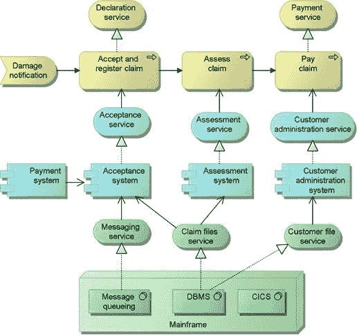
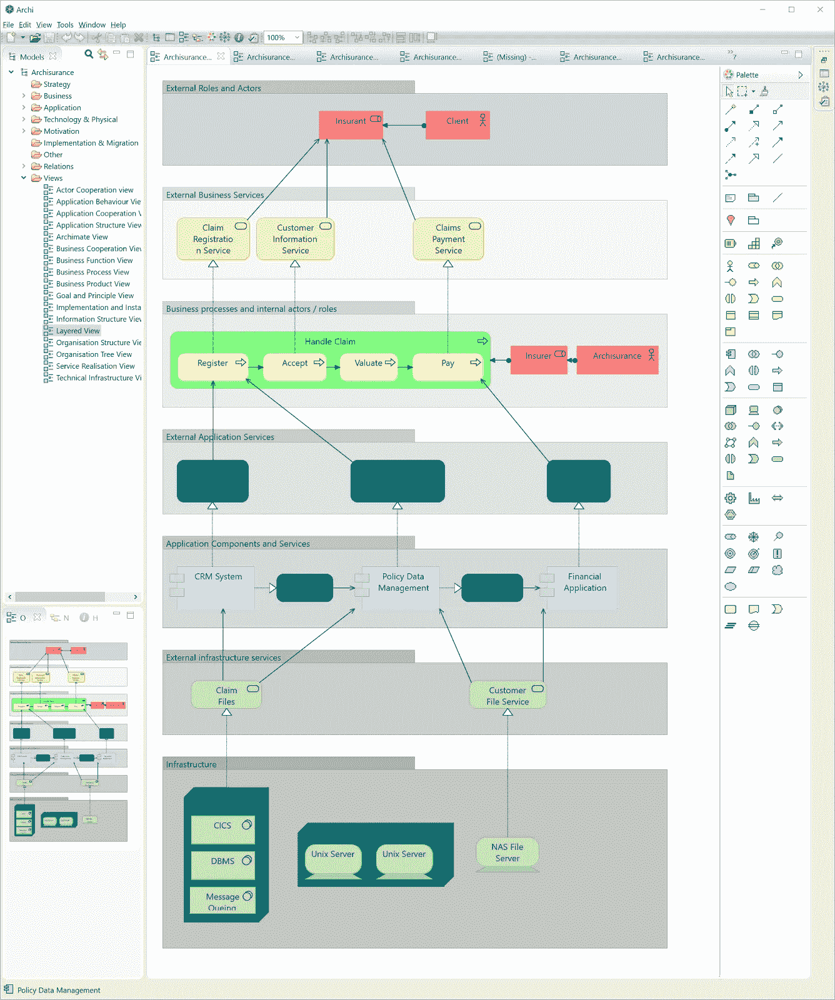
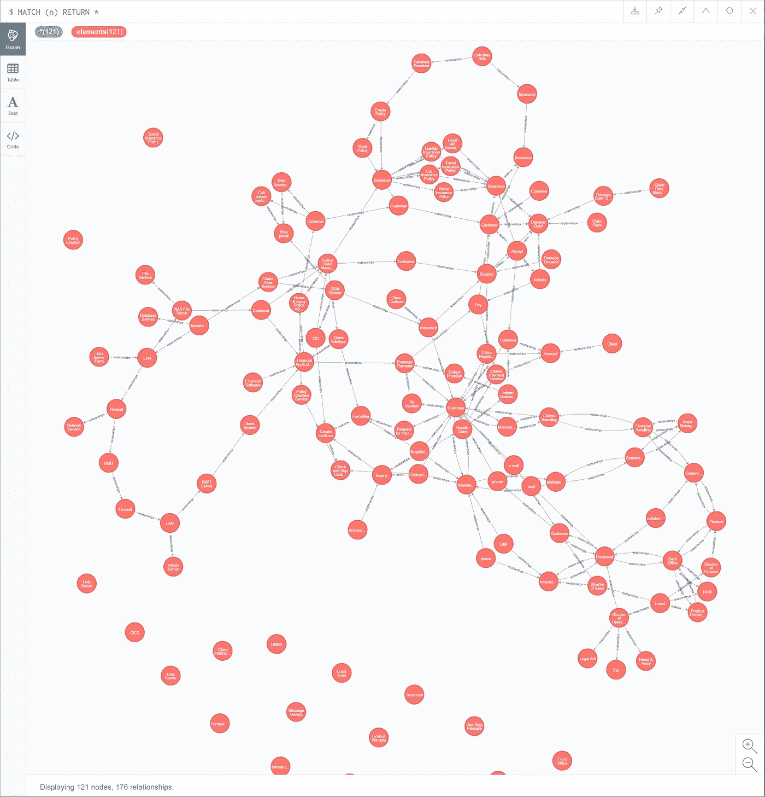
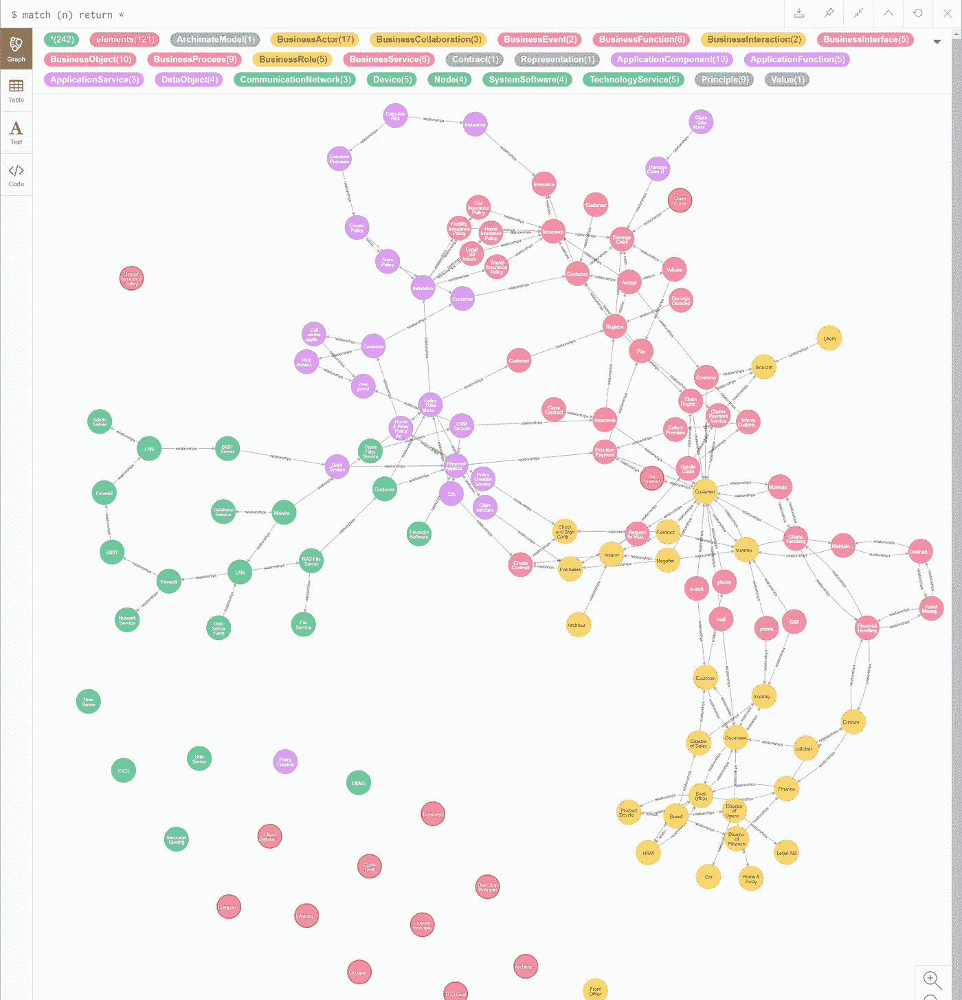
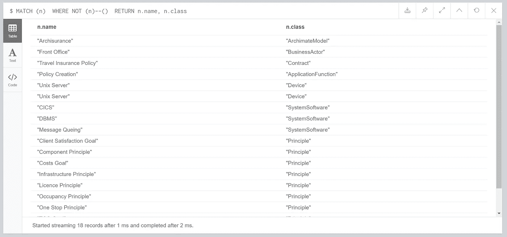
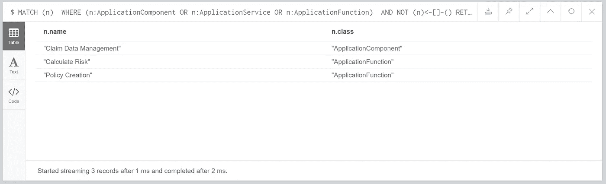
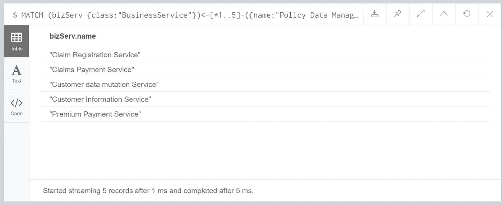
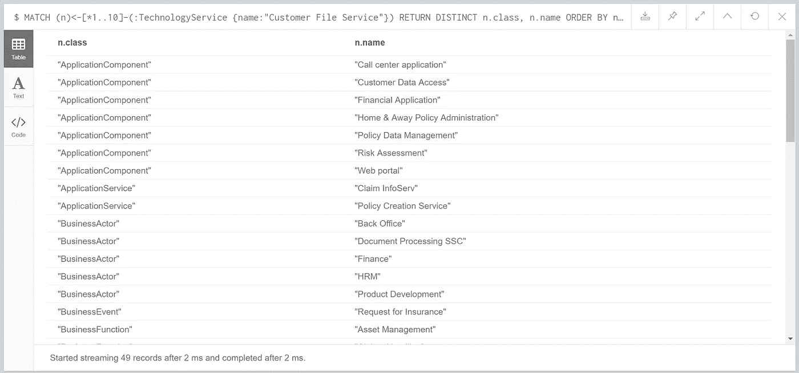
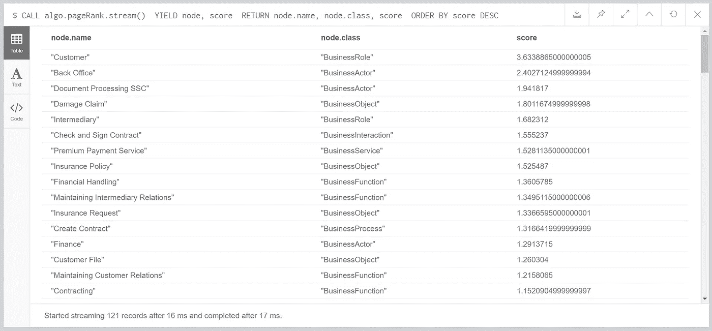
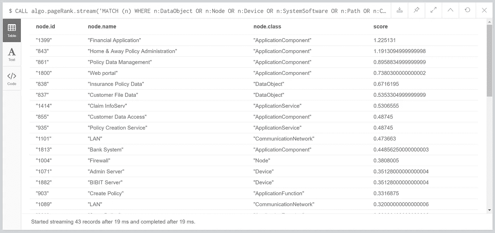

# 使用图形数据库探索您的 ArchiMate 模型

> 原文：<https://medium.com/geekculture/using-a-graph-database-to-explore-your-archimate-model-df7bd63f65dd?source=collection_archive---------4----------------------->

使用 Neo4j 探索您的企业架构资产。*重新发布到媒体，并针对 GDS 进行了更新*



在图形数据库中导入和查询您的企业架构组件有很多潜在的好处；您可以轻松地对依赖性、冗余、假设和根本原因分析进行广泛的分析。ArchiMate 是表示不同架构的常用框架；它被很好地定义并被许多组织所使用，许多图表软件包中都有模板。

有许多优秀的博客展示了在 Neo4j 中做到这一点的能力，例如:

*   [Michael Herman 关于在 Neo4j 中导入和查询 ArchiMate 模型的博客](https://hyperonomy.com/tag/neo4, https://www.linkedin.com/pulse/crossing-ea-chasm-graphitization-archimate-30-2-herman-toronto-/)
*   [Thomas Michem 关于采用 Neo4j 的 ArchiMate 模型的介绍性博客](http://www.loqutus.com/content/exploring-archimate-models-graph-database)

开始时的挑战可能是从现有的建模工具和人工制品库转移到能够开始使用图形数据库的能力。幸运的是，这对于 Neo4j 来说相对简单。在这篇博客中，我们将逐步介绍如何:

*   使用 Archi 数据库插件或 Neo4j 密码查询将现有 ArchiMate 图表导入 Neo4j
*   再次从 Neo4j 中导出数据
*   查询图表，包括基本项目，如单独的元素和连通性，以及使用一些图算法来查看元素关系强度

我们用来探索 ArchiMate 图的图表软件包是 [Archi](https://www.archimatetool.com) ，一个开源的建模工具。

***更新后的博文***

您现在可以跟随 [Neo4j 沙盒](https://neo4j.com/sandbox)进行操作，无需下载！请继续阅读，了解更多信息。

# 入门—保险案例研究

在这篇文章中，我们将使用 Open Group 提供的[保险案例研究](https://publications.opengroup.org/y121)。该模型已经被编码到 Archi 中，可以从他们的 GitHub repo 中获得。

这是一个很好的例子，它涵盖了您的架构可以扩展到的复杂性。很难查看整个模型，因为模型中传达了大量的信息和复杂性，并且有必要使用已创建的不同视图来浏览数据。

我们将把整个案例研究导入到 Neo4j 中，并开始询问模型的不同元素，从组件的依赖关系开始，到使用现在可用的图算法程序来寻找图中的连通性。



# 将数据导入 Neo4j

我们将探索将数据从 Archi 导入 Neo4j 的两种方法:

*   通过档案数据库插件
*   通过 Neo4j CSV 导入程序

**通过档案数据库插件**

Archi 数据库插件可从[这里](https://github.com/archi-contribs/database-plugin/tree/master/v2)获得，版本 2.07 支持数据导出到 Neo4j。一旦插件被下载并复制到 Archi plugin 文件夹中，并且运行 Neo4j 实例的详细信息被输入，就只需将模型导出到 Neo4j 中。调用 Neo4j 浏览器并运行`MATCH (n) RETURN *`将显示加载的数据:



导出工具将元素名称和关系类型存储在相应节点和关系的属性中。例如:

*   关系类型存储为关系的属性，例如`[:relationships {class:”TriggeringRelationship”}]`
*   元素类型作为属性存储在节点上，例如`(:elements {class:”BusinessRole”})`
*   元素名称也作为属性存储在节点上，例如`(:elements {name:”Customer files service”})`
*   附加到元素的任何属性都表示为具有关系“`hasProperty`”的附加节点，并且在节点`name:value`内由节点本身的名称和值属性持久化

**通过 Neo4j CSV 导入器**

我们还可以使用 Cypher 中的 LOAD CSV 工具来加载我们的 Archimate 模型。首先是“导出→模型到~CSV”。这将创建三个 CSV 文件:

*   元素. csv
*   properties.csv
*   relationships.csv

我已经冒昧地在我的 [GitHub repo](https://github.com/lju-lazarevic/misc/tree/main/archi) 上提供了导出，所以你可以使用一个空白的 [Neo4j 沙箱](https://neo4j.com/sandbox)来跟进。下面所有的密码查询都不需要你下载任何东西。这将在 Neo4j 中产生与 Archi export 插件相同的输出。

加载元素数据:

```
LOAD CSV WITH HEADERS FROM 'https://raw.githubusercontent.com/lju-lazarevic/misc/main/archi/elements.csv' AS line
CREATE (:elements {class:line.Type, name:line.Name, documentation:line.Documentation,
    id:line.ID })
```

装载关系信息:

```
LOAD CSV WITH HEADERS FROM 'https://raw.githubusercontent.com/lju-lazarevic/misc/main/archi/relations.csv' AS line
MATCH (n {id:line.Source})
WITH n, line
MATCH (m {id:line.Target})
WITH n, m, line
CREATE (n)-[:relationships {id:line.ID, class:line.Type, documentation:line.Documentation,
    name:line.Name}]->(m)
```

# 将模型导出回 Archi

我们还可以对模型进行调整(通过手动密码)。当然，我们没有 Archi 来验证我们所做的是合法的，所以要小心行事。另外，不要忘记为创建的每个新元素创建 UUID(由 [APOC](https://neo4j.com/labs/apoc/4.1/) 提供帮助支持)。

我们可以再次通过 CSV 功能将信息导出回 Archi。首先，我们需要创建类似 Archi 期望的 CSV 格式的输出。为此，我们将创建最初导入的两个输出文件，并通过 Cypher 查询创建预期的输出，一旦查询执行完毕，单击 export 函数。

以 Archi csv 友好格式(elements.csv)输出元素

```
MATCH (n)
WHERE n.id <>"null"
RETURN n.id AS ID, n.class AS Type, n.name AS Name, n.documentation AS Documentation
```

以 Archi csv 友好格式(relations.csv)输出关系

```
MATCH (n)-[r]->(m)
RETURN r.id AS ID, r.class AS Type, r.name AS Name, r.documentation AS Documentation,
    n.id AS Source, m.id AS Target
```

从这里开始，我们使用 Archi 中的 import CSV 函数，包括我们没有使用的 properties.csv，我们可以开始了。

# 探索新 4j 中的保险

我们现在将通过 Neo4j 浏览器中的一系列 Cypher 查询来探索我们的 ArchiMate 模型。在我们开始之前注意；我们将探索元素之间的“长距离”关系，因此我们将在长路径上进行模式匹配。在 Neo4j 中，这是一个非常强大的工具，因为我们可以深入了解那些对我们来说不那么明显的依赖关系。由于模型中存在循环关系(例如流关系)，我们将限制 Cypher 查询在查询图表时对关系的挖掘程度。此外，我们可以进一步调整列出的查询，并对 relationship 参数进行搜索，以便在适当的时候忽略/定位某些关系/节点类型。

由于我们将在查看特定图层的示例中使用一些有针对性的查询，下面的查询将采用 ArchiMate 元素类型(来自节点上的 class 属性)并将它们作为标签应用到节点，这是 APOC 提供的:

```
MATCH (n:elements)
CALL apoc.create.addLabels(n, [ n.class ]) YIELD node
RETURN node
```

如果我们愿意，也可以通过 Cypher query 将关系类型更改为档案关系`( [:relationships {class:”reltype”} ] )`。

由于我们现在已经向节点添加了新标签，我们可以在浏览器中给它们着色，这有助于我们可视化元素的不同层:



在 Neo4j 中，节点之间的关系方向是一个强大的概念，特别是在询问我们的体系结构模型时:当我们理解元素之间的连接强度时，我们可以忽略方向，我们可以使用它来理解层内组件的基础依赖关系。

下面列出的查询回答了我们关于模型的问题，从是否有任何不一致的问题，比如忘记添加关系，到实际的考虑，比如识别故障点和理解组件依赖关系。

Q1:我们还有什么没有被链接进去的元素吗？

这个问题旨在回答我们的 ArchiMate 图中是否有我们可能忘记链接到其他元素的元素。我们通过搜索没有关系的节点来实现这一点:

```
MATCH (n)
WHERE NOT (n)--()
RETURN n.name, n.class
```



**Q2:有什么应用程序元素没有从其他应用程序或更低的层链接吗？**

在前一个问题的基础上，我们现在来看看是否有任何应用程序级别的组件缺少与其他元素的向上关系，很可能在技术层:

```
MATCH (n)
WHERE (n:ApplicationComponent OR n:ApplicationService OR n:ApplicationFunction)
AND NOT (n)<-[]-()
RETURN n.name, n.class
```



**问题 3:哪些业务服务依赖于“策略数据管理”应用程序组件？**

现在，我们特别感兴趣的是了解哪些业务服务依赖于应用程序组件，即使它们没有直接连接:

```
MATCH (bizServ {class:"BusinessService"})<-[*1..10]-({name:"Policy Data Management"})
RETURN DISTINCT bizServ.name
```



请注意，因为我们已经向节点添加了标签，所以以下查询也返回相同的结果:

```
MATCH (bizServ:BusinessService )<-[*1..10]-({name:"Policy Data Management"})
RETURN DISTINCT bizServ.name
```

**Q4:如果技术服务“索赔文件服务”停止工作，哪些因素会受到影响？**

此问题旨在了解我们的依赖性以及技术服务不可用的连锁效应:

```
MATCH (n)<-[*1..10]-(:TechnologyService {name:"Customer File Service"})
RETURN DISTINCT n.class, n.name
ORDER BY n.class, n.name
```



由于我们已经将 ArchIsurance ArchiMate 模型表示为一个图，我们可以使用图算法来查找可能不一定立即显而易见的高度关联的元素。为此，我们将使用 [Neo4j 图形数据科学库](https://neo4j.com/docs/graph-data-science/current/)。

**Q5:我的房产中最相关的元素是什么？**

通过理解哪些是联系最紧密的组件，我们可以大致了解该元素的重要性，以及我们是否希望将该元素拆分出来。我们使用 [Pagerank 算法](https://neo4j.com/docs/graph-data-science/current/algorithms/page-rank/)(Google fame)来做到这一点。

首先，我们将创建一个图形投影:

```
CALL gds.graph.create(
'myGraph',
'elements',
'relationships')
```

现在运行 PageRank:

```
CALL gds.pageRank.stream('myGraph')
YIELD nodeId, score
WITH gds.util.asNode(nodeId) as node, score
RETURN node.name, node.class, score
ORDER BY score DESC
```



**问题 6:我的房产中最相关的应用/技术元素是什么？**

我们可以扩展上面的查询，使其具体化，我们希望查看应用程序和技术级别的元素。这里的兴趣是看看这些元素是如何相互联系的。这开始让我们感觉到在停机情况下的依赖性和风险评估。我们将使用附加到节点上的标签来专门调用应用程序和技术层中的所有元素。首先，让我们为应用程序或技术层中的所有内容添加标签:

添加应用层标签:

```
MATCH (n:elements)
WHERE n:DataObject OR n:ApplicationComponent OR n:n:ApplicationCollaboration
    OR n:ApplicationInterface OR n:ApplicationFunction OR n:ApplicationInteraction
	OR n:ApplicationProcess OR n:ApplicationEvent OR n:ApplicationService
CALL apoc.create.addLabels(n, [ "ApplicationLayer" ]) YIELD node
RETURN node
```

添加技术层标签:

```
MATCH (n:elements)
WHERE n:Node OR n:Device OR n:SystemSoftware OR n:Path OR n:CommunicationNetwork
    OR n:Artifact OR n:TechnologyCollaboration OR n:TechnologyInterface
	OR n:TechnologyFunction OR n:TechnologyProcess OR n:TechnologyInteraction
	OR n:TechnologyEvent OR n:TechnologyService
CALL apoc.create.addLabels(n, [ "TechnologyLayer" ])
YIELD node
RETURN node
```

现在我们已经添加了新标签，我们可以为 PageRank 算法创建新的图形投影:

```
CALL gds.graph.create.cypher('apptechGraph',
'MATCH (n) WHERE n:ApplicationLayer OR n:TechnologyLayer RETURN id(n) as id',
'MATCH (n)-->(m) WHERE (n:ApplicationLayer OR n:TechnologyLayer) AND (m:ApplicationLayer OR m:TechnologyLayer) RETURN id(n) as source, id(m) as target')
```

现在再次为 PageRank:

```
CALL gds.pageRank.stream('apptechGraph')
YIELD nodeId, score
WITH gds.util.asNode(nodeId) as node, score
RETURN node.name, node.class, score
ORDER BY score DESC
```



# 扩展模型

一个强有力的后续步骤是丰富模型，并开始创建与实时监控系统、事件发生、反馈意见等架构元素的关系。我们还可以在业务需求到来时添加业务需求，以帮助确定项目和平台进展的优先级。

使用像 Archi 这样的工具并在 Neo4j 中维护模型使这变得容易:我们可以在工具之间来回导入和导出 ArchiMate 模型，而不需要删除/同步其他数据源，前提是考虑到对现有元素的敏感性，并且惟一标识符不变。在下一篇文章中，我们将开始探索这可能是什么样子。

# 最后的话

我们已经展示了从 Archi 导入架构图并利用图的力量来进行模型完整性检查，以及寻找所提议的架构中的依赖项或夹点是多么容易。虽然我们只关注实体类型，但是请注意，我们也可以通过修改 Cypher 查询来专门针对关系类型。