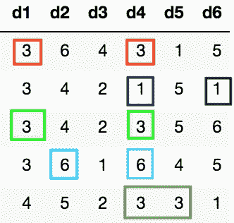
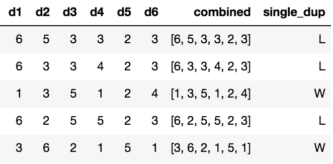
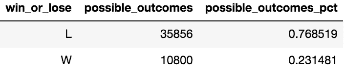

# 用熊猫数据框架解决一个概率问题

> 原文：<https://medium.com/geekculture/using-a-pandas-dataframe-to-solve-a-probability-question-e631f838652d?source=collection_archive---------13----------------------->

## 掷色子

Photo by Denes Kozma via Unsplash

在我最近的文章中，我解释了如何使用熊猫来计算我小时候遇到的掷出 6 个骰子的超级长镜头场景的概率。在这篇文章中，我将提出另一个概率问题，解释用于寻找答案的思维过程，并展示最终结果。

# 问题是:

在这种情况下，我们将再次使用 6 个骰子。问题是这样提出的:如果 6 个骰子都掷出来了，只有 2 个骰子是重复的概率是多少？

让我们利用这段时间重新审视这个问题。有什么比想象几个例子更好的方法呢？请注意，对于每个示例/卷，有一个值显示两次。其他值都不一样。

Photo by Author

这也可以表述为:只有一对的概率是多少？

# 这怎么用熊猫解决？

我将使用一个熊猫数据框架来解决这个问题。有多种方法可以做到这一点，但要查看我使用的代码，请随意查看 [Kaggle 笔记本](https://www.kaggle.com/josephburton06/probability-with-6-dice-in-python)。

1.  理解被问的问题(上图)。
2.  创建显示每个可能的 row 场景的数据框架(在 [Kaggle 笔记本](https://www.kaggle.com/josephburton06/probability-with-6-dice-in-python)中)。
3.  确定哪些行将被视为优胜行。
4.  提问:什么可以打破这个？
5.  计算获胜场景的概率。

# 识别获奖行

该数据帧有 6 列，每一列对应一个骰子，其中包含该特定场景下每个骰子的值。我们可以这样说，如果 D1 = D2 或 D1 = D3，…或 D5 = D6，那么它就是赢家。让我们尝试一些不同的东西。

如果将所有骰子值合并到一个列表中，我们将知道在 6 个骰子中有 5 个唯一值的地方，该行将有一个骰子是另一个骰子的副本。让我们这样做，并看看一些输赢行:

Photo by Author

请注意，在前 2 行中，值 3 在每行中出现了 3 次。在第四行中，2 和 5 都是重复的。

# 什么能打破这个？

仅仅因为可以编写逻辑来标识这些行，并不意味着它们可以应用于每个场景。总是问这样一个问题:什么能打破这个？

假设，我们试图回答一个类似的问题，但是我们想找到有 2 对或 2 组重复数字的行。如果我们尝试使用唯一值 4，我们会遇到将上面的前 2 行标记为赢家的问题，因为它们有 4 个唯一值，但它们是单个值的三倍。

# 计算概率

有多种方法可以得到这个答案。我们将使用 value_count()作为我们的路由。我们可以通过组合两个小的数据帧来显示计数和百分比，结果如下:

Photo by Author

因此，当掷出 6 个骰子时，大约有 23%的几率只有 2 个骰子显示相同的数值/得到一对。

# 最终注释

如前所述，我希望能让你思考如何使用代码来帮助解决问题。随着我在分析领域的发展，我发现专注于几个项目真的会有帮助:将问题分解成步骤，以不同的方式问问题，以及想出打破逻辑的场景都真的有帮助。