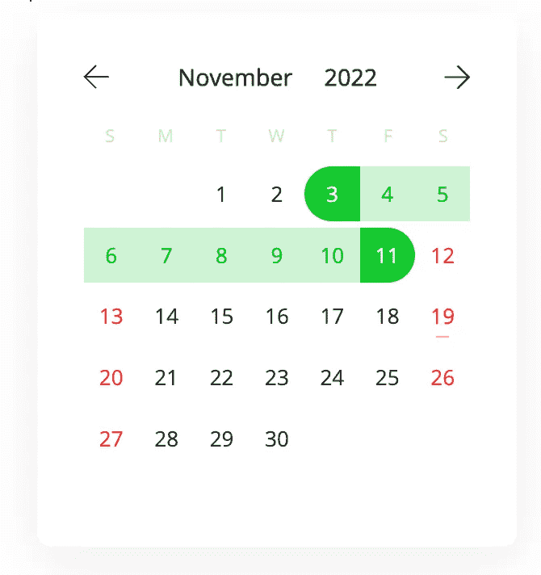

# 在 React 中使用响应日期范围选择器

> 原文：<https://medium.com/geekculture/using-a-responsive-date-range-picker-in-react-f2fce91dc815?source=collection_archive---------3----------------------->

## 添加 react 现代日历日期选择器

Responsive date range picker

有多个 React 库可以让你在你的网站上添加一个日期范围选择器，但是只有少数几个库是响应性的，并且易于使用。在本文中，我们将学习如何在 React 中添加一个响应日期范围选择器。我们将在本文中使用[react-modern-calendar-date picker](https://techwritingtools.com/react-modern-calendar-datepicker)库。