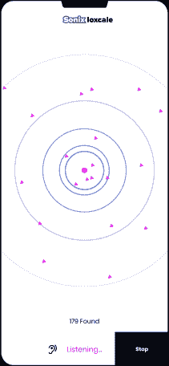
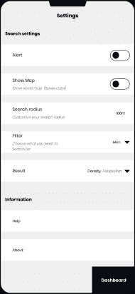

# 在商业中使用人工智能和机器学习。

> 原文：<https://medium.com/geekculture/using-ai-and-machine-learning-in-business-d794146b542f?source=collection_archive---------18----------------------->

# 概述:

威胁检测是一个巨大且不断发展的领域。威胁检测可以以网络保护机制的形式出现，或者在感知的重要位置安装软件。个人安全呢？一个人如何察觉自己面临的危险？

# 目标:

Sonix-Locale 是提议的产品，这是一种针对移动电话的威胁检测机制，可以使用武器的能量发射来检测危险。

使用热波探测软件收集数据，根据武器进行标记并输入模型。

# 商业案例:

这很重要，因为它不仅提高了用户的人身安全，还减少了政府在威胁检测方面的开支。

该项目旨在通过以下方式为我们的团队创收:

1.  私营公司合作，如电信公司希望将这一功能集成到他们的 sim 卡和手机中，而软件公司将试图在资金方面相互竞争，以制作更好的检测模型。
2.  消费者使用这一功能越多，公司通过流量获得的牵引力就越大。
3.  政府也有兴趣资助该项目，因为它减少了开支，并且是一种在威胁发生前及早发现威胁的更快、更方便的方法。

# 人工智能/人工智能的应用

我提出的项目将使用 ML/AI 来检测和区分来自人体和各种武器的热量或能量，以实现威胁检测。这些模型将利用神经网络自动:

1.  检测攻击者附近的武器类型
2.  区分人体热辐射和武器热辐射，以便准确识别。
3.  探测人类的情绪，如攻击性。

要实现的结果是改善邻居的安全性，并对安全代理的潜在威胁发出早期警报。

# 成功指标:

成功的衡量标准不仅要从真实世界数据中的模型性能来测试，还要从 MVP 测试中的性能来测试。

随着时间的推移，我们的目标市场将得到适当的界定和电子邮件细分，从而降低客户获取成本。

通过 SEO 提高网站的流量和更快的加载时间。

我们还将通过基线性能流量进行测量，即发布后 3 个月内的 10k 用户。

# 数据采集:

该数据集将来自电磁相机和军事武器探测的 LWIR 部分，将对其进行比较和隔离，以获得各种手持武器和人体的热辐射的综合数据集。

这样做的成本很高，而且由于会有军事探测数据集，因此需要进行清理以承担此类任务。

不会有数据敏感性问题，因为提取的是热能或热能。

随着更多数据的来源和添加，需要大量的数据来开始不断更新的过程。

# 数据源:

偏差将来自数据集的标记、比较和隔离。该数据将通过从项目一开始就与领域专家合作来改进，以将异常最小化到最低限度。

# 数据标签:

我要处理的标签取决于选择的武器范围和要考虑的情绪。

MVP 将包含以下标签:

1.  枪
2.  手榴弹
3.  刀子
4.  愤怒、悲伤、沮丧等情绪。

标签方案的优势在于数据收集将得到很好的定义，注释者对预期的内容有一个清晰的了解。

这种方案的缺点是不同的枪发出不同的热信号，可能导致模型性能的偏差。

# 模型构建:

该模型将由内部团队构建，因为该团队由领域专家组成。由于大量数据将被使用，存储将被外包。

# 评估结果:

要使用的指标包括 ROC AUC 曲线、精确度和召回率。所需的性能水平至少为 85%,因为这是一种建议的安全设备，并且需要尽可能少的假阳性和假阴性。

# 设计:

# 使用案例:

我正在为喜欢户外活动的夜行者设计。

此外，对于那些在危险的街区走动感到不安全的人，尤其是女性。

**大案:**

一位年轻女士下班很晚，乘火车。在回家的路上，她感到不安，好像有人在跟踪她。该产品检测到异常能量，如攻击性情绪或附近的武器，它首先向当局发出警报，然后使用用户设置的秘密音调向女士发出信号。

该产品可以通过集成在电话中、电话公司和电信公司的 sim 卡中来访问，这意味着该产品是内置的。

# 推出:

就像我前面提到的，它将被集成到手机和 sim 卡中，并通过软件更新将其集成到现有用户的手机中。

推出将包括以下里程碑:

1.  雇佣团队包括:

产品所有者、产品设计师、数据科学家、ML 工程师、QA、武器专家和 2 名软件工程师。这支队伍预计将在两个月后集合。

2.生成带标签的数据集:

我们将需要聘请一个外部数据注释公司来标记数据集，领域专家审查这个标记过程。我们预计这将在一个月内完成。

3.构建和训练模型:

我们预计第一次迭代的模型构建和训练大约需要 2-3 周的时间。

4.测试模型，迭代直到精度满足规范:

我们预计在启动 MVP 之前，测试/迭代阶段将持续 2 周左右。

5.启动:

不变的是，我们认为我们可以在大约 6-8 个月内发布。

6.迭代添加数据:

我们计划向模型中注入一组新数据，并以大约每月一次的频率进行重新训练，我们需要数据科学家和 ML 工程师每次留出大约一天的时间来完成这项工作。

# 长寿设计:

当检测被确认时，它作为模型的反馈。随着时间的推移，更多的标签将被添加，模型在这些更新的标签上重新训练并测试以确保效率。

训练数据和真实世界之间不会有差异，因为用于训练的数据是由团队策划的真实世界数据。

添加新型号后，30%将用于更新型号，70%用于当前型号和性能比较。

# 监控偏差:

用户反馈将主要用于减少不必要的偏差。

# 结论:

这个项目是我从 Udacity 为人工智能产品经理的顶点项目，图像来自我作为 2020 年 HNG 实习生的前端开发实施。你可以在这里查看实现[。报告可以在](https://nwosu-ihueze.github.io/sonix-locale/)[这里](https://github.com/Nwosu-Ihueze/AI_for_PM/tree/main/Capstone_Project)找到，你可以在 [LinkedIn](https://www.linkedin.com/in/rosemary-nwosu-ihueze/) 上和我联系。