# 使用 Amazon Web Services 通过 EC2 进行机器学习

> 原文：<https://medium.com/geekculture/using-amazon-web-services-for-machine-learning-with-ec2-ba3955b08133?source=collection_archive---------23----------------------->

作为一名数据科学家、分析师或工程师，我们需要在数据集上运行一些繁重的计算操作，特别是随着大数据的流行和对许多 ML 算法的计算要求，这在您的本地机器上可能非常难以做到。

在本文中，我们将创建一个基本的 Amazon Web Services (AWS)服务器，也称为 EC2 服务器，来运行我们的 python 和 notebook 操作。

## **好处**

*   永远在线
*   强大的计算能力(取决于服务器)
*   相对便宜或免费(如果这是你使用 AWS 的第一个月)


Photo by [Markus Winkler](https://unsplash.com/@markuswinkler?utm_source=medium&utm_medium=referral) on [Unsplash](https://unsplash.com?utm_source=medium&utm_medium=referral)

这种设置最好的部分是，这是*你的服务器*，只要你希望它在线，它就会在线，但是如果没有正确监控，你会遇到额外的费用。这在使用其他笔记本服务平台如 Google Colab、Kaggle 等时尤为明显。在特定时间后终止笔记本电脑或限制服务器类型。

# AWS 注册

我们首先想注册 AWS 的“免费层”选项，你可以在 [AWS 注册页面](https://aws.amazon.com/free)上这样做，这将为你提供 12 个月的免费使用特定服务。

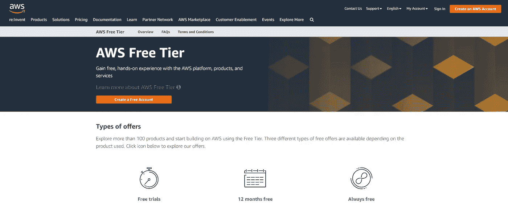

Click the “Create a Free Account” button

注册过程的其余部分是一个简单的一步一步的过程，因为页面布局会定期变化，所以我们不会重复。然而，信息通常是相同的:

*   联系信息(姓名、电子邮件、密码等)。)
*   账单信息(有效的信用卡/借记卡
*   身份验证

> 如果你使用**免费服务**一整年，你的卡不会被收费。

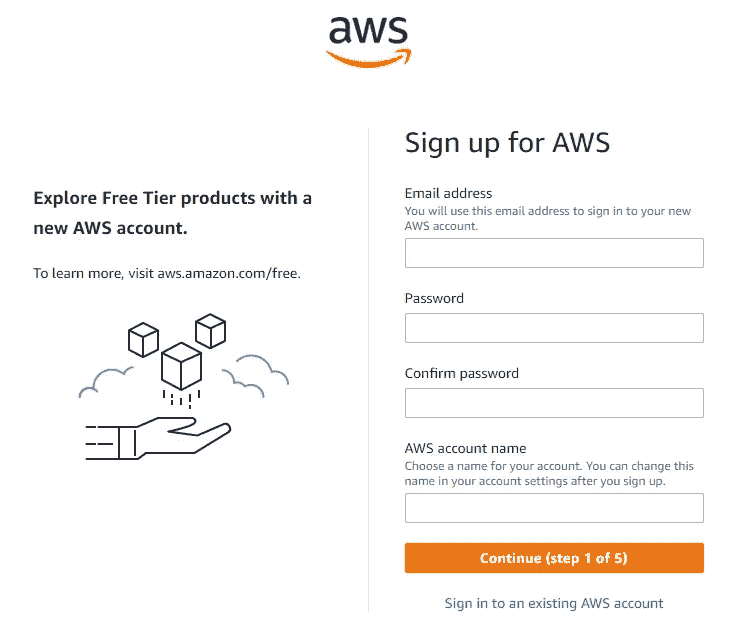

Initial signup page

一旦您的帐户已经设置和验证。登录，我们就可以开始创建 EC2 服务器了。

# 服务器(EC2)创建

登录后，我们需要定位 EC2 服务。在左上角，点击**服务**按钮并寻找 **EC2** (在**计算**部分下)。


EC2 may also be in your recent services list

在 EC2 管理页面中，点击**启动实例**按钮(右上角橙色按钮)。

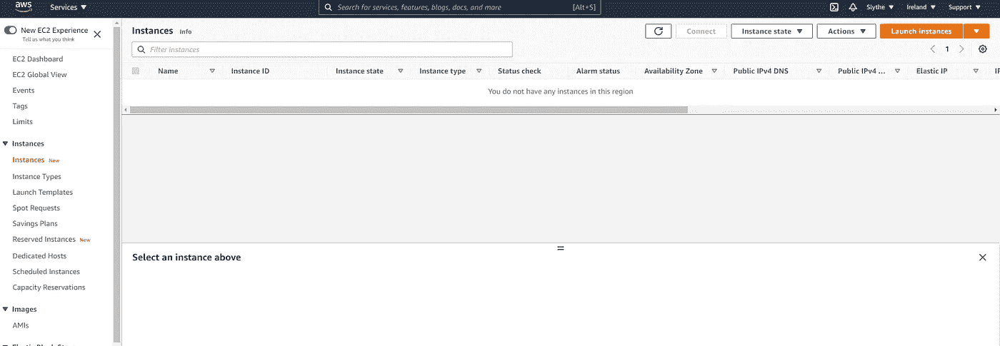

Launch instances

## 图像类型

接下来选择您的映像(服务器)类型，我们将使用免费层 Linux 服务器，它通常是列表中的第一个。但是，请确保其名称下有一个“**符合自由层条件的**”标签。

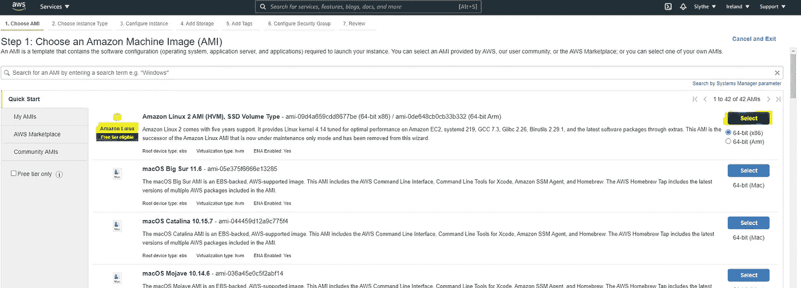

Select Linux Free Tier

## 实例类型

勾选最小的服务器； **t2.micro，**因为这是符合条件的自由层，单击**审查并启动**

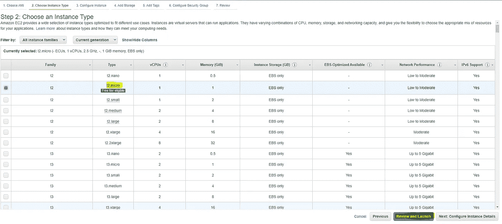

> 您可以根据用途(常规、用途、内存、存储、性能等)选择其他服务。)或处理器类型(CPU、GPU)。在这里查看所有的[实例类型](https://aws.amazon.com/ec2/instance-types/)以及它们的[定价](https://aws.amazon.com/ec2/pricing/)。
> 
> 当点击**查看并启动**时，我们跳过 EC2 服务器安全组的配置，这将保持所有端口打开。在完全实时的生产环境中，情况并非如此，因为我们希望将设置限制为仅允许特定流量和特定 IP 地址。

## 发动

在启动屏幕中，您可以查看和编辑将要创建的服务器，例如，如果您需要更多硬盘空间或更快的 SSD，可以使用更大的存储选项

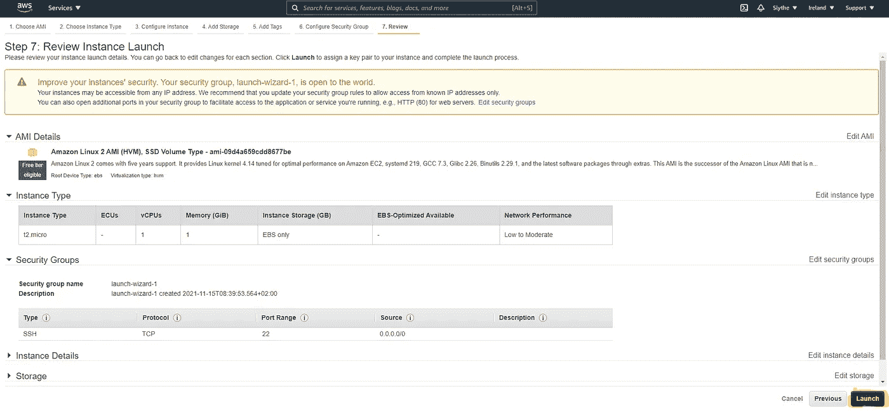

单击“启动”后，您将收到一个弹出屏幕，用于下载您的密钥对

**密钥对**

密钥对是一个文件，将用于连接(SSH)到您的服务器。

选择**创建一个新的密钥对**并给它一个可识别的名称

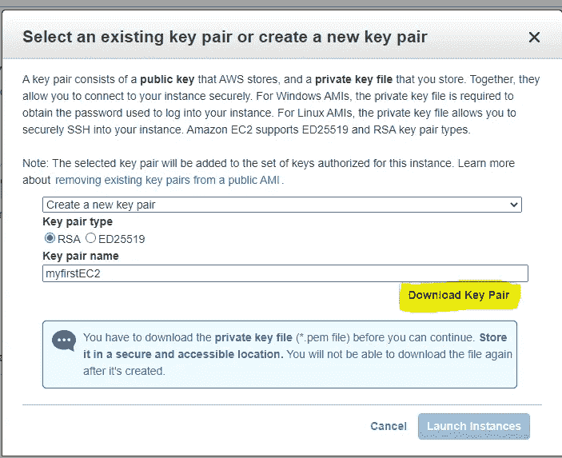

Key pair creation and download

> 密钥对只提供**一次，不会再提供**，所以请确保下载并保存在安全的地方

下载并安全保存到您电脑上的某个位置后，单击**启动实例。**

## 监控服务器

服务器启动可能需要几分钟时间，可通过单击其启动 ID 或屏幕右下角的按钮进行监控

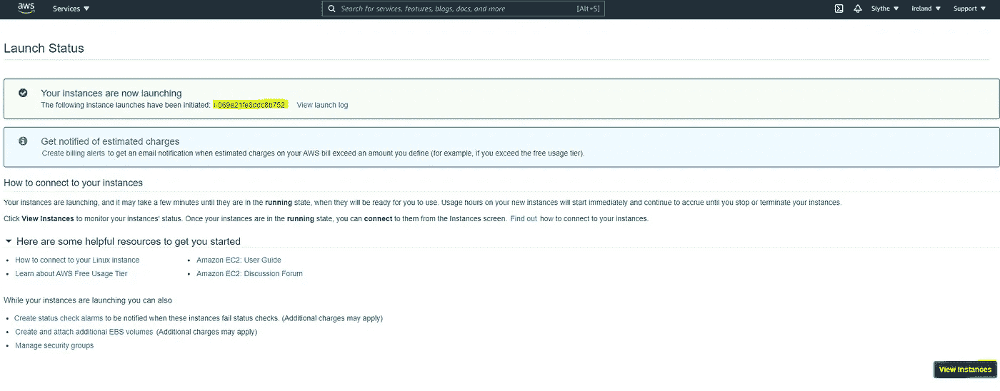

> 您还可以按照前面的步骤转到 EC2 服务部分，查看所有正在运行的服务器

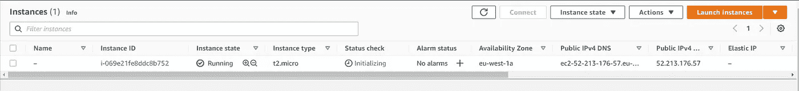

Running/ Pending instances

## 实例地址(公共 IPv4 DNS)

单击 InstanceID 并复制公共 IPv4 DNS。

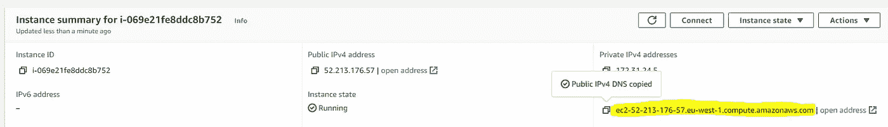

*将此地址粘贴到某个地方，因为我们将在本文后面使用此地址连接到我们的服务器*

# 使用 Putty 连接到服务器(Windows)

我们现在可以使用任何 Windows 计算机连接到我们的服务器，通过 Putty，可以在 [AWS 文档](https://docs.aws.amazon.com/AWSEC2/latest/UserGuide/putty.html)中找到完整的指南。我们将快速浏览下面的分步流程:

**第一步:**下载 [Putty](https://www.chiark.greenend.org.uk/~sgtatham/putty/)

转到上面的链接下载并安装 Putty

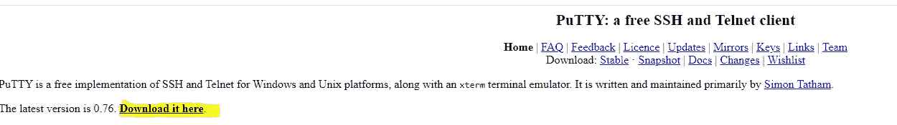

**步骤 2:** 转换密钥对文件(。pem)保存到私有文件(。ppk)使用腻子

在 windows 开始菜单中，搜索 P **uTTYgen，**一旦打开，确保勾选 **RSA** 并点击**加载**

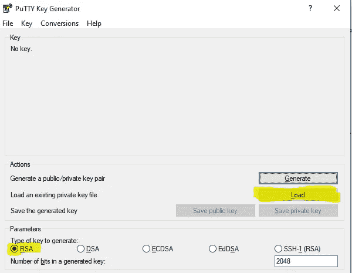

为了查看密钥对文件，选择**所有文件。**然后选择文件并点击确定

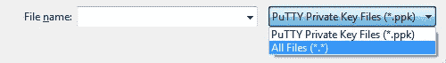

Select All file

拥有一个新的。ppk 文件。

点击**“保存私钥”**，为其命名并保存在安全的位置

**注意:**做**不做**点击**生成**

> 您可能需要在屏幕上移动鼠标来为 PuttyGen 创建文件产生随机性

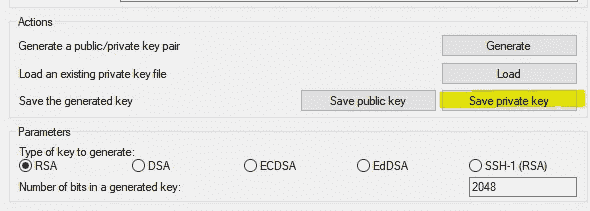

你可以关闭 PuttyGen

## 使用 Putty 通过 SSH 连接到服务器(Windows)

启动 Putty，展开 **SSH** 并选择 **Auth，**，然后**浏览**以找到您的私钥文件(。ppk)之前保存的

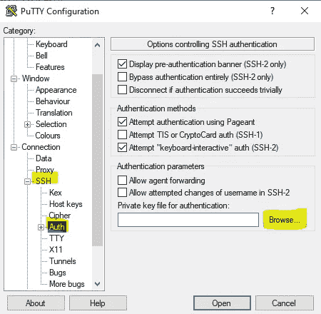

加载后，返回到**会话**部分。

在主机名字段中输入**用户名@PublicIPv4DNS**

用户名依赖于[实例类型](https://docs.aws.amazon.com/AWSEC2/latest/UserGuide/connection-prereqs.html#connection-prereqs-get-info-about-instance)。因为我们使用的是 AWS Linux 实例，所以用户名是 **ec2-user。**

> ec2-user@ < **PublicIPv4DNS 地址** *>*

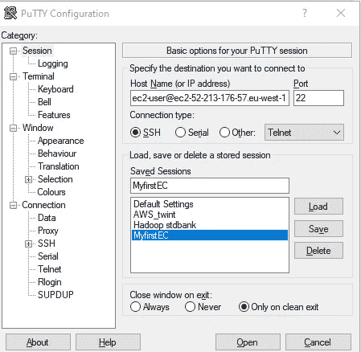

> 记得给它一个名字并保存配置，这样你就可以在每次想要连接的时候加载 T21

一旦完成，点击**打开**启动一个到我们服务器的 P **utty** 会话

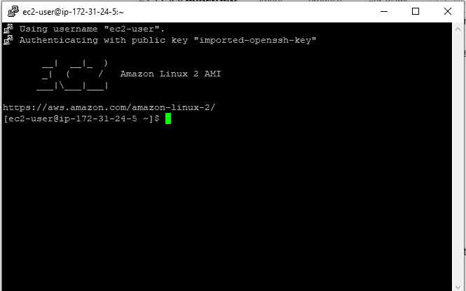

# 使用 SSH (Mac)连接到服务器

好吧，我打算在这里作弊，只提供亚马逊指南，因为我们没有现成的 Mac 来测试这个过程。

AWS 指南通常非常详细，但是如果您有问题，请评论您的错误，我们将尽可能提供帮助

# 机器学习设置

*   Python 更新
*   pip —安装
*   Jupyter 笔记本—安装

## 计算机编程语言

幸运的是，python3 已经安装在 Amazon Linux 实例上。但是我们可以使用 **python3 —版本**来检查

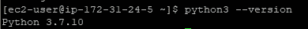

Check python version

更新 python(其他实例类型请参考本[指南](https://docs.aws.amazon.com/elasticbeanstalk/latest/dg/eb-cli3-install-linux.html))

## 点

我们现在可以使用

```
**> sudo yum install pip**
```

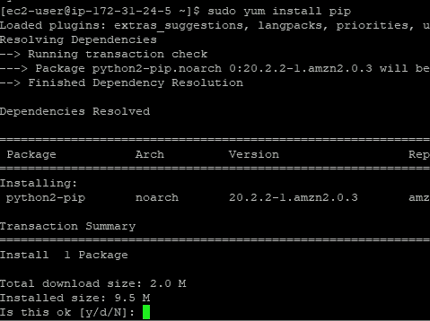

install pip

键入“ **y** ”以完成该过程

# Jupyter 设置

在命令行中键入

```
 **> pip3 install jupyter**
```

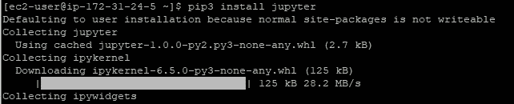

install Jupyter

好的做法是[创建一个虚拟环境](https://www.digitalocean.com/community/tutorials/how-to-set-up-jupyter-notebook-with-python-3-on-ubuntu-18-04)，但是因为我们不会在生产中使用这个服务器，所以我们需要做的就是创建一个 pem 文件，配置 jupyter 并运行服务(详细的指南可以在[这里找到](https://jupyter-notebook.readthedocs.io/en/stable/public_server.html))

在 Putty 窗口的命令行中，运行以下命令:

**配置笔记本:**

```
jupyter notebook — generate-config
```

**创建私钥(。密钥)和证书(。pem)文件:**

```
> cd ~
> mkdir ssl 
> cd ssl
> openssl req -x509 -nodes -days 365 -newkey rsa:2048 -keyout mykey.key -out mycert.pem
```

你将被要求回答几个基本问题。

导航到配置文件文件夹:

```
> cd ~/.jupyter/
```

编辑配置文件:

```
> vi jupyter_notebook_config.py
```

按下 **i** on，即可编辑文件，即插入数值。然后在文件顶部粘贴以下内容:

```
# Set options for certfile, ip, password, and toggle off
# browser auto-opening
c.NotebookApp.certfile = u'/home/ec2-user/ssl/mycert.pem'
c.NotebookApp.keyfile = u'/home/ec2-user/ssl/mykey.key'# Set ip to '*' to bind on all interfaces (ips) for the public server
c.NotebookApp.ip = '*'# Don't open browser by default
c.NotebookApp.open_browser = False# It is a good idea to set a known, fixed port for server access
c.NotebookApp.port = 8888
```

按 **Esc** 停止编辑。然后键入以下内容保存并退出文件

```
:wq
```

# 开始 Jupyter

要启动 Jupyter 服务，请运行以下代码

```
**> jupyter notebook**
```

Jupyter 笔记本服务现在正在运行

要访问该地址，我们需要在我们的**本地**电脑上打开浏览器，即在您电脑上的 chrome 或 Edge 浏览器中打开该地址

**PublicDNSAddress:8888**

其中公共地址是我们在前面步骤中保存的地址

干得好！你现在应该有一个 Jupyter 笔记本设置来开始运行一些机器学习模型

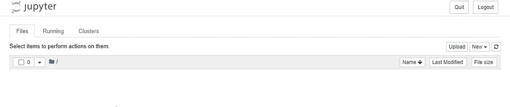

# 终止实例(可选)

这个过程的最后一点，是在你完成后终止你的服务器。这将停止向您的帐户收取任何额外费用(尽管您可以在被收费前运行一段时间)

在 AWS 中，转到 EC2 服务

查找任何正在运行的实例，选择它们并终止它们

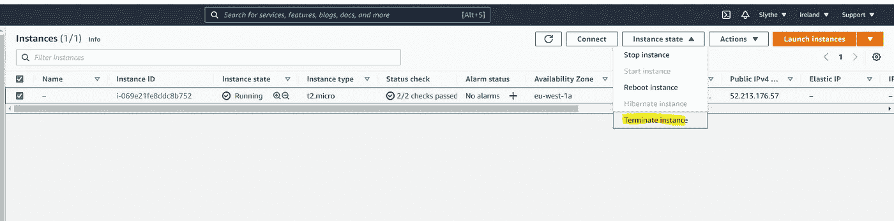

> Y 如果您希望稍后再次启动实例，您也可以停止实例，这也将停止运行成本，但不会停止存储和映像成本

# **附加导轨**

[使用 WinSCP 传输文件](https://docs.aws.amazon.com/AWSEC2/latest/UserGuide/putty.html#Transfer_WinSCP)