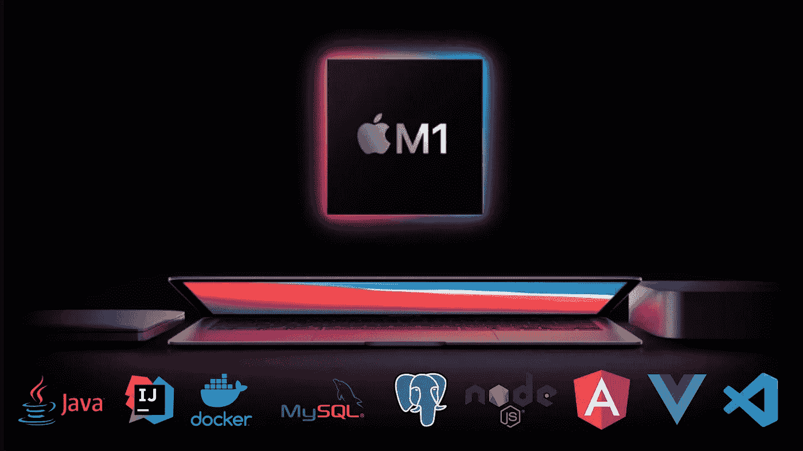

# 使用苹果硅 M1 进行软件开发

> 原文：<https://medium.com/geekculture/using-apple-silicon-m1-for-software-developments-46d405034a43?source=collection_archive---------1----------------------->

## Java 全栈开发

## 我在配置和使用 Java 全栈开发时所面临的问题

众所周知，苹果发布了其最新的**硅 M1 芯片**，目前我们可以在最新的 Macbook Air(M1，2020 年)、Macbook Pro(M1，2020 年)和 Mac Mini (M1，2020 年)上使用它……