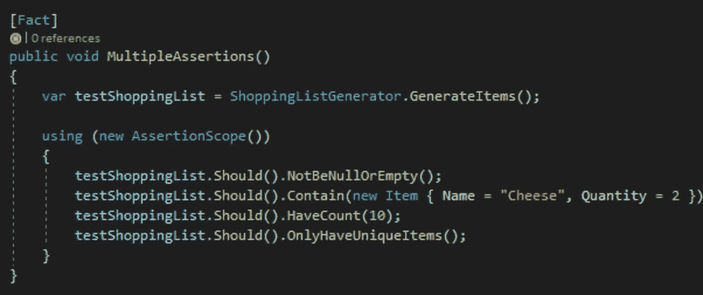
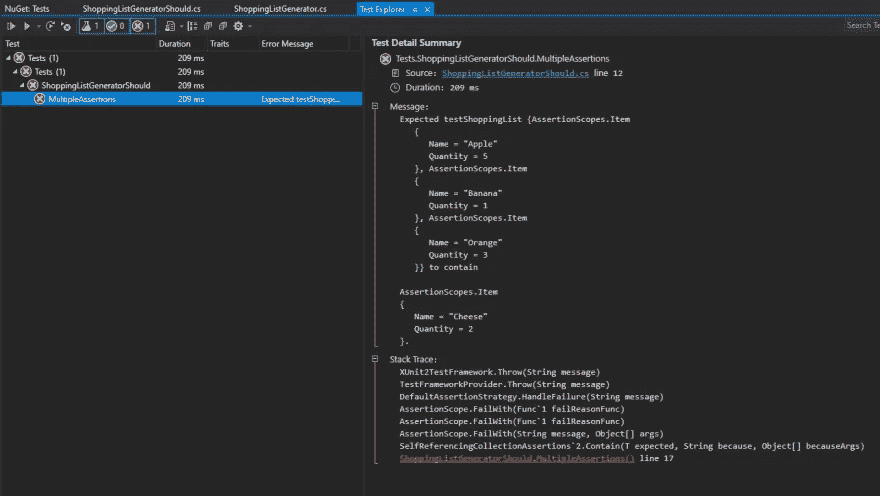
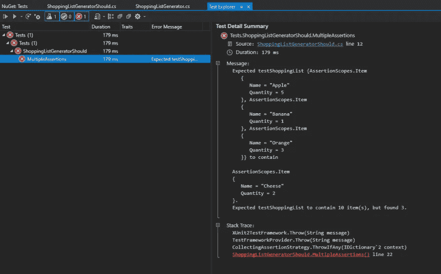

# 在 C#中使用断言范围执行多个断言

> 原文：<https://medium.com/geekculture/using-assertion-scopes-to-execute-multiple-assertions-in-c-fcded73b1a35?source=collection_archive---------9----------------------->

## 当在我们的单元测试中使用多个断言时，断言作用域使我们的生活变得更容易，因为它节省了我们找出测试失败原因的时间和精力。



Assertion Scopes allow us to test multiple assertions within a single test execution

流利断言是一个. NET 库，它提供了一系列有用的扩展方法，允许我们以更自然的方式测试我们的 C#代码。

比方说，我们正在测试一个字符串的输出。如果没有流畅的断言，我们可能会写出这样的东西:

```
string testString = "hello";
string expectedOutput = testString.ToUpper();
Assert.Equal(expectedOutput, "HELLO");
```

如果我们要使用流畅的断言来编写这个测试，我们可以这样做:

```
string testString = "hello";
string expectedOutput = testString.ToUpper();
expectedOutput.Should().Be("HELLO");
```

看到了吗？更加自然😊

# 引入断言范围

让我们用一个更广泛的例子。假设我有一个生成购物清单的类，如下所示:

```
public class ShoppingListGenerator
    {
        public static List<Item> GenerateItems()
        {
            return new List<Item>
            {
                new Item
                {
                    Name = "Apple",
                    Quantity = 5
                },
                new Item
                {
                    Name = "Banana",
                    Quantity = 1
                },
                new Item
                {
                    Name = "Orange",
                    Quantity = 3
                }
            };
        }
    }
```

对于更复杂的单元测试，我们可能想要断言多个属性，如下所示:

```
public class ShoppingListGeneratorShould
{
    [Fact]
    public void MultipleAssertions()
    {
       var testShoppingList = ShoppingListGenerator.GenerateItems();
       testShoppingList.Should().NotBeNullOrEmpty();
       testShoppingList.Should().Contain(new Item { Name = "Cheese", Quantity = 2 });
       testShoppingList.Should().HaveCount(10);
       testShoppingList.Should().OnlyHaveUniqueItems();           
     }
}
```

这种方法很好，但是看看我们的代码，我们可以看到，如果断言我们的列表将在。Contain()方法，因为我们的列表中没有包含奶酪的条目。这个测试也会在我们的。HaveCount()方法，因为我们的列表中只有 3 项，而不是 10 项。

让我们通过运行测试来确认我们的想法。



我们是正确的！但是在这个例子中，不仅我们的测试失败了。包含()方法，但它已经停止运行我们的测试！

假设我们修复了这个错误，使得断言通过，但是在下一个断言时失败。下一个，下一个，等等。

像这样测试我们的代码是相当乏味的。谢天谢地，我们可以使用断言范围来解决这个问题！

使用断言作用域，我们可以将多个断言批处理到一个 AssertionScope 中，这样 FluentAssertions 将只在作用域的末尾抛出一个异常，并处理所有的失败。

让我们将测试改为使用断言范围:

```
using AssertionScopes;
using FluentAssertions;
using FluentAssertions.Execution;
using System;
using Xunit;

namespace Tests
{
    public class ShoppingListGeneratorShould
    {
        [Fact]
        public void MultipleAssertions()
        {
            var testShoppingList = ShoppingListGenerator.GenerateItems();

            using (new AssertionScope())
            {
                testShoppingList.Should().NotBeNullOrEmpty();
                testShoppingList.Should().Contain(new Item { Name = "Cheese", Quantity = 2 });
                testShoppingList.Should().HaveCount(10);
                testShoppingList.Should().OnlyHaveUniqueItems();
            }                     
        }
    }
}
```

我们现在将断言包装在 using 语句中，我们的异常将只在处理 AssertionScope 时抛出。

让我们运行测试，看看会发生什么！



我们的测试失败了，但是现在我们得到了返回给我们的两个异常！

```
Message: 
    Expected testShoppingList {AssertionScopes.Item
       {
          Name = "Apple"
          Quantity = 5
       }, AssertionScopes.Item
       {
          Name = "Banana"
          Quantity = 1
       }, AssertionScopes.Item
       {
          Name = "Orange"
          Quantity = 3
       }} to contain 

    AssertionScopes.Item
    {
       Name = "Cheese"
       Quantity = 2
    }.
    Expected testShoppingList to contain 10 item(s), but found 3.
```

现在，我们不必在每次测试中断言失败时都运行并重新运行我们的测试，我们可以一次看到测试中失败的所有断言！

# 结论

流畅的断言是一个很棒的库，它允许我们以一种更自然、更有表现力的方式编写 C#测试。当在我们的单元测试中使用多个断言时，断言作用域使我们的生活变得更容易，因为它节省了我们找出测试失败原因的时间和精力。

如果你想了解更多关于流畅断言的知识，可以查看这里的文档:【https://fluentassertions.com/about/

我希望你从这篇文章中学到了一些东西！如果你有任何问题，请在下面评论或者在推特上联系我:[https://twitter.com/willvelida](https://twitter.com/willvelida)

编码快乐！☕💻