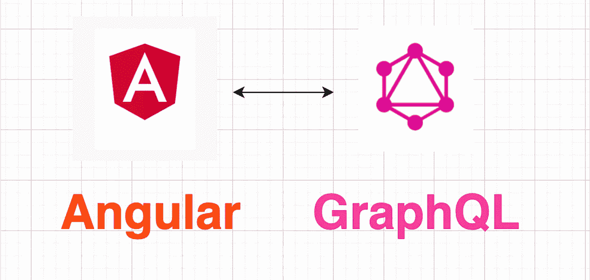

# 将 Angular App 与 GraphQL API 集成

> 原文：<https://medium.com/geekculture/using-aws-amplify-to-publish-angular-app-integrating-with-graphql-api-be750d4a770c?source=collection_archive---------15----------------------->



在这篇博客中，我将演示如何将 Angular App 与 GraphQL API 集成，然后使用 AWS Amplify 在 5 分钟内轻松将其发布到 AWS Cloudfront。

这里我们使用 SpaceX GraphQL API 端点作为数据源。

首先安装 Angular cli。

```
% sudo npm i -g @angular/cli
```