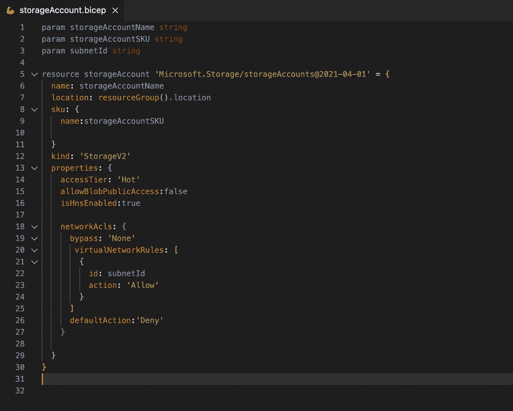
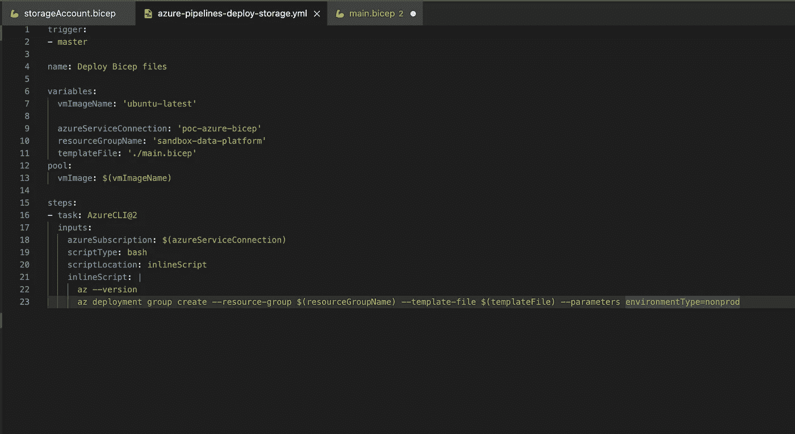
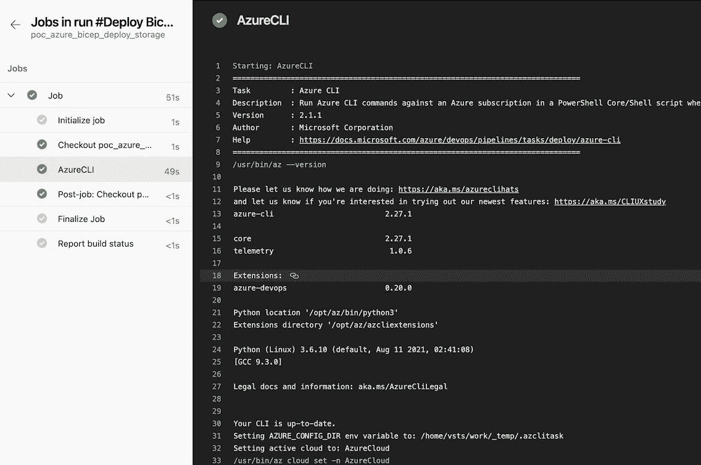

# 将 Bicep 用于基础设施作为 Azure 上的代码

> 原文：<https://medium.com/geekculture/using-bicep-for-infrastructure-as-code-on-azure-3bbc3845bc36?source=collection_archive---------26----------------------->

## **使用 Azure 本地语言简化基础设施部署的平台工程**

我在这里写了些东西已经有一段时间了。事实上，自从我的上一篇文章以来，发生了很多事情。我于今年 6 月加入皇家 FrieslandCampina，我必须说，我一直在忙于我们计划用 Data 和 Azure 做的令人敬畏的事情。我没有时间去尝试新事物或做一些实际工作。

那么，还有什么比把基础设施作为一种代码更好的话题呢？让我们看看我喜欢这门语言的哪些二头肌和一些特征。另外，请随时[点击这里](https://github.com/iammayanksrivastava/azurebicep)访问我的 GitHub 页面。


Photo by Photo by Anastase Maragos on [Unsplash](https://unsplash.com/photos/FP7cfYPPUKM)

请注意，这是我第一次尝试评估 Azure Bicep，以帮助我决定是否要将该工具添加到我的堆栈中。我仍然在按照最佳实践为我的 Azure 栈构建基础设施作为代码。

## 那么什么是二头肌呢？

Azure Bicep 是一种特定于领域的语言。是的，它是一种语言，可以与 Terraform 语言相媲美，告诉 Terraform 如何管理给定的基础设施集合。Bicep 是 ARM 模板之上的一个抽象层，它用一个非常简单、清晰的语法简化了整体开发体验，您可以按照模块化和重用的原则构建代码。

## 肱二头肌的一些优点

*   我一直喜欢 Terraform 的原因之一是因为它非常容易理解。与手臂不同，二头肌超级容易理解和编码。你可以按照[文档](https://docs.microsoft.com/en-us/azure/templates/microsoft.storage/storageaccounts?tabs=json)去做，非常详细清晰。与 JSON 的复杂性不同，Bicep 易于编写和遵循。例如，使用 bicep 和 JSON 声明参数

```
## Declaring parameters in bicep 
param location string = 'london'#Declaring parameters in json"parameters": {
  "location": {
    "type": "string",
    "defaultValue": "london"
  }
}
```

*   Bicep 模块有助于降低基础设施代码的复杂性。Bicep 模块是要一起部署的一个或多个资源的集合。模块也是使 Bicep 代码更加可重用的一种方式。你可以有一个单一的二头肌模块，许多二头肌模板使用。您可以按照标准集中 Bicep 模块，并且多个业务单元可以在其模板中使用相同的模块来部署组件。
*   参数和变量的使用使得你的 Bicep 模板或模块变得非常容易重用和通用。
*   Bicep 模板与 Azure DevOps 集成。你可以很容易地编写一个 YAML 模板，并整合你的二头肌模板作为一项任务。
*   我在 Terraform 上遇到的一个难题是 Azure 的新功能不可用。二头肌帮助你克服这一挑战。所有功能，无论是正式版还是预览版，都将从第一天开始提供。
*   如果你已经有了一个使用 ARM 模板的设置，你仍然可以将 ARM 模板反编译成 Bicep 模板，然后切换到 Azure Bicep。我还没有尝试这些功能，但是从我在这里读到的来看，这似乎是一个简单的工作。

我们是否应该将 Azure 二头肌作为堆栈的一部分？从架构的角度来看，我建议使用 Bicep 作为 Azure 原生基础设施，作为技术堆栈中的代码工具。

## 安装二头肌

安装二头肌非常容易。我不会花太多时间解释如何安装二头肌。请[点击](https://docs.microsoft.com/en-us/azure/azure-resource-manager/bicep/install)此链接了解安装该工具的详细步骤。简而言之，安装 VS 代码和 Bicep CLI 创建模板。我强烈建议在 VSCode 中安装 Bicep 扩展，以方便您创建模板。提供语言支持和资源自动完成。该扩展帮助您创建和验证 Bicep 文件。

**写一个模块存放账户**



Module in Bicep for Storage Account

**使用二头肌模板中的模块**


Bicep template which uses the module

请注意，您可以在模板中内联定义参数，也可以在单独的文件中创建参数并在代码中引用它。对于这个例子，我已经在模板文件中内嵌了所有的参数。

**将二头肌与 Azure DevOps 相结合**

您可以编写一个 YAML 文件来使用 Azure CLI 部署 Bicep 模板。您可以将部署定义为 Yaml 文件中的一个任务，并从 Azure 管道中执行它。



YAML file to create a DevOps pipeline

然后，您可以使用 Azure DevOps 管道执行 Bicep 模板，该管道将返回您的订阅的 Azure 资源组中部署的资源的详细信息。



Azure DevOps pipeline for Bicep

来自 Terraform 的世界，我错过的事情之一是生成随机密码的选项。在 Terraform 中，我们有 random_password，它可以解决我在参数文件中或作为变量硬编码密码的问题。在 Bicep 中，我没有发现任何问题，而且项目团队也不打算在短期内添加该功能。我还没有找到一个替代方案，如果你有一个，请对这个选项的故事进行评论。

请注意，这是我为了测试 Azure Bicep 是否适合作为企业基础设施的代码而进行的一次快速而肮脏的尝试。我花了几个小时编写一个模块和一个模板来创建一个虚拟网络、一个子网，并在该子网内部署一个存储帐户，我设法使代码非常通用。我很想听听你对蓝色二头肌的看法。你认为你会在你的堆栈中使用它吗？我准备这样做。

**参考**

1.  Azure Bicep 文档:[https://docs . Microsoft . com/en-us/azure/azure-resource-manager/Bicep/](https://docs.microsoft.com/en-us/azure/azure-resource-manager/bicep/)
2.  GitHub 项目 Azure Bicep:【https://github.com/Azure/bicep T3