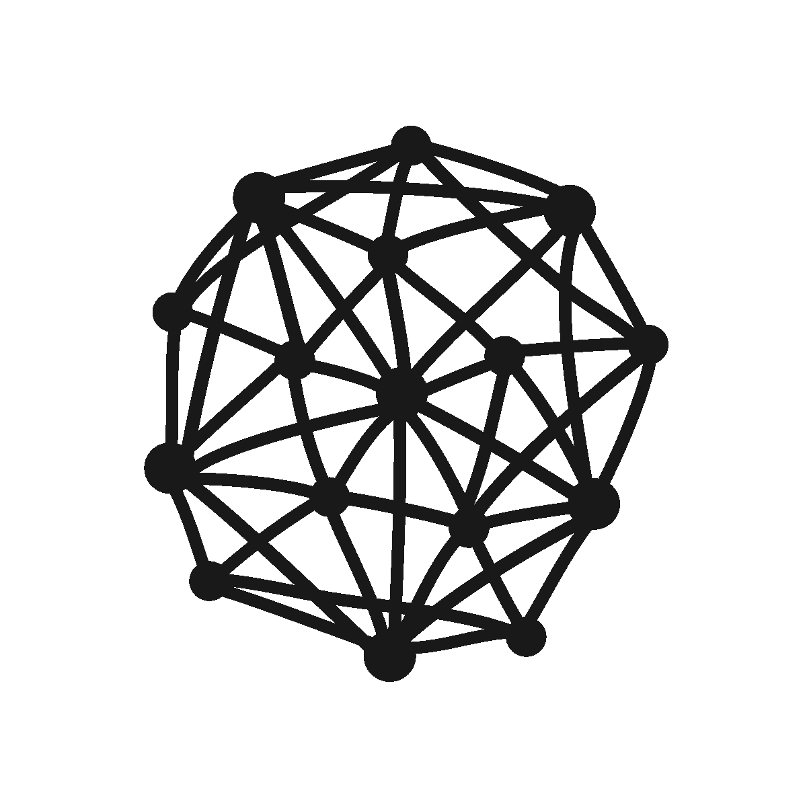

# 使用区块链归档开源调查中使用的数字数据和证据

> 原文：<https://medium.com/geekculture/using-blockchain-to-archive-digital-data-and-evidence-used-in-open-source-investigations-fd7860f0b60c?source=collection_archive---------10----------------------->

我一直对在线调查和开源情报感兴趣。众包调查和个人聚在一起调查现实世界的问题是很有意思的。几年前，在我研究这个课题的过程中，我不可避免地遇到了 Bellingcat。我最近读完了艾略特·希金斯的《我们是铃铛猫》，书中深入探讨了他是如何创立铃铛猫的，以及铃铛猫是如何发展成今天这个样子的。这是一本很棒的读物，我强烈推荐它，请点击这里。

在阅读**、**时，我注意到有一个非常有趣的观点，围绕着在与战争罪相关的审判或任何与此相关的审判中使用数字媒体作为证据，以及存档这些证据的问题。由于在线调查的性质，视频、图像和地图等证据的收集和存储方式可能会在以后试图在审判中使用这些证据甚至撰写报道时造成问题。例如，上传到 YouTube 的视频显示了战争罪或警察暴行的证据，可以用于在线调查，但当需要再次下载该证据时，它可能会被上传它的人或 YouTube 自己删除，因为该视频违反了条款和条件。

在审判中使用数字证据时出现的另一个问题是，它只能在监管链被记录为高标准的情况下使用。证据上传或提交后不可能被编辑或更改。这就引出了一个问题，我们怎么知道当我们需要再次访问录像或证据时事情没有改变呢？

在书中，希金斯提出了一些关于获取此类信息的重大问题，例如:
-曾经发布的所有内容是否仍然可用？
-会被验证吗？
-可以找到剪辑吗？

权利组织和基金会通常会存档数字证据和媒体，用于开源调查或数字证据，但这通常不是他们的主要关注点，可能会被错误处理或打乱。法官或执法部门也很难获得这些证据，并确保这些证据没有以任何方式被编辑或篡改，这些证据需要被核实，监管链需要清晰。法官和法律官员需要能够获得经过核实的证据，并能够有效地利用这些证据。

# 区块链和去中心化

想到的一个想法是使用区块链或去中心化的结构来存档数字资产或证据。这意味着资产可以上传到一个透明的、分布式的分类账上，以便安全地存储和保管。当某个故事或试验需要该资源时，可以下载该资源，并清楚记录其上传时间、上传者及其验证。很明显，围绕如何验证上传的证据存在一个问题，就像任何调查一样，证据需要得到明确的核实，并得到进一步的证据支持，以确保它是真实的，它所说的是什么。然而，我不认为网络会证实这一点，而是使用或发布证据的人或组织会证实这一点。与大多数分散式网络一样，对访问或发送资产收取网络费用，将激励上传合法证据，阻止虚假信息泛滥。也可能存在私有链，在能够为特定情况上传或下载数据之前需要认证。

## Filecoin 和 DSN 的

由 [Protocol Labs](https://protocol.ai/) 制造的 Filecoin 网络是一个允许用户存储和检索信息的现有网络，被称为分散存储网络或 DSN。从 Filecoin 网站上摘录的简单解释如下:

> Filecoin 是一个在互联网上存储文件的点对点网络，内置经济激励机制，确保文件长期可靠存储。可用存储和定价不由任何一家公司控制。相反，Filecoin 促进了任何人都可以参与的存储和检索文件的开放市场。

Filecoin 的创建是为了对抗那些控制价格和用户使用成本的集中式云服务。网络的工作原理是用户将数据上传到网络，然后给数据一个唯一的标识符密钥，该密钥可用于检索数据。首先，用户希望存储数据，然后矿工竞争赢得存储合同，用户选择获胜的矿工，数据被存储。为了获得 Filecoin，矿工们必须证明他们正确地存储了数据。这是通过加密证明来完成的，挖掘者向网络提交新块中的存储证明，并在网络上验证新块，只有正确的块才被接受。通过这样做，它激励矿工诚实并正确有效地存储数据。

为了检索文件，用户查找可能拥有该文件的矿工，然后他们选择最快或最便宜的矿工，然后客户向矿工支付检索文件的费用。随着越来越多的人请求这个文件，这个文件越来越受欢迎，越来越多的矿工可以选择它并重新托管它。数据被传播到需求增长的地方，随着数据在全球流动，这反过来又优化了访问。

矿商的范围从小型操作到完整的数据中心，通过合作托管和正确存储数据，用户和主机都受益。

从这份对 Filecoin 协议的简要(非专家)概述中，您可以看到像这样的网络如何改进和有益于开源调查的数字证据的存储或归档。通过将重要数据存储在分散的网络上，它提高了数据的安全性，通过让多个矿工存储数据，它降低了数据丢失、被取走或被破坏的风险。由于矿工必须证明他们正在正确和安全地存储数据以获得回报，这意味着数据的完整性更有可能保持完整。它的另一个好处是以与 Filecoin 模型相同的方式去中心化，检索数据可以变得更有效，并且可以从任何地方访问，文件的请求越多。例如，如果多人请求该文件用于其他开源调查或新闻报道，则越多的矿工可以托管该文件，该文件将变得更容易访问和传播。反过来，这使得文件不太可能丢失，存储更安全。

这类似于一个视频在网上疯传。它传播得越广，视频丢失的可能性就越小，即使它从平台上被删除。当它们被删除后，会被相同或不同平台上的其他人重新上传。但是，如果该视频被社交网络或论坛删除或屏蔽，它可能会丢失。如果该视频被上传到 Filecoin 网络，然后被知道识别密钥的多个用户反复请求，随着数据流的传播，数据就越容易被访问。该文件是分散的，不太可能丢失，因为它由多方托管。

## 专用的分散网络

虽然 Filecoin 是一个声誉良好且高效的网络，但由于开源调查中使用的证据的性质以及一些数据的重要性，我认为专门为开源调查存储和归档数据而构建的独立网络将会是有益的。网络可能会受到攻击，或者存储数据的矿工可能会受到不良行为者的攻击，但是如果文件被分散并由多个经过验证的矿工存储，则可以降低风险。您还可以确保矿工得到验证/确认，以确保他们打算安全、高效和诚实地存储数据。这可以通过使用利益证明或工作证明模型的财务激励来实现。Filecoin 在这方面有一个很好的模型，使用复制证明和空间时间证明，存储提供商必须让客户相信他们存储了他们付费存储的数据，存储提供商然后生成区块链网络或客户可以验证的存储证明。有许多不同的协议可以在网络中使用，我还没有完全弄清楚什么是最好的…但我们会实现的。

提供安全存储解决方案的公司很容易做到这一点，但通过集中大量存档或存储的数据(如数字证据)，成功攻击并将其清除的风险会更高，因为这些数据都在一个地方，甚至有备份。通过将数据分散存档，这意味着多个经过验证的矿工可以存储数据，因此如果其中一个受到攻击并丢失，数据仍然由其他矿工或存储设施安全保存。这也意味着可以从多个来源访问它，这可以提高检索数据的可访问性。

一个使用案例可能是用户或矿工、开源调查人员、非政府组织、存档基金会、大学或任何对访问或存储用于调查的数字数据感兴趣并希望保持数据完整性的人。

## 监管链

还可能有一个实现来证明数字文档的保管链，使用公共分类账，就像比特币网络一样，但是文件的创建和收集需要存储在哪里。除此之外，数据在上传之前必须进行验证，以证明其真实性，并且这种验证也必须与数据一起上传。这将意味着任何下载数据的人都可以验证证据的合法性。这方面的一个例子是上传一个显示某个国家的战争罪行的视频，验证可以是地理位置数据或图像，以及该证据的书面记录，以验证位置、日期、时间和在镜头中看到的内容。这样，当数据被其他人下载时，他们可以很容易地验证证据或重新创建自己检查证据的步骤。然后，块上的数据可以有一个验证标记。如果上传的数据没有补充证据来验证它，它可能会有一个标记显示给用户。

一旦文件被上传到公共分类账，并由网络中的矿工验证，它将被保存在那里，任何人都可以访问，这意味着它可以被下载和查看，因为它由网络上的矿工验证，这意味着它不能被更改或编辑，因此证明了监管链。为此，您可以使用与比特币网络类似的实现，但不是存储哈希和交易数据，而是存储数字数据或文件。然后，下一个节点将包含前一个块的散列，以便每个节点可以验证它们。通过将可以用作证据的文件上传到分散的网络，然后记录在公共账本上，这意味着原始文件可以保持安全，并且所有人都可以看到，这降低了数据从其他平台被删除和丢失的风险。

## 影响和成本

这种实现显然存在问题，因为使用网络是有成本的。成本以财务和计算能力的形式出现。这通常以工作证明或利益证明的形式用于激励用户和保护网络的完整性。在 Filecoin 网络中，他们使用存储证明、时空证明和复制证明，如果您对此感兴趣，请查看白皮书**。**

*根据实施情况，可能会出现用户由于财务或计算成本而无法上传数据或完成数据交易的情况。这就是权利组织或档案基金会可以提供帮助的地方。这也可以通过使用治理令牌的网络来解决。该网络可以用自己的治理令牌奖励用户，然后这些令牌可以用于交易成本，例如 [Rarible](https://rarible.com/) 如何使用 Rari 令牌。这意味着上传或存储信息的活跃用户每周将从网络创造的收入中获得分成。然后，用户可以选择捐赠或使用治理令牌支付远期交易费用，这将允许那些无法支付费用的人上传/下载数字数据，如视频或照片证据。这将有利于那些无法获得数字资金或生活在政府控制互联网或金融自由的压迫性社会中的人。*

# *结论*

*在我看来，存储/访问信息的节点或用户可以是开源调查员、调查记者、非政府组织、开源基金会或对该领域感兴趣的人。这意味着该网络将由志同道合的用户组成，他们可以安全有效地存储和访问数据，用于开源调查、试验或简单的新闻报道，通过共享信息使人们受益。我不知道这实际上是什么样子，但我相信这样的网络是有好处和需要的。*

*这只是一个有效归档数字数据的初步概念，可以用于开源调查、审判或新闻报道。我绝不是一个专家(正如你可能从这篇文章中看出的)，但我想分享这个概念，围绕这个主题展开讨论。如果有人想进一步讨论这个问题，甚至想看看如何实现这样一个网络，请联系我们！*

*如果有任何不正确的信息或解释，也请让我知道。*

*在[推特](https://twitter.com/hockeydev)上找到我*