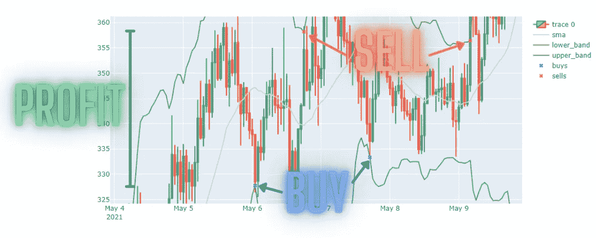

# 使用布林线与 Python 进行加密货币交易

> 原文：<https://medium.com/geekculture/using-bollinger-bands-to-trade-cryptocurrency-with-python-f9decfab8476?source=collection_archive---------8----------------------->

(*Image by author*)

在之前的[文章](https://towardsdatascience.com/dynamic-cryptocurrency-trading-backtesting-platform-python-219dfcd7421e)中，我介绍了一个加密货币交易回溯测试平台，通过使用移动平均交叉测试一个简单的加密货币交易策略；结果是相当无利可图。为了进一步演示如何使用回溯测试平台来评估交易策略，我们将构建一个类似的环境来回溯测试“波段内交易”布林线…