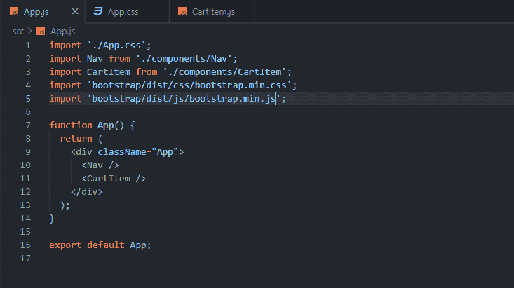
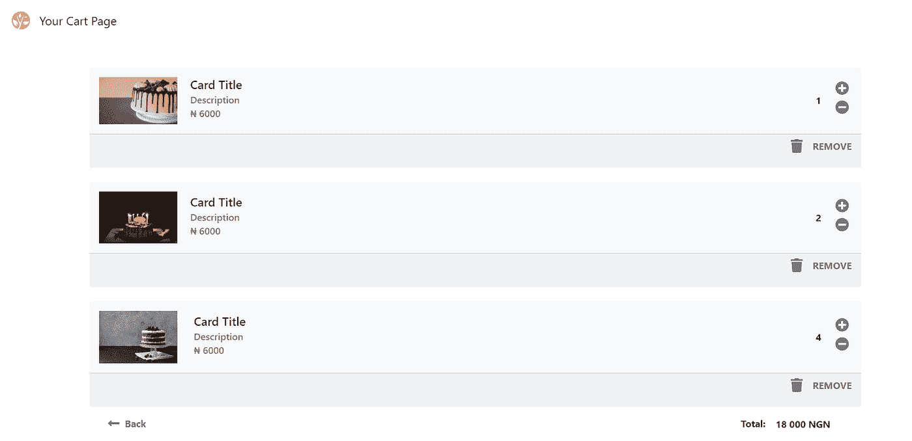
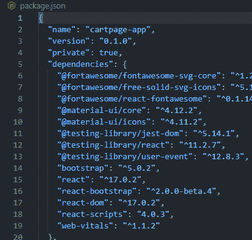
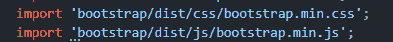
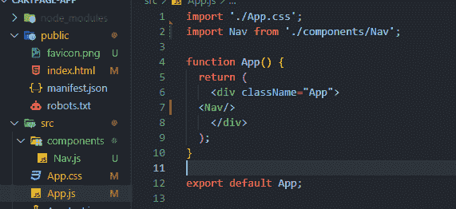
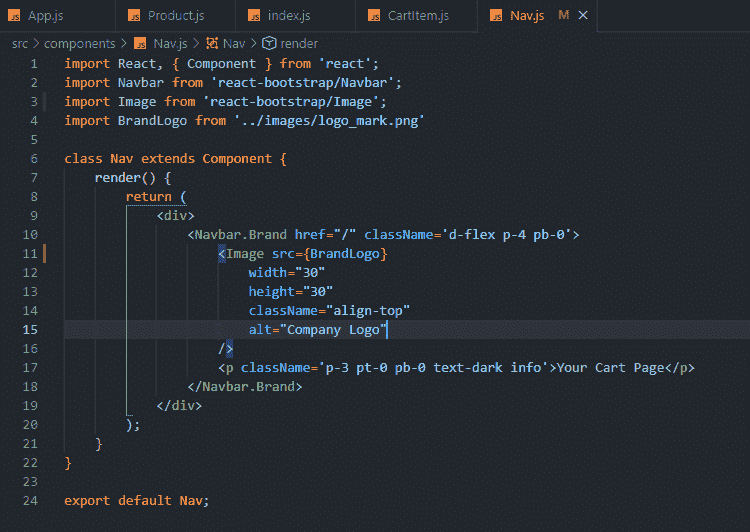
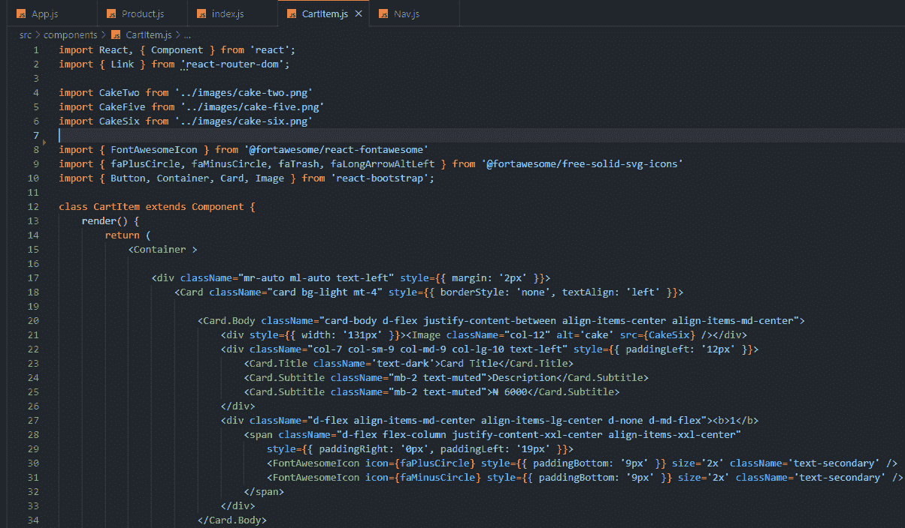

# 通过 ReactJs 使用 Bootstrap(正确的方法)

> 原文：<https://medium.com/geekculture/using-bootstrap-with-reactjs-the-right-way-9d7ce6cf249e?source=collection_archive---------8----------------------->

# **反应和自举**

如果你从事过前端 web 开发，你应该已经知道 Bootstrap 作为 CSS 框架和 React 作为 JavaScript 框架是一件大事，如果你不知道，现在你知道了。*(如果你不知道什么是 CSS 或 JavaScript，你可能想离开这篇文章，去洗碗吧)*。学习和实现 React 可能是一个挑战，但是正如您将会发现的，最初的压力绝对是值得的。React 专注于建立一个网站，一个组件接一个组件。这使得您的网站代码看起来非常结构化，例如:



这是我建立的一个完整的网页，当然，在这些组件下面是相当多的手写代码。


Bootstrap Professor

> 这就是**‘自举’**的用武之地。

作为参考，该页面如下所示:



**Bootstrap** 是很多东西，但在这种情况下，我们将把它视为**一个库，它允许我们导入和使用不同的组件**在 React 应用程序中创建用户界面。这节省了大量的时间，因为开发人员不需要从头开始编写一切。

我太激动了，不能用解释来烦你，让我们开始吧

# **先决条件**

*   确保您的计算机上安装了 [npm](https://www.npmjs.com/) 。
*   Visual Studio 代码，你可以从[这里](https://code.visualstudio.com/)下载。
*   React 中创建和导入组件的知识
*   引导类的基础知识
*   有点渴望被吹走
*   链接到储存库[这里](https://github.com/Uny1me/cartpage-app)

# **你将学到什么**

*   在 React 中使用引导组件(减少必须添加的类的数量)
*   额外收获:在 React 中使用字体很棒的图标

# 步骤 1 —开始

通过在终端或 cmd 中键入以下命令，导航到所需的文件夹并创建一个 React 项目。

```
npx create-react-app cartpage-app
```

请注意，根据您的网速，此构建过程可能需要一些时间。

安装完成后，在代码编辑器中打开该文件夹。然后，键入 npm start 启动开发服务器。您可以在浏览器中导航到 [http://localhost:3000/](http://localhost:3000/) 来查看默认的 React 应用程序。

# 步骤 2 —安装引导

我们必须安装 Material-UI 来访问它的不同功能或组件。打开您的终端，并确保您位于应用程序的主文件夹中。

然后在您的终端中通过键入以下命令安装材料

```
npm install react-bootstrap@next bootstrap@5.0.2
```

# 步骤 2.i —安装字体 Awesome

要开始，您需要使用 npm 将以下包安装到您的项目中。下面是安装你需要的所有东西的例子，以及使用每个软件包管理器的图标的实体风格。

```
npm i — save @fortawesome/fontawesome-svg-corenpm install — save @fortawesome/free-solid-svg-iconsnpm install — save @fortawesome/react-fontawesome
```

为了这个项目，这将是足够的，但还有其他的品牌图标或其他需要安装。

我们可以通过检查 package.json 来确认已经安装了上述依赖项。如下所示:



最后一步是在我们的 App.js 中导入引导文件，如下所示:



让我们分成几个部分，看看我们能做些什么:

1.  导航条组件
2.  购物车项目组件

# **第三步-建造**

## **3i。导航条**

第一件事是创建 navbar 组件并将其导入到我们的 App.js 文件中。大概是这样的:



注意，Nav.js 位于 components 文件夹中，这对于像第 2 行那样导入它很有用。

现在是代码:

## **BOOTSTRAP UI 组件**

完整的组件列表可在[这里](https://react-bootstrap.github.io/components/navbar/)找到。您需要知道的是，要导入引导组件，组件的名称通常是元素标记的主名称，如上面 Navbar 的例子所示。在 [package.json](https://docs.google.com/document/d/1vfWE05otVOnjfBqSW2tXXPLAJYyz6c0VJOJmMFihFRQ/edit#heading=h.1j50kt9bpro) 图片的第 16 行，安装的 react-bootstrap 是我们用来提取组件的。

## **导入**

必须在 react 中使用无处不在的 import 关键字调用该组件，并从“react-bootstrap/component”位置调用，如下面第 2 行所示:



在 React 中使用 Bootstrap 时，这是最基本的。

既然我们已经记下了那件事，让我们把事情再往上提一点。

## **3ii。卡提姆组件**



## **注:**

*   一旦主组件被导入，它的子集**也不需要**导入。举个例子:引导卡有卡体和卡名的子集类，一旦卡被导入，这些都随之而来。
*   引导类作为 React 组件的命名约定是使用 PascalCase 在组件名称后加一个点，如' **Navbar 所示。**牌和**牌。体'**
*   在从 react-bootstrap 导入多个组件时，通常使用第 10 行使用的方法。即

```
import { Button, Container, Card, Image } from ‘react-bootstrap’;
```

当导入字体很棒的图标时，也使用了同样的思想。但是有一个缺点:“这会增加最终发送给客户端的代码量。”

# **字体牛逼图标组件**

说到字体牛逼，和往常一样，你只需要知道图标的类名，剩下的就是在公园里散步了。

首先，如第 8 行和第 9 行所示，字体 awesome 有两个导入，组件本身

```
import { FontAwesomeIcon } from ‘@fortawesome/react-fontawesome’
```

然后是图标

```
import { faPlusCircle, faMinusCircle, faTrash, faLongArrowAltLeft } from ‘@fortawesome/free-solid-svg-icons’
```

可以注意到，图标名称类似于使用*标签调用图标的普通类，但是它的命名约定也是 PascalCase。下面是一个使用减号图标的示例:*

```
<FontAwesomeIcon icon={faPlusCircle} style={{ paddingBottom: ‘9px’ }} size=’2x’ className=’text-secondary’ />
```

这里的字体牛逼图标有五种尺寸，sm，md，lg，1x 和 2x。

> 体验这些知识的乐趣。信心来自建设